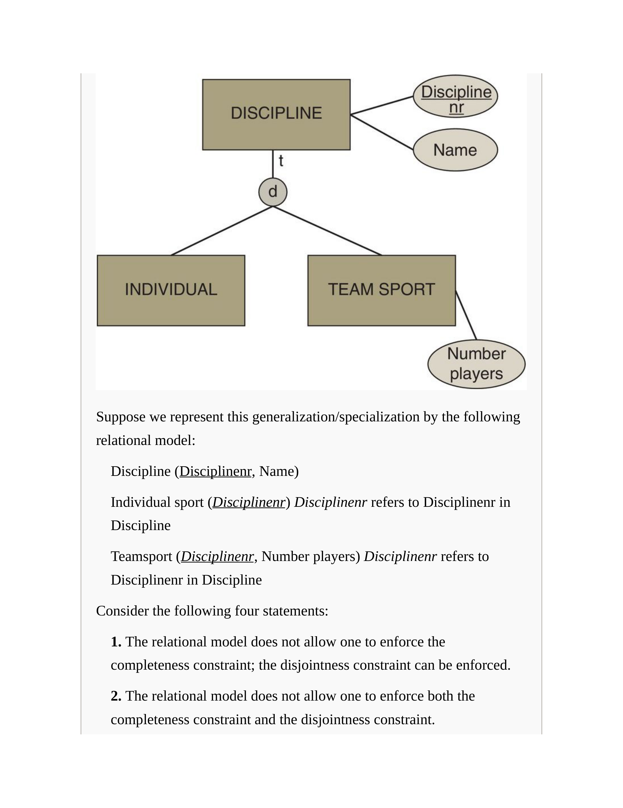
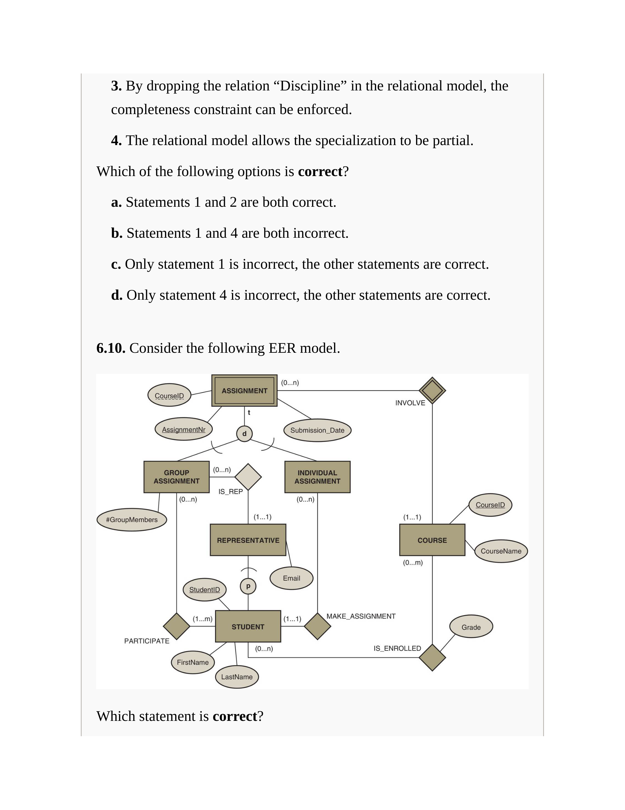
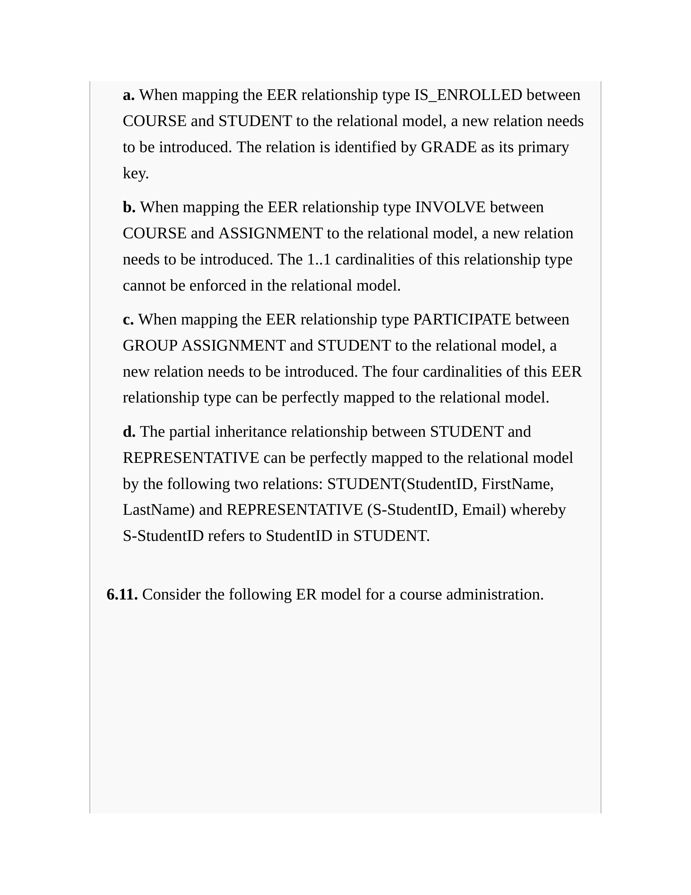
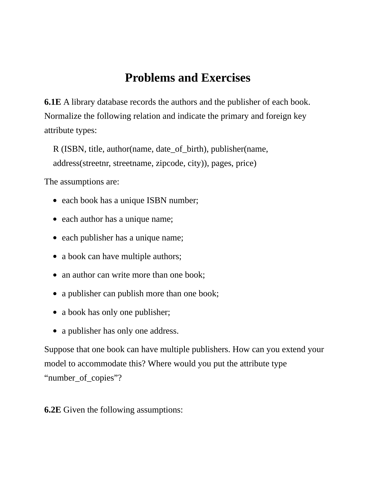
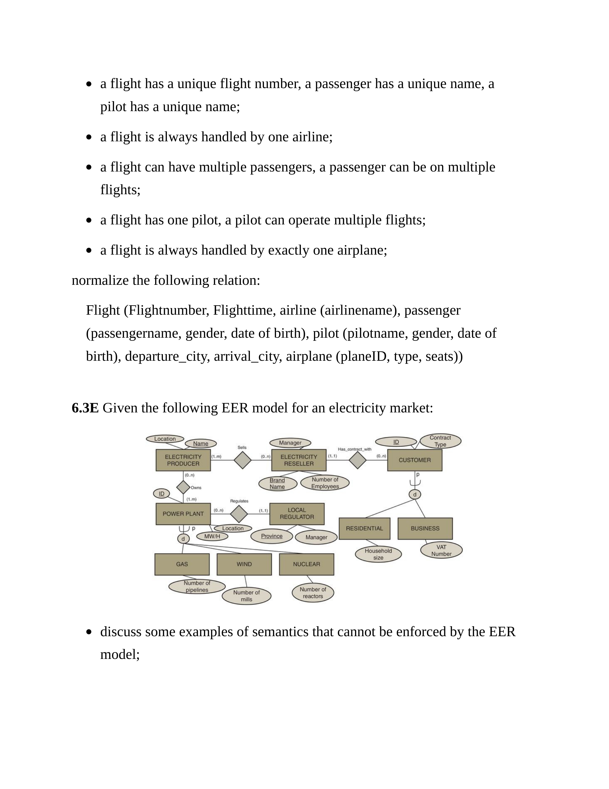
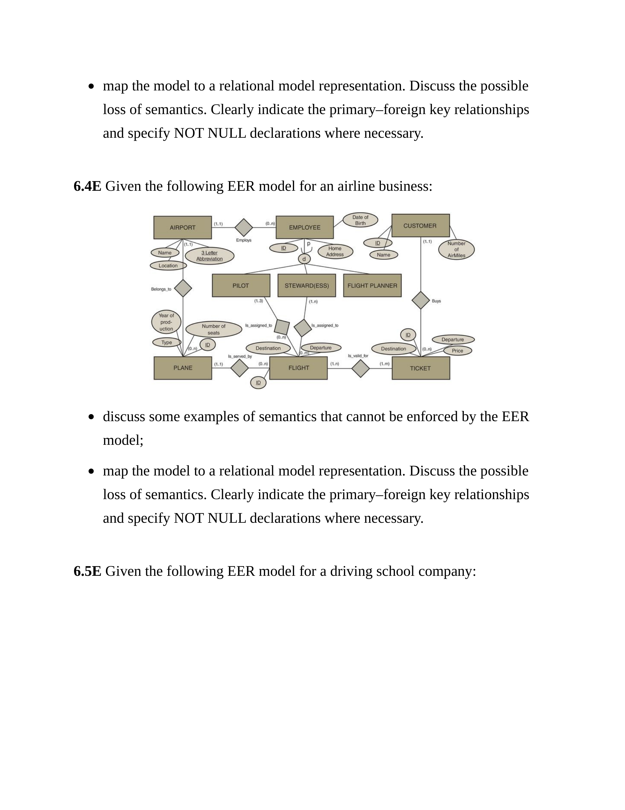
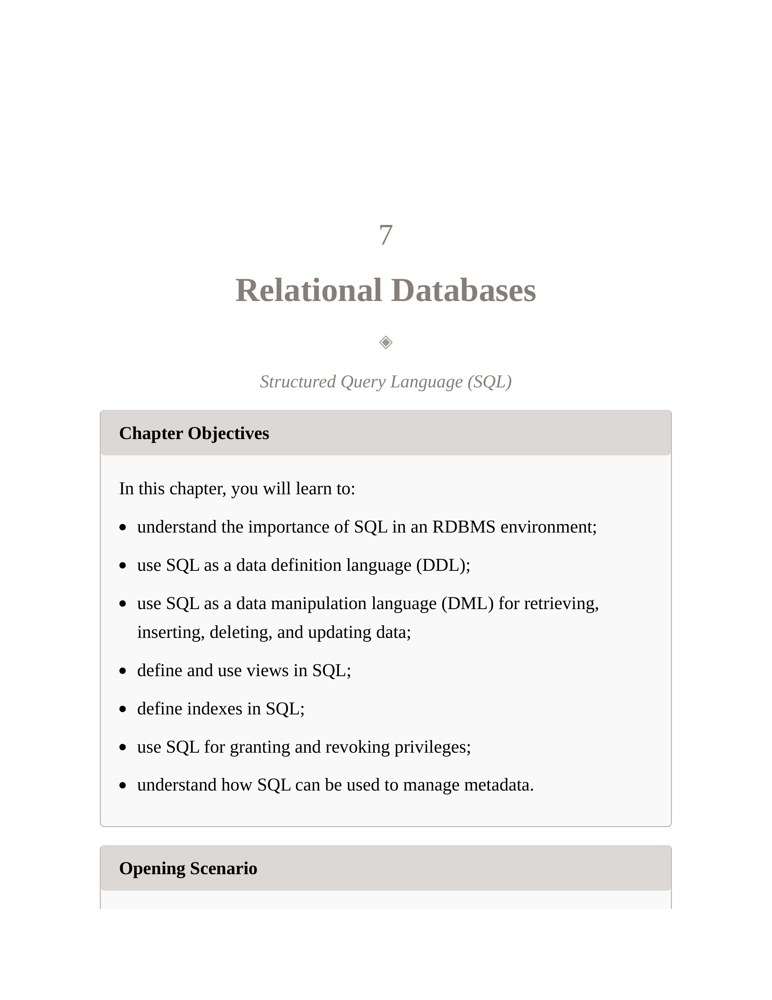

# Exam Answers (Chapters 1-6)

This file answers the questions in `Exam.md`. Each question is immediately followed by its answer.

References are to `Principles of Database Management.txt` (chapter/section names as they appear in the book).

## Chapter 1: Fundamental Concepts of Database Management

### Retention Questions

#### Set 1

**Q:** Give some examples of applications of database technology.

**A:**

- Operational applications (OLTP): banking (accounts/transfers), e-commerce orders/payments, airline reservations, hospital EHR/appointments.
- Inventory and supply chain: stock levels, purchase orders, suppliers, shipments.
- Content and multimedia: music/video catalogs and streaming metadata (artist/album/playlist) plus large objects (audio/video) stored as BLOBs.
- Location and spatial: GIS maps, ride-hailing pick-up/drop-off locations, routing.
- Sensor/IoT and event data: wearables health metrics, industrial sensors, telematics.
- Analytics (OLAP/BI): sales dashboards, customer segmentation, fraud/risk analytics using historical data.

(Reasoning: Chapter 1 treats database technology as broader than just tables for business transactions; it also covers multimedia, spatial, volatile/sensor data, and analytical use cases. The examples map directly to those categories.)

(Ref: Chapter 1, Section 1.1 “Applications of Database Technology”.)

#### Set 2

**Q:** Define the following concepts: database, DBMS, database system.

**A:**

- **Database:** A collection of related data items for a specific business process/problem setting, including the relationships among those items.
  - Example: a purchase-order database with products, suppliers, and orders, where orders link to exactly one supplier and list ordered products.
- **DBMS (Database Management System):** The software used to define, create, use, and maintain a database (e.g., handles storage, querying, security, concurrency, recovery).
  - Example products: Oracle, SQL Server, IBM DB2; open-source examples like MySQL.
- **Database system:** The combination of the database (data) and the DBMS (software managing it), typically including users/applications around it.

(Reasoning: The definitions are layered: the database is the organized related data; the DBMS is the software that manages it; the database system is the DBMS and database together in use.)

(Ref: Chapter 1, Section 1.2 “Key Definitions”.)

#### Set 3

**Q:** Contrast the file versus database approach to data management.

**A:**

- **File-based approach:** Each application manages its own files and embeds its own data definitions.
  - Typical problems: redundant/duplicated data across files, inconsistent updates, tight coupling (data structure change forces app changes), weak concurrency control, hard integration across apps.
- **Database approach:** Shared, centrally managed data with metadata and access controlled via a DBMS.
  - Typical benefits: reduced redundancy, improved consistency, shared access, better security, concurrency control, recovery utilities, and data independence.

(Reasoning: In file-based systems, the same facts live in multiple files and data definitions are duplicated per application, so updates drift and maintenance is hard. A DBMS centralizes data and metadata and adds system services (constraints, concurrency, recovery), so these issues are reduced.)

(Ref: Chapter 1, Section 1.3 “File versus Database Approach to Data Management”.)

#### Set 4

**Q:** What are the key elements of a database system?

**A:**

- **Database state (data):** the actual stored facts/records at a point in time.
- **Database model/metadata (schema):** definitions of tables/structures, constraints, indexes, views, etc., typically stored in the catalog.
- **DBMS software modules:** language processing (DDL/DML), query processing/optimization, storage management, transaction/concurrency, recovery, security, utilities.
- **Users and applications:** business users, application developers, DBAs; applications access the DBMS via interfaces/APIs.
- **Hardware/storage:** disks/SSDs, memory/buffer pool, network, etc. (DBMS abstracts much of this for users).

(Reasoning: A “database system” is the database plus the management software plus the metadata and the surrounding users/apps that interact with it; those are the elements required for a DBMS to provide definition, access, and control.)

(Ref: Chapter 1, Section 1.4 “Elements of a Database System”.)

**Q:** Discuss the three-layer architecture of a database application. Illustrate with an example.

**A:**

- **External layer:** user/application-specific views (“windows”) on the data.
  - Example: HR app sees a view with employee name, department, manager; payroll app sees salary and tax fields.
- **Conceptual/logical layer (middle):** global logical structure of the database (entities/relations, constraints).
  - Example: relations EMPLOYEE, DEPARTMENT, WORKS_ON and their keys/constraints.
- **Internal layer:** physical storage details (file organization, indexes, partitions, placement).
  - Example: EMPLOYEE stored in a heap file, with a B+ tree index on SSN and a secondary index on DNR.

This architecture supports:

- **Logical data independence:** change conceptual/logical schema with minimal impact on external views/apps.
- **Physical data independence:** change internal storage/indexing with minimal impact on logical schema/apps.

(Reasoning: The layering isolates concerns: users see views, designers reason about the global logical meaning, and DBAs tune physical storage. Independence is the point: changes below should not force changes above.)

(Ref: Chapter 1, Section 1.4.3 “The Three-Layer Architecture”; Section 1.5.1 “Data Independence”.)

**Q:** What is a catalog and why is it needed?

**A:**

- The **catalog** stores metadata: schema definitions, constraints, privileges, view definitions, indexes, and other DBMS-managed descriptions.
- Needed because DBMS components rely on it to:
  - validate queries/updates against schema and constraints,
  - enforce security/privileges,
  - help the optimizer choose access paths (e.g., by knowing available indexes),
  - support administration and utilities.

(Reasoning: The catalog is the DBMS’s central metadata store. Without it, the DBMS cannot consistently validate operations, enforce privileges, or optimize queries using known structures like indexes.)

(Ref: Chapter 1, Section 1.4.4 “Catalog”.)

#### Set 5

**Q:** What are the advantages of database systems and database management?

**A:**

- Reduced redundancy and improved consistency versus siloed files.
- Shared, concurrent access with **concurrency control** to avoid conflicts.
- Enforced **integrity rules** (constraints) for correctness.
- Security: authentication/authorization and controlled access.
- Backup and recovery utilities for failures.
- Better maintainability via data independence (apps less coupled to storage/schema).
- Performance support: query optimization, indexing, buffering, tuning utilities.

(Reasoning: These advantages are the “system services” a DBMS adds on top of raw files, and they directly address file-based drawbacks: redundancy/inconsistency, weak concurrency, difficult recovery, poor maintainability, and performance issues.)

(Ref: Chapter 1, Section 1.5 “Advantages of Database Systems and Database Management”.)

**Q:** What is data independence and why is it needed?

**A:**

- **Data independence** means changes to one layer of the database architecture minimally affect higher layers.
- Two key kinds:
  - **Physical data independence:** change internal storage (indexes, file organization) without changing the logical schema or apps.
  - **Logical data independence:** change the conceptual/logical schema without rewriting all external views/apps (to the extent possible).
- Needed to reduce maintenance cost and support evolution (new requirements, performance tuning, new storage).

(Reasoning: Data independence minimizes how much application/view code changes when the schema or storage details change, which is critical because both schema evolution and performance tuning are inevitable.)

(Ref: Chapter 1, Section 1.5.1 “Data Independence”.)

**Q:** What are integrity rules? Illustrate with examples.

**A:**

- **Integrity rules** are constraints that ensure database correctness.
- Common examples:
  - **Domain constraints:** `age` must be an integer in a valid range; `status` in an allowed set.
  - **Key constraints:** primary key values are unique and NOT NULL (e.g., SSN uniquely identifies EMPLOYEE).
  - **Referential integrity:** foreign keys must reference an existing primary key (e.g., `EMPLOYEE.DNR` must exist in `DEPARTMENT.DNR`).
  - **Semantic (business) rules:** “an employee cannot earn more than their manager” (often requires assertions/triggers/application logic).

(Reasoning: Some integrity rules are structural and are enforced directly by the data model (domains/keys/references). Others are semantic business constraints that often require additional mechanisms beyond basic schema constraints.)

(Ref: Chapter 1, Sections 1.5.5 “Specifying Integrity Rules”; also key/foreign key notions recur in Chapter 6 “Relational Constraints”.)

**Q:** What is the difference between structured, semi-structured, and unstructured data?

**A:**

- **Structured data:** fixed schema (tables/columns), strongly typed; easy to query with SQL.
  - Example: customer table with columns `(id, name, email)`.
- **Semi-structured data:** flexible/self-describing structure (tags/keys), schema may vary per record.
  - Example: XML/JSON documents with optional fields.
- **Unstructured data:** no explicit machine-readable structure for the DBMS to exploit directly.
  - Example: free-form text documents, images, audio/video (often stored as BLOBs plus metadata).

(Reasoning: The key axis is how much explicit schema exists for the DBMS to validate/query: fixed schema (structured), flexible self-describing schema (semi-structured), or essentially opaque content requiring specialized processing (unstructured).)

(Ref: Chapter 1, discussion of structured/semi-structured/unstructured and evolving data types in Chapter 1; also later chapters on XML/NoSQL expand this theme.)

**Q:** Define the ACID properties in a transaction management context.

**A:**

- **Atomicity:** all-or-nothing; either all transaction updates occur or none do.
  - Example: bank transfer debits A and credits B; if credit fails, debit is rolled back.
- **Consistency:** a transaction preserves integrity constraints; DB moves from one valid state to another.
  - Example: foreign keys remain valid after updates.
- **Isolation:** concurrent transactions behave as if executed serially (to the extent of the chosen isolation level).
  - Example: one user should not see half-finished updates of another.
- **Durability:** once committed, results persist even after crashes (via logging/recovery).

(Reasoning: ACID is the checklist for safe transactional updates under concurrency and failures. Bank transfer is the classic example because partial execution creates an incorrect state unless atomicity + durability (and isolation) are enforced.)

(Ref: Chapter 1, transaction management/ACID introduction; Chapter 2 architecture notes transaction/recovery managers.)

### Review Questions

**Q 1.1:** Which statement is not correct?

a. The file-based approach to data management causes the same information to be stored separately for different applications.
b. In a file-based approach to data management, the data definitions are included in each application separately.
c. In a file-based approach to data management, different applications could be using older and newer versions of the same data.
d. In a file-based approach to data management, a change in the structure of a data file is easily handled because each application has its own data files.

**A:** **d**.

Reasoning (each option):

- a: Accept. Separate files per application commonly cause redundant storage of the same information.
- b: Accept. In a file-based approach, data definitions/metadata are maintained per application.
- c: Accept. Duplicate copies can drift, so applications can see older/newer versions of the same data.
- d: Reject. File structure changes typically require changes in every dependent application (tight coupling), so it is not “easily handled”.

(Ref: Chapter 1, Section 1.3.1 “The File-Based Approach”.)

**Q 1.2:** Which statement is not correct?

a. In a database approach, applications don’t have their own files, but all applications access the same version of the data by interfacing with the DBMS.
b. In a database approach, the data definitions or metadata are stored in the applications accessing the data.
c. In a database approach, there is typically less storage needed compared to the file approach.
d. In a database approach, maintenance of data and metadata is easier.

**A:** **b**.

Reasoning (each option):

- a: Accept. In the database approach, applications interface with the DBMS to access the same shared version of the data.
- b: Reject. Metadata/data definitions are stored in the catalog, not inside each application.
- c: Accept (typical). Reduced redundancy usually implies less storage than the file approach (indexes can add overhead, but redundancy is still reduced).
- d: Accept. Centralized data/metadata management generally reduces maintenance effort.

(Ref: Chapter 1, Section 1.4.4 “Catalog”; Section 1.3.2 “The Database Approach”.)

**Q 1.3:** Which statement is not correct?

a. In a file-based approach, every application has its own query and access procedures, even if they want to access the same data.
b. SQL is a database language to manage DBMSs without having to write a substantial amount of programming code.
c. SQL is a database language that focuses on how to access and retrieve the data.
d. SQL is a database language that allows different applications to access different subsets of the data necessary for each application.

**A:** **c**.

Reasoning (each option):

- a: Accept. Each file-based application typically contains its own access logic.
- b: Accept. SQL reduces the need for low-level navigation/programming for common data tasks.
- c: Reject. SQL is declarative: it describes what data is needed, not how to navigate to retrieve it.
- d: Accept. Views and privileges can expose different subsets to different applications/users.

(Ref: Chapter 2, procedural vs declarative DML discussion; Chapter 1 database languages overview.)

**Q 1.4:** Which statement is not correct?

a. In a conceptual data model, the data requirements from the business should be captured and modeled.
b. A conceptual data model is implementation-dependent.
c. A logical data model translates the conceptual data model to a specific implementation environment.
d. Examples of implementations of logical data models are hierarchical, CODASYL, relational, or object-oriented models.

**A:** **b**.

Reasoning (each option):

- a: Accept. Conceptual modeling captures business requirements.
- b: Reject. Conceptual models are implementation-independent.
- c: Accept. Logical models translate conceptual models to a target environment.
- d: Accept. Hierarchical/CODASYL/relational/object-oriented are examples of logical models.

(Ref: Chapter 1, conceptual/logical/internal distinctions; Chapter 3 database design phases also reinforce this.)

**Q 1.5:** Complete the sentence (A and B).

a. A: internal, B: logical.
b. A: conceptual, B: internal.
c. A: logical, B: internal.
d. A: logical, B: conceptual.

**A:** **a**.

Reasoning (each option):

- a: Select. “Stored where and in what format” is an internal/physical concern derived from the logical model.
- b: Reject. The conceptual model is not derived from internal storage.
- c: Reject. The logical model is not the physical mapping; the internal model is.
- d: Reject. The sentence is about physical storage (internal), not conceptual modeling.

(Ref: Chapter 1, three-layer architecture and internal vs logical descriptions.)

**Q 1.6:** What concept specifies the data items, relationships, constraints, storage details, etc.?

a. Database model.
b. Catalog.
c. Database state.
d. None of the above.

**A:** **a. Database model.**

Reasoning (each option):

- a: Select. The database model/schema specifies data structures, constraints, and (at internal level) storage structures.
- b: Reject. The catalog stores metadata about the model; it is not the model itself.
- c: Reject. The database state is the current instance (data values), not the definitions.
- d: Reject. A correct concept exists (database model).

(Ref: Chapter 1, Section 1.4.2 “Data Model”.)

**Q 1.7:** Which statement regarding the database state is correct?

a. The database state represents the data in the database when the database is first created.
b. The database state changes when data are updated or removed.
c. The database state specifies the various data items, their characteristics, and relationships, and is specified during the database design.
d. The database state is stored in the catalog.

**A:** **b**.

Reasoning (each option):

- a: Reject. The state is not only the initial contents; it changes over time.
- b: Select. Inserts/updates/deletes change the database instance (state).
- c: Reject. That describes the database model/schema, not the state.
- d: Reject. The catalog stores metadata; the state is stored data values.

(Ref: Chapter 1, Section 1.4.1 “Database Model versus Instances”.)

**Q 1.8:** Between the external layer and the conceptual/logical layer, there is …

a. physical data independence.
b. logical data independence.
c. no independence, they are basically the same thing.
d. the internal layer.

**A:** **b. logical data independence.**

Reasoning (each option):

- a: Reject. Physical data independence is between conceptual/logical and internal layers.
- b: Select. Logical data independence shields external views/apps from conceptual/logical changes (as much as possible).
- c: Reject. The architecture exists specifically to introduce independence.
- d: Reject. The internal layer is the lowest layer, not “between” external and conceptual/logical.

(Ref: Chapter 1, Section 1.5.1 “Data Independence”.)

**Q 1.9:** Which statement is correct?

Statement A: The middle layer of the three-layer architecture consists of both the conceptual data model and the logical data model. The logical data model is physically implemented in the internal layer.

Statement B: The top level of the three-layer architecture is the external layer. Views for one or more applications always offer a window on the complete logical model.

a. Only sentence A is right.
b. Only sentence B is right.
c. Sentences A and B are right.
d. Neither A nor B is right.

**A:** **a**.

Reasoning (each option):

- a: Select. A is correct; B is incorrect because views are typically subsets, not necessarily a window on the complete logical model.
- b: Reject. B is not correct.
- c: Reject. Both are not correct.
- d: Reject. A is correct.

(Ref: Chapter 1, three-layer architecture and view concept.)

**Q 1.10:** Which statement is correct?

Statement A: DDL is the language used to define the logical data model, but no other data models.

Statement B: SQL is a DML language to retrieve, insert, delete, and modify data. It is stored in the catalog.

a. Only A.
b. Only B.
c. A and B.
d. Neither A nor B.

**A:** **d. Neither A nor B.**

Reasoning (each option):

- a: Reject. In practice, DDL is not limited to defining only the logical data model.
- b: Reject. DML statements are executed; the catalog stores metadata, not application queries.
- c: Reject. Both statements are not correct.
- d: Select. Neither statement is correct.

(Ref: Chapter 2 DDL compiler description; Chapter 1 catalog description.)

**Q 1.11:** Which statement is correct?

Statement A: Physical data independence implies that neither the applications nor the views or logical data model must be changed when changes are made to the data storage specifications in the internal data model.

Statement B: Logical data independence implies that software applications are minimally affected by changes in the conceptual or logical data model.

a. Only A.
b. Only B.
c. A and B.
d. Neither A nor B.

**A:** **c. A and B.**

Reasoning (each option):

- a: Reject. B is also correct.
- b: Reject. A is also correct.
- c: Select. Both match the definitions of physical and logical data independence.
- d: Reject. Both are correct.

(Ref: Chapter 1, Section 1.5.1 “Data Independence”.)

**Q 1.12:** “An employee … can never earn more than the manager …” is an example of a:

a. syntactical integrity rule.
b. semantical integrity rule.

**A:** **b. semantical integrity rule.**

Reasoning (each option):

- a: Reject. Not a syntactical/type-format constraint; it’s cross-entity business logic.
- b: Select. It is a semantic business rule.

(Ref: Chapter 1, integrity rules discussion; semantic constraints typically require more than basic schema typing.)

### Problems and Exercises

**Q 1.1E:** Discuss examples of database applications.

**A:**

- Retail POS: stores transactions (items, quantities, timestamp, store) enabling restocking and analytics.
- Banking: accounts, payments, transfers with transactional guarantees (ACID).
- Social/media platforms: user profiles, posts, relationships (followers/friends), plus multimedia blobs.
- Healthcare: patient records, lab results, appointments, prescriptions (strong integrity/security requirements).
- GIS/ride-hailing: spatial data, routes, continuous location updates (sensor/streaming aspects).

(Ref: Chapter 1, Section 1.1 “Applications of Database Technology”.)

**Q 1.2E:** What are the key differences between the file-based and database approaches to data management?

**A:**

- **Ownership:** file-based = per-application data ownership; database = shared data managed by DBMS.
- **Redundancy/consistency:** file-based commonly duplicates data and risks inconsistency; database reduces redundancy and enforces constraints.
- **Coupling:** file-based tightly couples apps to file structures; database supports data independence.
- **Concurrency/recovery/security:** DBMS provides built-in mechanisms; file-based systems often implement ad hoc or lack these features.
- **Integration:** DBMS facilitates multiple apps accessing consistent data via common interfaces/languages.

(Ref: Chapter 1, Section 1.3 “File versus Database Approach”.)

**Q 1.3E:** Discuss the elements of a database system.

**A:**

- Database and its state (stored data).
- DBMS software (query processor, storage manager, transaction/recovery, security, utilities).
- Catalog/metadata (schemas, constraints, privileges, indexes, views).
- Users and roles (business users, information architect, DBA, developers).
- Applications and interfaces/APIs (SQL tools, embedded SQL, drivers).
- Hardware/storage/network environment that the DBMS manages/abstracts.

(Ref: Chapter 1, Section 1.4 “Elements of a Database System”; Chapter 2 expands the internal architecture.)

**Q 1.4E:** What are the advantages of database systems and database management?

**A:**

- Correctness: integrity rules + centralized enforcement.
- Robustness: backup/recovery and transactional guarantees.
- Multi-user support: concurrency control and isolation.
- Security/governance: privileges and controlled access.
- Maintainability: data independence and centralized metadata.
- Performance: query optimization, indexing, buffering, tuning utilities.

(Ref: Chapter 1, Section 1.5 “Advantages…”.)

## Chapter 2: Architecture and Categorization of DBMSs

### Retention Questions

#### Set 1

**Q:** What are the key components of a DBMS?

**A:**

- **Interfaces/utilities:** tools for querying, loading, monitoring, reorganization, backup/recovery, user management.
- **Connection and security manager:** establishes sessions and checks privileges.
- **DDL compiler:** parses/validates schema definitions and registers them in the catalog.
- **Query processor:** handles DML (parsing, rewriting, optimizing, executing).
- **Storage manager:** manages low-level data access and the components enabling ACID and performance:
  - transaction manager, buffer manager, lock manager, recovery manager.

(Ref: Chapter 2, Section 2.1 “Architecture of a DBMS” and its subsections.)

**Q:** What is the difference between procedural and declarative DML?

**A:**

- **Procedural DML (record-at-a-time):** specifies _how_ to navigate records (often pointer-based); application code drives access path; typically no optimizer.
  - Example idea: “get this record, follow pointer to next, repeat…”.
- **Declarative DML (set-at-a-time):** specifies _what_ data is needed; DBMS chooses access path via optimizer.
  - Example: SQL `SELECT ... FROM ... WHERE ...` describes the result set; optimizer decides join order/index usage.

(Ref: Chapter 2, Section 2.1.3.1 “DML Compiler” discussion of procedural vs declarative DML.)

**Q:** Give some examples of DBMS utilities and interfaces.

**A:**

- Utilities: loading/import tools, backup & recovery, reorganization/maintenance, performance monitoring, index tuning, user/privilege management.
- Interfaces: command-line/interactive SQL tools, GUI admin consoles, forms-based interfaces, embedded SQL in applications, database APIs/drivers (e.g., JDBC/ODBC conceptually).

(Ref: Chapter 2, Sections 2.1.5 “DBMS Utilities” and 2.1.6 “DBMS Interfaces”.)

#### Set 2

**Q:** How can DBMSs be categorized based on data model?

**A:**

- Legacy models: **hierarchical** DBMSs, **network/CODASYL** DBMSs.
- Relational family: **relational** DBMSs, **object-relational/extended relational** DBMSs.
- Object and semi-structured: **object-oriented** DBMSs, **XML** DBMSs (native vs XML-enabled).
- NoSQL: key-value, document, column-family, graph databases.

(Ref: Chapter 2, Section 2.2.1 “Categorization Based on Data Model”.)

**Q:** How can DBMSs be categorized based on usage?

**A:**

- **OLTP:** many short, concurrent transactions; strong concurrency control and low latency.
- **OLAP:** fewer but complex analytical queries over large historical datasets; query performance for scans/aggregations.
- Other usage-oriented categories discussed include spatial/multimedia/sensor/mobile/open-source, depending on context and workload characteristics.

(Ref: Chapter 2, Section 2.2.4 “Categorization Based on Usage”.)

### Review Questions

**Q 2.1:** Which of these is part of the query processor?

a. DDL compiler.
b. DML compiler.
c. Transaction manager.
d. Security manager.

**A:** **b. DML compiler.**

(Reasoning (each option):

- a: Reject. The DDL compiler is separate from the query processor.
- b: Select. The DML compiler is a query-processor component.
- c: Reject. Transaction manager is part of the storage manager.
- d: Reject. Security manager is separate from the query processor.)

(Ref: Chapter 2, Section 2.1.3 “Query Processor”.)

**Q 2.2:** Which of these is not part of the storage manager?

a. Connection manager.
b. Transaction manager.
c. Buffer manager.
d. Recovery manager.

**A:** **a. Connection manager.**

(Reasoning (each option):

- a: Select. Connection management is outside the storage manager.
- b: Reject. Transaction manager is part of storage manager.
- c: Reject. Buffer manager is part of storage manager.
- d: Reject. Recovery manager is part of storage manager.)

(Ref: Chapter 2, Section 2.1.4 “Storage Manager”.)

**Q 2.3:** Which statement(s) is/are correct?

Statement A: The DDL compiler compiles data definitions specified in
DDL. It is possible that there is only one DDL with three instruction sets.

Statement B: The first step of the DDL compiler is to translate the
DDL definitions.

a. Only A.
b. Only B.
c. A and B.
d. Neither A nor B.

**A:** **a. Only A.** The DDL compiler compiles DDL definitions and implementations may use a single DDL with instruction sets; its first steps include parsing/syntactic checks before translation/registration.

(Reasoning:

- Statement A is true: this matches the DDL compiler description.
- Statement B is false: translation is not the first step; parsing/syntax checks come first.
- Therefore only A is correct.)

(Ref: Chapter 2, Section 2.1.2 “DDL Compiler”.)

**Q 2.4:** Which statement(s) is/are correct?

Statement A: There is no query processor available in procedural
DML.

Statement B: With procedural DML, the DBMS determines the access
path and navigational strategy to locate and modify the data specified in
the query.

a. Only A.
b. Only B.
c. A and B.
d. Neither A nor B.

**A:** **a. Only A.** Procedural DML typically lacks a DBMS query processor/optimizer; the access path is driven by application logic, not chosen by the DBMS.

(Reasoning:

- Statement A is true: procedural/record-at-a-time DML does not rely on a DBMS optimizer-driven query processor.
- Statement B is false: in procedural DML, navigation/access path is specified by the application, not determined by the DBMS.
- Therefore only A is correct.)

(Ref: Chapter 2, Section 2.1.3.1 discussion of procedural DML.)

**Q 2.5:** Evaluate the statements (record-at-a-time vs set-at-a-time).

1. Record-at-a-time DML means that the query gets recorded from the
user at the time the user inputs the query and then gets processed.

2. Record-at-a-time DML means that navigating the database starts
with positioning on one specific record and going from there onwards
to other records.

3. Set-at-a-time DML means that the query gets set beforehand and
then gets processed by the DBMS.

4. Set-at-a-time DML means that many records can be retrieved in one
DML statement.

a. 1 and 3 are right.
b. 2 and 3 are right.
c. 1 and 4 are right.
d. 2 and 4 are right.

**A:** **d. 2 and 4 are right.** Record-at-a-time is navigational (position on a record and navigate); set-at-a-time can retrieve many records in one statement. Statements 1 and 3 misuse “recorded/set beforehand”.

(Reasoning:

- 1 is false: “record-at-a-time” refers to retrieving/manipulating one record per operation, not “recording a query”.
- 2 is true: navigational DML positions on one record and navigates from there.
- 3 is false: “set-at-a-time” refers to set-oriented processing, not pre-setting queries.
- 4 is true: declarative/set-at-a-time DML can retrieve many records in one statement.
- Therefore option d (2 and 4) is correct.)

(Ref: Chapter 2, procedural vs declarative DML discussion.)

**Q 2.6:** Which statement(s) is/are correct?

Statement A: The impedance mismatch problem can be solved by
using middleware to map data structures between the DBMS and the
DDL statements.

Statement B: An object-oriented host language such as Java combined
with a document-oriented DBMS such as MongoDB does not require
mapping objects to documents and vice versa.

a. Only A.
b. Only B.
c. A and B.
d. Neither A nor B.

**A:** **b. Only B.** The impedance mismatch is about mapping between application data structures (often OO) and DBMS data structures (often relational); document-oriented DBMSs reduce the need for heavy object-document mapping compared with object-relational mapping. Statement A is incorrect as written (DDL is not what OO middleware maps to).

(Reasoning:

- Statement A is false: impedance mismatch is not “DBMS vs DDL statements”; it is about mismatch between application data structures and database data structures.
- Statement B is true in the book’s intended sense: OO objects align closely with document structures, so mapping friction is minimized versus OO-relational.
- Therefore only B is correct.)

(Ref: Chapter 2, categorization and discussion of impedance mismatch / mapping; and document DBMS characterization.)

**Q 2.7:** Which statement(s) is/are correct?

Statement A: The query parser optimizes and simplifies a query and
then passes it on to the query executor.

Statement B: In the DBMS architecture, the storage manager takes
care of concurrency control.

a. Only A.
b. Only B.
c. A and B
d. Neither A nor B.

**A:** **b. Only B.** Query optimization is the optimizer’s task, not the parser’s; concurrency control is handled within storage manager components (notably lock/transaction managers).

(Reasoning:

- Statement A is false: the optimizer optimizes; the parser parses (and the rewriter/optimizer are separate stages).
- Statement B is true: concurrency control is handled by storage manager components like lock/transaction managers.
- Therefore only B is correct.)

(Ref: Chapter 2, Sections 2.1.3.2–2.1.3.4 and 2.1.4.\*.)

**Q 2.8:** Fill in the gaps (A and B).

When, during crash recovery, aborted transactions need to be undone,
that is a task of the …A…

The part of the storage manager that guarantees the ACID properties is
the …B…

a. A: lock manager, B: recovery manager.
b. A: lock manager, B: lock manager.
c. A: recovery manager, B: buffer manager.
d. A: recovery manager, B: transaction manager.

**A:** **d. A: recovery manager, B: transaction manager.** Undoing aborted transactions during recovery is part of recovery; guaranteeing ACID (especially atomicity/isolation) is centered in transaction management.

(Reasoning:

- Undoing aborted transactions during crash recovery is a recovery manager responsibility.
- Guaranteeing ACID properties is centered in transaction management (with support from locking/recovery).
- Therefore option d.)

(Ref: Chapter 2, Sections 2.1.4.1 “Transaction Manager” and 2.1.4.4 “Recovery Manager”.)

**Q 2.9:** CODASYL is an example of …

a. a hierarchical DBMS.
b. a network DBMS.
c. a relational DBMS.
d. an object-oriented DBMS.

**A:** **b. a network DBMS.**

(Reasoning (each option):

- a: Reject. Hierarchical DBMSs are tree-structured; CODASYL is not limited to a tree.
- b: Select. CODASYL is the classic network DBMS model.
- c: Reject. Relational DBMSs are based on relations/tables.
- d: Reject. Object-oriented DBMSs store objects/classes.)

(Ref: Chapter 2, Section 2.2.1.2 “Network DBMSs”.)

**Q 2.10:** Which DBMS type is not a classification based on a data model?

a. Hierarchical DBMS.
b. Network DBMS.
c. Cloud DBMS.
d. Object-relational DBMS.

**A:** **c. Cloud DBMS.** It’s a deployment/architecture category, not a data model.

(Reasoning:

- Hierarchical/network/object-relational are data-model categories.
- “Cloud” describes deployment/architecture rather than the underlying logical data model.
- Therefore option c.)

(Ref: Chapter 2, Sections 2.2.1 vs 2.2.3 “Categorization Based on Architecture”.)

**Q 2.11:** Which statement(s) is/are correct?

Statement A: In a hierarchical DBMS, DML is declarative and set
oriented with a query processor.

Statement B: In a relational DBMS, there is data independence
between the conceptual and internal data model.

a. Only A.
b. Only B.
c. A and B.
d. Neither A nor B

**A:** **b. Only B.** Hierarchical DBMSs are typically navigational/procedural; relational DBMSs support data independence between conceptual/logical and internal layers (physical data independence).

(Reasoning:

- Statement A is false: hierarchical DBMSs are typically procedural/record-at-a-time, not declarative with a query processor.
- Statement B is true: relational systems provide physical data independence between conceptual/logical and internal levels.
- Therefore only B.)

(Ref: Chapter 2, hierarchical DBMS characteristics; Chapter 1/2 on data independence and relational DBMSs.)

**Q 2.12:** DBMS architecture that can access multiple data sources and hides low-level details:

a. n-tier DBMS.
b. cloud DBMS.
c. client–server DBMS.
d. federated DBMS.

**A:** **d. federated DBMS.**

(Reasoning:

- A federated DBMS integrates multiple data sources and presents a uniform interface while hiding low-level details.
- The other architecture options do not necessarily imply source federation/integration.
- Therefore option d.)

(Ref: Chapter 2, architecture categories including federated DBMSs.)

**Q 2.13:** Which statement(s) is/are correct (OLTP vs OLAP)?

Statement A: An OLTP system is able to cope with real-time,
simultaneous transactions that the database server is able to process in a
large volume.

Statement B: An OLAP system uses large amounts of operational data
to run complex queries on and provide insights for tactical and strategic
decision-making.

a. Only A.
b. Only B
c. A and B.
d. Neither A nor B.

**A:** **c. A and B.**

(Reasoning:

- OLTP: high volume of short, concurrent transactions (Statement A).
- OLAP: fewer, complex analytical queries for decision support (Statement B).
- Therefore both are correct.)

(Ref: Chapter 2, Section 2.2.4 “Categorization Based on Usage”.)

**Q 2.14:** Which statement(s) is/are correct (native XML vs XML-enabled)?

Statement A: Native XML DBMSs map the hierarchical structure of
an XML document to a physical storage structure, because they are able
to use the intrinsic structure of an XML document.

Statement B: XML-enabled DBMSs are able to store XML data in an
integrated and transparent way, because they are able to use the intrinsic
structure of an XML document.

a. Only A.
b. Only B.
c. A and B.
d. Neither A nor B.

**A:** **a. Only A.** Native XML DBMSs store XML using its hierarchical structure; XML-enabled DBMSs typically store XML in relational structures and do not inherently “use the intrinsic structure” in physical storage the same way.

(Reasoning:

- Native XML DBMSs exploit XML’s intrinsic hierarchical structure in storage and querying (Statement A true).
- XML-enabled DBMSs store XML on top of a different underlying model (often relational), so they do not inherently store by XML’s intrinsic structure (Statement B false).
- Therefore only A.)

(Ref: Chapter 2, XML DBMS categorization: native vs XML-enabled.)

### Problems and Exercises

**Q 2.1E:** What are the key components of a DBMS architecture and how do they collaborate?

**A:**

- Collaboration pipeline (typical query/update path):
  - user/app connects via connection manager; security manager checks privileges;
  - DML goes to query processor (parse/rewrite/optimize/execute);
  - executor asks storage manager for pages/records;
  - buffer manager caches pages; lock manager coordinates concurrent access; transaction manager ensures atomicity/isolation; recovery manager logs/recovers to guarantee durability.
- DDL goes through DDL compiler and updates the catalog, which the optimizer/security modules consult.
- Utilities support administration (backup, reorg, monitoring) and influence performance/correctness.

(Ref: Chapter 2, Section 2.1 “Architecture of a DBMS”.)

**Q 2.2E:** What is the difference between procedural and declarative DML?

**A:** Procedural DML specifies navigation steps over records (application-driven access paths); declarative DML specifies result conditions and lets the DBMS optimizer choose access paths and execution strategies (set-oriented).

(Ref: Chapter 2, Section 2.1.3.1 “DML Compiler”.)

**Q 2.3E:** Why is it important that a DBMS has a good query optimizer?

**A:**

- Many equivalent logical query formulations can have drastically different physical costs.
- Optimizer chooses access paths (indexes vs scans), join orders/methods, and execution plans to reduce I/O/CPU and improve response time and throughput.
- Especially critical for declarative languages (SQL): the DBMS is responsible for “how” to execute.

(Ref: Chapter 2, Section 2.1.3.3 “Query Optimizer” and overall query processor rationale.)

**Q 2.4E:** Give some examples of DBMS utilities and interfaces.

**A:**

- Utilities: backup/recovery tools, bulk load/import, index rebuild, table reorganization, performance monitors, user/privilege management.
- Interfaces: interactive SQL console, admin GUI, embedded SQL in host languages, APIs/drivers for applications, forms/reporting tools.

(Ref: Chapter 2, Sections 2.1.5 and 2.1.6.)

**Q 2.5E:** How can DBMSs be categorized in terms of data model, degree of simultaneous access, architecture, usage?

**A:**

- **Data model:** hierarchical, network/CODASYL, relational, object-oriented, object-relational, XML, NoSQL (key-value/document/column/graph).
- **Degree of simultaneous access:** single-user vs multi-user systems (concurrency control needs differ).
- **Architecture:** centralized, client-server, n-tier, cloud, federated (integration across sources).
- **Usage:** OLTP vs OLAP, plus specialized usage categories (spatial, multimedia, sensor, mobile) depending on workload and data types.

(Ref: Chapter 2, Section 2.2 “Categorization of DBMSs”.)

## Chapter 3: Conceptual Data Modeling Using the (E)ER Model and UML Class Diagram

### Retention Questions

#### Set 1

**Q:** What are the key building blocks of the ER model?

**A:**

- **Entity types** (rectangles): business concepts (e.g., SUPPLIER, MOVIE).
- **Attribute types** (ellipses): properties of entity/relationship types (e.g., SUPNR, prodname).
- **Relationship types** (rhombuses/diamonds): associations among entity types (e.g., SUPPLIES between SUPPLIER and PRODUCT).

(Reasoning: The ER model is defined around “things”, “their properties”, and “associations” among things. Those are exactly entity types, attribute types, and relationship types.)

(Ref: Chapter 3, Section 3.2 “The Entity Relationship Model”.)

**Q:** Discuss the attribute types supported in the ER model.

**A:**

- **Domain (value set)**: defines allowed values for an attribute (often not shown in ER diagrams).
- **Key attribute type(s)**: uniquely identify entities; can be composite (e.g., flightnr + date).
- **Simple vs composite**: composite can be decomposed (e.g., Address -> street, city, zip).
- **Single-valued vs multi-valued**: multi-valued holds multiple values (e.g., supplier emails).
- **Derived**: computed from other attributes (e.g., age derived from date_of_birth).

(Reasoning: These attribute-type categories are needed to model uniqueness/identification, structure (atomic vs decomposable), multiplicity, and computed data without storing duplicates.)

(Ref: Chapter 3, Section 3.2.3 “Attribute Types” and subsections.)

**Q:** Discuss the relationship types supported in the ER model.

**A:**

- **Degree**: unary/recursive, binary, ternary (and higher).
- **Roles**: names for each direction/interpretation of the relationship.
- **Cardinalities** (min/max per role): 0 or 1 minimum; 1 or N maximum.
- **Relationship attribute types**: attributes attached to the relationship instance (e.g., working_hours on PRODUCES).

(Reasoning: Relationship types must capture how many entities can participate (cardinalities), how to interpret connections (roles), and whether the relationship itself carries data (relationship attributes).)

(Ref: Chapter 3, Section 3.2.4 “Relationship Types”.)

**Q:** What are weak entity types and how are they modeled in the ER model?

**A:**

- A **weak entity type** cannot be uniquely identified by its own attributes alone; it needs an **owner entity type** plus a **partial key**.
- It is **existence-dependent** on the owner (it cannot exist without it).
- Modeled via:
  - an identifying relationship type to the owner, and
  - a discriminator/partial key for the weak entity (unique only within the owner).

(Reasoning: “Weak” is about identification (needs owner + partial key), while existence dependency is the business implication: the weak entity’s lifetime depends on the owner.)

(Ref: Chapter 3, Section 3.2.5 “Weak Entity Types”.)

**Q:** Discuss the limitations of the ER model.

**A:**

- Snapshot-in-time: cannot enforce **temporal constraints** (e.g., start_time < end_time).
- Limited support for **complex integrity constraints** across multiple relationships (inter-relationship consistency rules).
- Does not model **methods/behavior** (it is not an OO model).
- Domains/advanced constraints typically cannot be fully specified or enforced purely in ER notation.

(Reasoning: ER is intentionally simple for communicating data requirements; the simplicity limits the kinds of business rules and time-dependent constraints you can encode directly.)

(Ref: Chapter 3, Sections 3.2.8 “Limitations of the ER Model” and chapter scenario conclusion themes.)

#### Set 2

**Q:** What modeling extensions are provided by the EER model? Illustrate with examples.

**A:**

- **Specialization/generalization**: superclass-subclass (inheritance).
  - Example: CAR specialized into SOBER_CAR and OTHER_CAR.
- **Categorization (union type)**: subclass defined as subset of the union of multiple superclasses.
  - Example: PATIENT as a subset of (MAN ∪ WOMAN).
- **Aggregation**: treat a relationship (with its participating entities) as a higher-level “aggregate” that can participate in another relationship.
  - Example: ALLOCATION aggregate participating in another relationship.

(Reasoning: EER adds constructs that ER lacks for inheritance-like modeling (specialization), union-like modeling (categorization), and higher-order modeling (aggregation).)

(Ref: Chapter 3, Section 3.3 “The Enhanced ER Model (EER)”.)

**Q:** What are the limitations of the EER model?

**A:**

- Still limited for **temporal constraints** and complex cross-relationship constraints.
- Many constraints require additional formal constraint languages or implementation mechanisms.
- Still does not capture OO behavior (methods) the way UML does.

(Reasoning: EER increases expressive power over ER, but it remains a conceptual data model; it doesn’t become a full constraint/specification language or behavioral model.)

(Ref: Chapter 3, scenario conclusion and limitations discussion across the chapter.)

#### Set 3

**Q:** What are the key concepts of object orientation (OO)?

**A:**

- **Abstraction**: represent essential characteristics, hide irrelevant details.
- **Encapsulation / information hiding**: internal state accessed via methods (getters/setters).
- **Inheritance**: subclasses reuse/extend superclass state/behavior.
- **Polymorphism + dynamic binding**: same method call can behave differently by runtime type.

(Reasoning: These are the standard OO pillars; Chapter 3 uses them to motivate UML’s richer semantics vs ER/EER.)

(Ref: Chapter 3, Section 3.4.1 “Recap of Object Orientation”.)

**Q:** Discuss the components of a UML class diagram.

**A:**

- **Classes** with:
  - variables (attributes/properties),
  - methods (operations),
  - access modifiers (private/public/protected).
- **Associations** with multiplicities and navigability (uni/bidirectional).
- **Association classes** (relationship with its own attributes/methods).
- **Generalization/specialization** (inheritance).
- **Aggregation/composition** (whole-part).

(Reasoning: UML is an OO conceptual model: it adds behavior (methods), access control, and richer association semantics compared to ER/EER.)

(Ref: Chapter 3, Section 3.4 “Conceptual Data Modeling using UML Class Diagram” and subsections.)

**Q:** How can associations be modeled in UML?

**A:**

- **Bidirectional association**: navigable both ways.
- **Unidirectional association**: navigable one way.
- **Association class**: association with its own variables/methods.
- **Qualified association**: uses an index/qualifier to reduce multiplicity (often used to model weak entities).

(Reasoning: UML associations cover both navigation semantics (direction), relationship data (association class), and key-like navigation (qualified association).)

(Ref: Chapter 3, Sections 3.4.5–3.4.5.3.)

**Q:** What types of aggregation are supported in UML?

**A:**

- **Shared aggregation** (hollow diamond): part can belong to multiple wholes; loose coupling.
- **Composite aggregation / composition** (filled diamond): part belongs to at most one whole; tight coupling; deletion of whole removes parts.

(Reasoning: The key difference is ownership/lifecycle: composition implies exclusive ownership and lifetime dependency.)

(Ref: Chapter 3, Section 3.4.7 “Aggregation”.)

**Q:** What advanced modeling concepts are offered by UML?

**A:**

- **Changeability**: default/addOnly/frozen constraints on variables/links.
- **OCL (Object Constraint Language)**: declarative invariants and pre/post conditions, navigation constraints.
- **Dependency relationships**: “using” relationships indicating change impact.

(Reasoning: These features let UML express constraints and semantics beyond ER/EER, especially integrity rules that aren’t naturally captured by cardinalities alone.)

(Ref: Chapter 3, Section 3.4.9 “Advanced UML Modeling Concepts”.)

**Q:** Contrast the UML class diagram with the EER model.

**A:**

- UML is **semantically richer**: supports methods, access modifiers, dependency, OCL constraints, changeability.
- EER focuses on **data requirements** (entities/relationships + specialization/categorization/aggregation), but not behavior.
- Both can model inheritance and aggregation, but UML provides more formal constraint tooling (OCL) and OO semantics.

(Reasoning: EER extends ER for richer data semantics; UML extends further into OO design (state + behavior + constraints).)

(Ref: Chapter 3, Section 3.4.10 “UML versus EER”.)

### Review Questions

#### Figure For Questions 3.1–3.2

**Q 3.1:** Given the ER model above, which of the following statements is correct?

a. A movie can have as many lead actors as there are actors in the movie.
b. PRODUCER is an existence-dependent entity type.
c. A director of a movie can also act in the same movie.
d. A movie can have multiple actors, producers, and directors.

**A:** **c. A director of a movie can also act in the same movie.**

Reasoning (each option):

- a: Reject. The model’s LEAD_ROLE cardinality limits the number of lead actors per movie (it is not “as many as there are actors”).
- b: Reject. PRODUCER is not modeled as weak/existence-dependent; the model allows producers without produced movies (min can be 0 on produced side).
- c: Select. The ALSO_A_DIRECTOR relationship allows an ACTOR to also be a DIRECTOR; nothing prevents that person from DIRECTS and PERFORMS_IN the same MOVIE.
- d: Reject. A movie does not necessarily have multiple directors; the model constrains the director side (each movie has at most one director in this diagram’s cardinalities).

(Ref: Chapter 3, ER cardinalities/roles; weak vs existence-dependent; relationship semantics.)

**Q 3.2:** In the movie ER model above (relationship PRODUCES), adding attribute type WORKING HOURS for producer-movie: which scenario is possible?

a. We can migrate the attribute type “WORKING HOURS” to the “MOVIE” entity type.
b. We can migrate the attribute type “WORKING HOURS” to the “PRODUCER” entity type.
c. We can migrate the attribute type “WORKING HOURS” to either one of the linked entity types.
d. We can add the attribute type “WORKING HOURS” to the relationship type PRODUCES.

**A:** **d. We can add the attribute type “WORKING HOURS” to the relationship type PRODUCES.**

Reasoning (each option):

- a: Reject. If WORKING_HOURS varies per producer per movie, storing it on MOVIE would mix multiple producers’ hours into one attribute (loss of meaning).
- b: Reject. Storing on PRODUCER would mix multiple movies’ hours into one attribute (again loss of meaning).
- c: Reject. Migrating to either linked entity type loses the dependency on the producer-movie pair.
- d: Select. Relationship attribute types exist for exactly this case: attributes that depend on the relationship instance.

(Ref: Chapter 3, Section 3.2.4.3 “Relationship Attribute Types”.)

**Q 3.3:** Which statement is correct (ternary vs binary relationship types)?

a. In the case a ternary relationship type is represented as three binary relationship types, then semantics will get lost.
b. A ternary relationship type can always be represented as three binary relationship types without loss of semantics.
c. Three binary relationship types between three entity types can always be replaced by one ternary relationship type between the three participating entity types.
d. A ternary relationship type cannot have attribute types.

**A:** **a. In case a ternary relationship type is represented as three binary relationship types, semantics will get lost.**

Reasoning (each option):

- a: Select. A ternary relationship ties 3 entities in one fact; splitting into binaries usually cannot preserve the original constraint semantics.
- b: Reject. It is not always possible without loss.
- c: Reject. Three binaries can represent different semantics than one ternary (they are not generally interchangeable).
- d: Reject. Ternary relationship types can have attribute types (attributes can be attached to relationship instances).

(Ref: Chapter 3, Section 3.2.6 “Ternary Relationship Types”.)

**Q 3.4:** Which statements are correct (weak entity types / existence dependency)?

a. A weak entity type can only have one attribute type.
b. A weak entity type is always existence-dependent.
c. An existence-dependent entity type is always a weak entity type.
d. An existence-dependent entity type always participates in a 1:1 relationship type.

**A:** **b. A weak entity type is always existence-dependent.**

Reasoning (each statement):

- a: Reject. Weak entities can have multiple attribute types; “weak” is about identification, not attribute count.
- b: Select. Weak entities are existence-dependent on an owner.
- c: Reject. An existence-dependent entity type is not necessarily weak; it may still have its own key.
- d: Reject. Existence dependency does not imply a 1:1 relationship; it can occur with 1:N as well.

(Ref: Chapter 3, Section 3.2.5 “Weak Entity Types”; cardinality/existence dependency discussion.)

#### Figure For Question 3.5

**Q 3.5:** Given the ER model, which statement is not correct?

a. The ER model does not enforce that a supplier can only have purchase orders outstanding for products he/she can actually supply.
b. The ER model has both weak and existence-dependent entity types.
c. According to the ER model, a supplier cannot have more than one address.
d. According to the ER model, there can be suppliers that supply no products and have no purchase orders outstanding.

**A:** **b. The ER model has both weak and existence-dependent entity types.**

Reasoning (each option):

- a: Accept. The model cannot enforce that PO_LINE only orders products that the supplier (of the purchase order) supplies; this is a cross-relationship constraint.
- b: Reject. The diagram does not show a weak entity type; existence dependency may be present (e.g., purchase orders linked to a supplier), but “weak” (owner + partial key identification) is not shown here.
- c: Accept. SUPADDRESS is modeled as a single-valued attribute type, so multiple addresses are not represented.
- d: Accept. SUPPLIER can participate with minimum 0 in SUPPLIES and ON_ORDER, so suppliers with no products and no orders are allowed.

(Ref: Chapter 3, weak entities vs existence dependency; ER limitations on cross-relationship constraints.)

#### Figure For Question 3.6

**Q 3.6:** Given the EER specialization, which statement is correct?

a. A supermarket product can be a food and non-food product at the same time.
b. There are certain supermarket products that are not fruits and vegetables, not meat and not non-food.
c. All food products are either fruits and vegetables or meat.
d. A meat product does not have any attribute types.

**A:** **b. There are certain supermarket products that are not fruits and vegetables, not meat and not non-food.**

Reasoning (each option):

- a: Reject. The top specialization is disjoint (d), so a product cannot be both FOOD and NON-FOOD.
- b: Select. The top specialization is total (t), so every product is FOOD or NON-FOOD. FOOD is then specialized partially (p) into FRUITS&VEGETABLES and MEAT, so some FOOD products can belong to neither subtype (e.g., dairy), hence not fruits/veg, not meat, and not non-food.
- c: Reject. Because the FOOD specialization is partial, not all FOOD must be fruits/veg or meat.
- d: Reject. A MEAT product inherits the superclass attributes (e.g., ProductNr, Brand), so it has attribute types.

(Ref: Chapter 3, Section 3.3.1 “Specialization/Generalization” with total/partial and disjoint/overlap constraints.)

#### Figure For Question 3.7

**Q 3.7:** Given the EER categorization, which statement is correct?

a. All men and women are patients.
b. A patient only inherits the “Name” and “Date of birth” attribute types from the superclass that the current entity belongs to.
c. The categorization can also be represented as a specialization.
d. The categorization can also be represented as an aggregation.

**A:** **b. A patient only inherits the “Name” and “Date of birth” attribute types from the superclass that the current entity belongs to.**

Reasoning (each option):

- a: Reject. The categorization is partial (p), so not all men and women must be patients.
- b: Select. In categorization (union type), each subclass instance comes from one of the superclasses; it inherits attributes accordingly (here both superclasses show Name and Date of birth).
- c: Reject. Categorization is not the same as specialization; it defines a subclass as subset of a union of superclasses.
- d: Reject. Aggregation is a different construct (whole-part on a relationship), not a union/subset construct.

(Ref: Chapter 3, Section 3.3.2 “Categorization”.)

**Q 3.8:** Which is an example of a disjoint and partial specialization?

a. HUMAN → VEGETARIAN + NON-VEGETARIAN
b. HUMAN → BLONDE + BRUNETTE
c. HUMAN → LOVES FISH + LOVES MEAT
d. HUMAN → UNIVERSITY DEGREE + COLLEGE DEGREE

**A:** **b. HUMAN → BLONDE + BRUNETTE**

Reasoning (each option):

- a: Reject. VEGETARIAN vs NON-VEGETARIAN is typically modeled as total (everyone is one or the other), not partial.
- b: Select. BLONDE vs BRUNETTE is disjoint, and partial because some humans are neither (e.g., red-haired).
- c: Reject. LOVES FISH and LOVES MEAT can overlap (not disjoint).
- d: Reject. UNIVERSITY DEGREE and COLLEGE DEGREE is ambiguous and can overlap depending on definitions; not a clean disjoint-partial example.

(Ref: Chapter 3, specialization constraints: disjoint vs overlap, total vs partial.)

**Q 3.9:** Which statement is correct (aggregation)?

a. An aggregation cannot have attribute types.
b. An aggregation cannot participate in a relationship type.
c. An aggregation should both have attribute types and participate in one or more relationship types.
d. An aggregation can have attribute types and participate in relationship types.

**A:** **d. An aggregation can have attribute types and participate in relationship types.**

Reasoning (each option):

- a: Reject. Aggregation can carry semantics and can be associated with attributes in modeling.
- b: Reject. Aggregation is specifically introduced so the aggregated construct can participate in another relationship.
- c: Reject. It is not required that an aggregation both has attributes and participates in relationships.
- d: Select. Aggregation can participate in relationship types, and it is not inherently prohibited from having attribute types.

(Ref: Chapter 3, Section 3.3.3 “Aggregation”.)

**Q 3.10:** Which statement is correct (OO concepts)?

a. A class is an instance of an object.
b. A class only has variables.
c. Inheritance is not supported in object orientation.
d. Information hiding (also referred to as encapsulation) states that the variables of an object can only be accessed through either getter or setter methods.

**A:** **d. Information hiding (encapsulation) states variables can only be accessed through getter/setter methods.**

Reasoning (each option):

- a: Reject. Objects are instances of classes, not the other way around.
- b: Reject. Classes can have both variables and methods.
- c: Reject. Inheritance is a core OO concept.
- d: Select. Encapsulation is implemented by controlling access to variables via methods.

(Ref: Chapter 3, Section 3.4.4 “Access Modifiers” and OO recap.)

**Q 3.11:** Which variable types are not directly supported in UML?

a. Composite variables.
b. Multi-valued variables.
c. Variables with unique values (similar to key attribute types in the ER model).
d. Derived variables.

**A:** **c. Variables with unique values (similar to key attribute types in ER).**

Reasoning (each option):

- a: Reject. Composite information can be modeled using multiple variables and/or associated classes; it is representable.
- b: Reject. Multi-valued variables can be modeled using multiplicities/collections.
- c: Select. “Key-ness” (uniqueness) is not a first-class variable type in UML; it must be expressed via constraints (e.g., OCL) rather than a dedicated key-attribute notation like ER underlining.
- d: Reject. Derived variables can be represented conceptually (and constrained/defined) though enforcement is via specification (often with constraints/methods).

(Ref: Chapter 3, UML vs ER comparison and constraint discussion; ER key attribute type vs UML constraints.)

**Q 3.12:** Which of the following statements is not correct (UML access modifiers)?

a. In UML, access modifiers can be used to specify who can have access to a variable or method.
b. A private access modifier (denoted by the symbol “–”) is used in the case that the variable or method can only be accessed by the class itself.
c. A public access modifier (denoted by the symbol “+”) is used in the case that the variable or method can be accessed by any other class.
d. A protected access modifier (denoted by the symbol “#”) is used in the case that the variable or method can be accessed by both the class and its superclasses.

**A:** **d.** (Protected access is for the class and its subclasses, not its superclasses.)

Reasoning (each option):

- a: Accept. Access modifiers restrict access to variables/methods.
- b: Accept. Private (“-”) means only the class itself can access.
- c: Accept. Public (“+”) means any class can access.
- d: Reject. Protected (“#”) is accessible by the class and its subclasses (not “superclasses”).

(Ref: Chapter 3, Section 3.4.4 “Access Modifiers”.)

**Q 3.13:** Which statement is correct (associations)?

a. An association is an instance of a link.
b. Only binary associations are supported in the UML class diagram.
c. An association is always bidirectional.
d. Qualified associations can be used to represent weak entity types.

**A:** **d. Qualified associations can be used to represent weak entity types.**

Reasoning (each option):

- a: Reject. A link is an instance of an association; an association is not an instance of a link.
- b: Reject. UML supports n-ary associations (not only binary).
- c: Reject. Associations can be uni- or bidirectional.
- d: Select. Qualified associations (using an index/qualifier) are a standard way to model weak-entity-like identification.

(Ref: Chapter 3, Sections 3.4.5 and 3.4.5.3 “Qualified Association”.)

**Q 3.14:** A composite aggregation…

a. has a maximum multiplicity of 1 and a minimum multiplicity of 0 or 1 at the composite side.
b. has a maximum multiplicity of n and a minimum multiplicity of 0 at the composite side.
c. has a maximum multiplicity of n and a minimum multiplicity of 0 or 1 at the composite side.
d. has a maximum multiplicity of 1 and a minimum multiplicity of 1 at the composite side.

**A:** **a. has a maximum multiplicity of 1 and a minimum multiplicity of 0 or 1 at the composite side.**

Reasoning (each option):

- a: Select. Composition implies a part belongs to at most one composite; min can be 0 or 1 depending on whether the part can exist unattached.
- b/c: Reject. Max multiplicity n at the composite side contradicts “part belongs to at most one composite”.
- d: Reject. Min is not always 1 in the book’s discussion; 0 can occur in certain composition scenarios.

(Ref: Chapter 3, Section 3.4.7 “Aggregation”.)

**Q 3.15:** Which statement is not correct (UML advanced concepts)?

a. The changeability property specifies the type of operations that are allowed on either variable values or links.
b. OCL constraints are defined in a procedural way.
c. OCL constraints can be used for various purposes, such as to specify invariants for classes, to specify pre- and post-conditions for methods, to navigate between classes or to define constraints on operations.
d. In UML, dependency defines a “using” relationship that states that a change in the specification of a UML modeling concept may affect another modeling concept that uses it.

**A:** **b. OCL constraints are defined in a procedural way.**

Reasoning (each option):

- a: Accept. Changeability limits allowed operations on values/links.
- b: Reject. OCL is declarative: it specifies what must be true, not control flow.
- c: Accept. OCL can specify invariants, pre/post conditions, navigation constraints, etc.
- d: Accept. Dependency indicates a “using” relationship where changes may affect dependents.

(Ref: Chapter 3, Section 3.4.9 “Advanced UML Modeling Concepts”, especially OCL subsection.)

### Problems and Exercises

**Q 3.1E:** Conan fitness database: Make an EER model and UML class diagram. Comment on limitations of both.

**A (EER model, textual specification):**

- Entity types (keys underlined conceptually):
  - CENTER(_centerName_, address)
  - ROOM(_centerName_, _roomNo_, maxCapacity) (weak/existence-dependent on CENTER; partial key = roomNo)
  - PERSON(_firstName_, _familyName_, _birthDate_) (given uniqueness assumption)
  - TRAINER (subclass of PERSON, diploma)
  - SESSION(_centerName_, _roomNo_, _date_, _startHour_) (identify by room+center+date+startHour per rule)
  - GROUP_SESSION (subclass of SESSION, type)
  - INDIVIDUAL_SESSION (subclass of SESSION)
- Relationship types:
  - HAS_ROOM: CENTER (1..1) to ROOM (1..n) (room existence depends on center)
  - HELD_IN: SESSION (1..1) to ROOM (1..1)
  - PARTICIPATES: PERSON (0..n) to SESSION (0..n) (prospects allowed => min 0 on PERSON)
  - SUPERVISES: TRAINER (0..n) to GROUP_SESSION (1..1) (exactly one trainer per group session; trainers may supervise none)
- Key constraints/semantics:
  - At a given (center, room, date, startHour), at most one session starts: enforced by SESSION key.
  - Person can be trainer in one session and participant in another: model supports via TRAINER subclass and PARTICIPATES relationship.

**A (UML class diagram, textual specification):**

- Classes: `Center`, `Room`, `Person`, `Trainer : Person`, `Session`, `GroupSession : Session`, `IndividualSession : Session`.
- Associations:
  - `Center 1..1` owns `Room 1..*` (composition).
  - `Room 1..1` hosts `Session 0..*` (association; `Session` has date/startHour).
  - `Person 0..*` participates in `Session 0..*` (association class `Participation` optional if you later add attributes like attendance).
  - `Trainer 0..*` supervises `GroupSession 1..1`.
- Use a **qualified association** for `Center -> Room` with qualifier `roomNo` if you want weak-entity identification behavior explicitly.

**Limitations (both models):**

- Temporal/ordering constraints (e.g., duration overlaps, end times) are not enforced without extra constraints.
- Capacity constraint “participants <= maxCapacity” is not naturally enforced in ER/EER; UML can express it with OCL but enforcement is still implementation-dependent.
- Rich operational rules (scheduling, pricing, etc.) need additional logic beyond conceptual models.

(Ref: Chapter 3, ER/EER/UML constructs and their limitations; weak entities; OCL as advanced constraint option.)

**Q 3.2E:** Science Connect research database: Make EER and UML; comment on limitations.

**A (EER, high-level):**

- Entity types:
  - PERSON(_personID_, phone)
  - INSTITUTION(_institutionCode_)
  - ARTICLE(_doi_, title)
  - PEER_REVIEWED_PAPER (subclass of ARTICLE, citationCount)
  - TECHNICAL_REPORT (subclass of ARTICLE)
  - PUBLISHER(_publisherName_)
  - JOURNAL(_publisherName_, _journalName_, impactFactor) (weak-like: journalName unique only per publisher)
- Relationships:
  - WORKS_FOR: PERSON (1..1) -> INSTITUTION (0..n) (exactly one institution per person)
  - HAS_KEYWORD: PERSON (0..n) -> KEYWORD (or model as multi-valued attribute if allowed)
  - AUTHORS: PERSON (0..n) <-> ARTICLE (1..n) with attribute `authorPosition` (association/relationship attribute)
  - REVIEWS: PERSON (0..n) <-> PEER_REVIEWED_PAPER (0..n)
  - PUBLISHED_BY: TECHNICAL_REPORT (1..1) -> INSTITUTION (0..n)
  - PUBLISHES: PUBLISHER (0..n) -> JOURNAL (0..n)
  - PUBLISHED_IN: PEER_REVIEWED_PAPER (1..1) -> JOURNAL (0..n)

**A (UML, high-level):**

- Classes: `Person`, `Institution`, `Article`, `PeerReviewedPaper : Article`, `TechnicalReport : Article`, `Publisher`, `Journal`.
- Association class `Authorship` between `Person` and `Article` with `position`.
- Qualified association for `Publisher -> Journal` with qualifier `journalName` (uniqueness per publisher).

**Limitations:**

- Constraints like “only peer-reviewed papers appear in journals” are easy via specialization + associations, but enforcement in implementation requires schema constraints.
- Reviewer cannot be an author? (If required) is a cross-relationship constraint not enforced by EER alone; UML could express with OCL.

(Ref: Chapter 3 modeling constructs; relationship attributes; qualified association; limitations.)

**Q 3.3E:** Pizza app with entertainment: Make EER and UML; comment on limitations.

**A (EER, high-level):**

- Entity types:
  - USER(_userID_, name, address, phone, email)
  - RESTAURANT(_restID_, name, address)
  - ORDER(_orderID_, orderTime, deliveryAddress, status)
  - PIZZA(_pizzaID_, name, basePrice)
  - ENTERTAINMENT_ORDER (subclass of ORDER, entertainmentType, duration)
  - REGULAR_ORDER (subclass of ORDER)
  - ENTERTAINER(_stageName_, bio, pricePer30Min)
- Relationships:
  - PLACED_BY: ORDER (1..1) -> USER (0..n)
  - FULFILLED_BY: ORDER (1..1) -> RESTAURANT (0..n)
  - ORDER_LINE: ORDER (1..n) <-> PIZZA (0..n) with attribute quantity
  - ENTERTAINS: ENTERTAINMENT_ORDER (1..1) -> ENTERTAINER (0..n)
  - WORKS_FOR: ENTERTAINER (0..n) <-> RESTAURANT (0..n) with attributes availabilityDay (could be separate entity AVAILABILITY)

**A (UML):**

- Classes mirroring the above; association class `OrderLine(quantity)` between `Order` and `Pizza`.
- `Order` generalized into `RegularOrder` and `EntertainmentOrder`.
- Association `Entertainer` assigned to `EntertainmentOrder` (1 to 1).

**Limitations:**

- Constraints like “entertainer availability by day” and schedule conflicts need additional constraints/logic beyond EER; UML can express with OCL but still requires enforcement at implementation.

(Ref: Chapter 3 constructs; relationship attribute types; specialization; limitations.)

**Q 3.4E:** Musicmatic streaming: Make EER and UML; comment on limitations.

**A (EER, high-level):**

- Entity types:
  - ARTIST(_artistName_, dateOfBirth, url)
  - SONG(_songID_ or composite key (_artistName_, _title_), title, year, length, genre)
  - USER(_userID_, name, address)
  - REGULAR_USER (subclass of USER)
  - BUSINESS_USER (subclass of USER, vatNumber)
  - SINGLE (subclass of SONG)
  - HIT (subclass of SONG)
  - ALBUM(_albumID_, createdDate)
- Relationships:
  - CREATES: REGULAR_USER (0..n) -> ALBUM (0..n)
  - CONTAINS: ALBUM (1..n) <-> HIT (0..n) with attribute trackNo (ordering)
  - UPLOADS: BUSINESS_USER (0..n) -> SONG (0..n)
  - BUYS_SINGLE: REGULAR_USER (0..n) <-> SINGLE (0..n)
  - BUYS_ALBUM: REGULAR_USER (0..n) <-> ALBUM (0..n)
  - BELONGS_TO: SONG (1..1) -> ARTIST (0..n)
- For “user can be regular on some occasions and business on others”, model USER with overlapping specializations or model roles via relationships rather than disjoint subtypes.

**Limitations:**

- Recommendation/similar purchasing behavior is analytical/behavioral logic not enforced by EER.
- Subtype membership constraints (e.g., HIT vs SINGLE) need careful specialization constraints.

(Ref: Chapter 3, specialization/overlap; limitations of conceptual models.)

**Q 3.5E:** Facepage social network: Make EER and UML; comment on limitations.

**A (EER, high-level):**

- Entity types:
  - USER(_userID_, name, email, dateOfBirth)
  - ACCOUNT(_accountNo_) (generated), accountType
  - BUSINESS_ACCOUNT (subclass of ACCOUNT, companyName, monthlyFee)
  - PERSONAL_ACCOUNT (subclass of ACCOUNT)
  - PAGE((_accountNo_, _pageName_), visits) (weak-like: pageName unique per account)
  - AD_PAGE (subclass of PAGE, bounceRate, clickThroughRate, conversionRate)
- Relationships:
  - OWNS: USER (1..1) -> ACCOUNT (1..1) (enforces “one account per user” if total and 1:1)
  - CREATES: ACCOUNT (1..1) -> PAGE (0..n)
  - FRIEND_REQUEST: PERSONAL_ACCOUNT (0..n) <-> PERSONAL_ACCOUNT (0..n) (possibly as relationship type with status/time)
  - GRANTED_PRIVILEGE: PERSONAL_ACCOUNT (0..n) <-> PAGE (0..n)

**Limitations:**

- “No multiple accounts per user” can be captured by 1:1, but operational checks (attempted duplicates) are implementation-level.
- Privilege semantics and friend-request workflows (states) are not captured by ER/EER without extra modeling (e.g., relationship attributes or extra entities).

(Ref: Chapter 3, weak-like identification; specialization; limitations and need for extra constraints/behavioral logic.)

## Chapter 4: Organizational Aspects of Data Management

### Retention Questions

#### Set 1

**Q:** Discuss some of the key dimensions of data quality.

**A:**
Data quality (DQ) is multidimensional. A common framework groups DQ dimensions into four categories:

- **Intrinsic** (quality “in itself”):
  - **Accuracy:** values are correct/error-free (e.g., customer address matches reality).
  - **Objectivity:** unbiased/unprejudiced (e.g., ratings not manipulated).
  - **Reputation:** trusted source/content.
- **Contextual** (fitness for the task):
  - **Completeness:** not missing and sufficient breadth/depth for the task (e.g., credit-risk records missing income reduce usefulness).
  - **Appropriate amount:** right volume for task (not too little/too much).
  - **Value-added:** data provides benefit/advantage.
  - **Relevance:** applicable to the task (e.g., old marketing fields irrelevant to current campaign).
  - **Timeliness:** sufficiently up-to-date (e.g., last-updated date within SLA).
  - **Actionable:** ready for use (e.g., standardized formats enable immediate processing).
- **Representation** (how it is presented/understood):
  - **Interpretable:** clear definitions, appropriate language/symbols.
  - **Easily understandable:** comprehensible.
  - **Consistency:** presented in the same format (e.g., dates always `YYYY-MM-DD`).
  - **Concisely represented:** well organized/formatted.
  - **Alignment:** reconcilable/compatible across sources.
- **Access** (availability and secure obtainability):
  - **Accessibility:** available and quickly retrievable.
  - **Security:** access restricted appropriately.
  - **Traceability:** can trace data back to its source.

(Reasoning: The key idea is that “quality” depends not only on correctness (accuracy) but also on whether data fits the use case (context), is understandable (representation), and can be obtained securely (access).)

(Ref: Chapter 4, Table 4.1 “Data quality dimensions” and the discussion immediately following it.)

**Q:** How can data governance contribute to better data quality?

**A:**

- Creates a **company-wide controlled approach** to DQ: defines roles/responsibilities and establishes DQ management processes.
- Treats data as an **asset** (proactive DQ) rather than a liability (reactive firefighting).
- Ensures **senior-management support** and alignment with corporate governance.
- Uses iterative improvement frameworks such as **TDQM**:
  - **Define** relevant DQ dimensions (e.g., accuracy, completeness, timeliness).
  - **Measure** via metrics/indicators (e.g., % incorrect addresses; % missing birthdates; last-update indicator).
  - **Analyze** root causes of DQ problems (process/system causes).
  - **Improve** with corrective actions (verification processes, constraints, alerts, etc.).
- Supports compliance requirements where relevant (e.g., risk/insurance governance guidelines).

(Reasoning: Governance “turns DQ into a process”: measure and monitor what matters, assign owners/stewards for action, and iterate until DQ reaches the level required by the business.)

(Ref: Chapter 4, Section 4.1.4 “Data Governance” and TDQM discussion.)

#### Set 2

**Q:** Discuss the job profiles in data management. Which ones can be combined?

**A:**
Key job profiles:

- **Information architect:** designs conceptual data model with business users; bridges business processes and IT.
- **Database designer:** translates conceptual model to logical/internal models; helps define external views; sets naming conventions.
- **Data owner:** accountable authority over data access/usage; can fill/update values with knowledge of meaning and current correct value.
- **Data steward:** DQ expert for business data + metadata; performs DQ checks and metrics; drives corrective actions and root-cause analysis (but typically does not directly correct values).
- **DBA:** implements and monitors the database; installs/upgrades DBMS; backup/recovery; performance tuning; memory/replication; security/authorization; service levels.
- **Data scientist:** analyzes data with advanced analytical techniques; multidisciplinary (programming + statistics + business + communication + creativity).

Which can be combined (typical in smaller organizations):

- **Information architect + database designer** can be the same person (conceptual through logical/internal).
- **Database designer + DBA** can overlap in smaller teams (design + operational management).
- **Data owner + business role**: data ownership often sits with a business function producing/using the data.

Roles that are usually better kept distinct:

- **Data steward vs data owner:** steward evaluates/coordinates; owner corrects/authorizes use (separation avoids conflicts and clarifies accountability).
- **Data scientist vs DBA:** analytics/research skillset differs from operational DB administration.

(Reasoning: The book defines distinct responsibilities per role. “Can be combined” depends on staffing and scale, but stewardship/ownership separation is important because the steward monitors and escalates while the owner has authority and responsibility to correct/approve usage.)

(Ref: Chapter 4, Sections 4.2.1–4.2.6.)

**Q:** What differentiates a data owner from a data steward?

**A:**

- **Data owner:** has authority to decide on access/usage; can fill/update values because they know the meaning and can obtain the correct value.
- **Data steward:** DQ expert; measures/monitors DQ with checks/metrics, initiates corrective measures and investigates root causes; typically does not directly correct data values (that’s the owner’s responsibility).

(Reasoning: Owner is accountable for the truth and permissions; steward is accountable for DQ monitoring and improvement process.)

(Ref: Chapter 4, Sections 4.2.3 “Data Owner” and 4.2.4 “Data Steward”.)

**Q:** What are the key characteristics of a data scientist?

**A:**

- Applies state-of-the-art analytical techniques to extract insights (e.g., customer behavior).
- Multidisciplinary: programming/ICT + quantitative modeling/statistics + business understanding + communication + creativity.

(Reasoning: The role is defined by analytical problem solving and cross-domain skills rather than database operations or schema design.)

(Ref: Chapter 4, Section 4.2.6 “Data Scientist”.)

### Review Questions

**Q 4.1:** Which statement is correct (catalog/metadata)?

Options:
a. The catalog forms the heart of a database. It can be an integral part of the DBMS or a standalone component.
b. The catalog makes sure the database continues to be correct by, among other measures, specifying all integrity rules.
c. The catalog describes all metadata components that are defined in the metamodel.
d. All of the above are correct.

**A:** **d. All of the above are correct.**

Reasoning (each option):

- a: Accept. The catalog is the heart of the database system; it can be integrated with the DBMS or standalone (manual update).
- b: Accept. The catalog includes (among other metadata) integrity rules/constraints used to keep the database correct.
- c: Accept. A metamodel defines what metadata components exist; the catalog stores/describes those metadata components.
- d: Select. Since a–c are correct, d is correct.

(Ref: Chapter 4, Section 4.1.1 “Catalogs and the Role of Metadata” and Section 4.1.2 “Metadata Modeling”.)

**Q 4.2:** Data in a different language: which type of DQ error?

Options:
a. Intrinsic.
b. Contextual.
c. Representational.
d. Accessibility.

**A:** **c. Representational.**

Reasoning (each option):

- a: Reject. Intrinsic is about correctness/certification of values (accuracy).
- b: Reject. Contextual is about fitness for task (relevance/timeliness/etc.).
- c: Select. Different language affects interpretability/representation.
- d: Reject. Accessibility is about availability/retrievability, not language format.

(Ref: Chapter 4, Table 4.1 representation category, especially “Interpretable”.)

**Q 4.3:** True/false: “The accuracy of a database depends on its representational and contextual characteristics.”

Options:
a. True.
b. False.

**A:** **b. False.**

Reasoning (each option):

- a: Reject. Accuracy is an intrinsic dimension (correctness vs true values), not defined as dependent on representation/context.
- b: Select. Representational/contextual issues can affect usability, but accuracy itself is intrinsic.

(Ref: Chapter 4, Table 4.1: Intrinsic vs Contextual vs Representation vs Access categories.)

**Q 4.4:** Why can data incompleteness prove useful information?

Options:
a. We can track down faults in the database model, such as updating errors that cause inconsistencies.
b. We can track down the source of the incompleteness and thereby eliminate the cause thereof.
c. We can track down certain patterns in the incomplete fields, which can lead to more information about a certain user.
d. All of the above.

**A:** **d. All of the above.**

Reasoning (each option):

- a: Accept. Missing values can reveal faults in the data model/process (e.g., update errors causing inconsistencies).
- b: Accept. Tracing why fields are missing can identify and remove root causes.
- c: Accept. Patterns in missingness can be informative (e.g., certain user segments omit certain fields).
- d: Select. Since a–c are all valid, d is correct.

(Ref: Chapter 4, data quality discussion and governance/root-cause analysis emphasis.)

**Q 4.5:** Which statement is not correct?

Options:
a. Subjectivity can cause data quality issues.
b. Consistency issues can arise due to sharing data across multiple departments.
c. Data quality can always be measured objectively.
d. All aspects of data quality need to be checked regularly, as every change in the database or even the company can lead to unforeseen issues.

**A:** **c. Data quality can always be measured objectively.**

Reasoning (each option):

- a: Accept. Subjective judgment in data production can cause objectivity issues.
- b: Accept. Multiple sources/departments sharing/updating data can create consistency problems.
- c: Reject. DQ includes subjective perspectives; not all dimensions are purely objective.
- d: Accept. DQ should be checked regularly because changes can introduce new issues.

(Ref: Chapter 4, data quality dimensions discussion: objective and subjective perspectives; and Section 4.1.3.2 causes of poor DQ.)

### Problems and Exercises

**Q 4.1E:** Discuss the importance of metadata modeling and catalogs.

**A:**

- Metadata must be modeled/managed like raw data; poor metadata management causes major maintenance problems (especially in file-based approaches where metadata is duplicated per application).
- The catalog (data dictionary/repository) is the heart of the DBMS approach and supports:
  - understanding what data exists and where,
  - ownership/access control questions,
  - data definitions/structures and integrity rules,
  - supporting DBMS operations like optimization and security enforcement.
- A metamodel defines what metadata can be stored; a well-designed catalog enables consistent maintenance and evolution.

(Reasoning: Without a well-managed catalog, teams lose the “map” of the data and constraints, making updates risky and expensive; with it, both humans and DBMS components can reason correctly about schema and rules.)

(Ref: Chapter 4, Sections 4.1.1 “Catalogs and the Role of Metadata” and 4.1.2 “Metadata Modeling”.)

**Q 4.2E:** Define data quality and discuss why it is important. What are the most important DQ dimensions? Illustrate with examples.

**A:**

- **Definition:** DQ is multidimensional; each dimension captures one aspect of quality, including both objective and subjective perspectives.
- **Why important:** low DQ leads to bad operational decisions (wrong addresses, duplicates), faulty analytics, compliance risk, and costly rework.
- Important dimensions (commonly emphasized):
  - **Accuracy (intrinsic):** wrong address -> failed deliveries.
  - **Completeness (contextual):** missing birthdate -> cannot compute age-based eligibility.
  - **Timeliness (contextual):** stale inventory -> overselling.
  - **Consistency/alignment (representation):** mixed units/currencies -> wrong aggregation.
  - **Accessibility/security/traceability (access):** data not retrievable in time; or accessible without proper restrictions; or cannot audit lineage.

(Reasoning: In interviews and practice, “accuracy + completeness + timeliness + consistency + accessibility/security” cover the most common failure modes. The framework matters because “quality” depends on both correctness and fitness-for-use.)

(Ref: Chapter 4, Table 4.1 and surrounding discussion.)

**Q 4.3E:** Discuss the TDQM data governance framework and illustrate with examples.

**A:**
TDQM (Total Data Quality Management) is an iterative cycle with four steps:

- **Define:** choose relevant DQ dimensions (e.g., accuracy, completeness, timeliness) for the business.
- **Measure:** quantify with metrics/indicators:
  - % customer records with incorrect address (accuracy),
  - % missing birthdate (completeness),
  - “last updated” indicator (timeliness).
- **Analyze:** identify root causes (process gaps, integration issues, subjective judgment, resource constraints, etc.).
- **Improve:** implement corrective actions:
  - periodic address verification,
  - making birthdate mandatory (constraint),
  - alerts when data not updated for 6 months.

(Reasoning: TDQM operationalizes governance: pick what matters, measure it, explain why it’s bad, then fix and repeat.)

(Ref: Chapter 4, Section 4.1.4 “Data Governance” and TDQM discussion.)

**Q 4.4E:** Discuss and contrast the various roles in data management (activities/skills). Discuss which job profiles can be combined.

**A:**

- **Information architect:** requirements + conceptual modeling; needs domain understanding + modeling skills + communication.
- **Database designer:** logical/internal design + view support + naming conventions; needs schema design + mapping + performance awareness.
- **Data owner:** authority over access/usage and correctness of field values; needs domain ownership and ability to obtain correct values.
- **Data steward:** DQ metrics/checks + coordinating corrective actions + root cause analysis; needs DQ frameworks, measurement, process improvement.
- **DBA:** operational reliability/performance/security; needs DBMS admin, recovery, tuning, monitoring, infrastructure collaboration.
- **Data scientist:** analytics and modeling; needs programming, statistics, business understanding, communication, creativity.

Which can be combined:

- In small orgs, **information architect + database designer** and sometimes **designer + DBA** can be combined.
- **Data owner** is often a business role (not necessarily a dedicated IT role).
- **Data steward** can be combined with governance/quality roles, but is conceptually distinct from data owners because owners correct/authorize while stewards measure/coordinate improvement.

(Reasoning: Combining roles is mainly a staffing/scaling decision; you can combine design roles, but stewardship/ownership separation remains important to keep accountability clear.)

(Ref: Chapter 4, Sections 4.2.1–4.2.6.)

## Chapter 5: Legacy Databases

### Retention Questions

#### Set 1

**Q:** What are the key concepts of the hierarchical model?

**A:**

- **Record type:** a set of similar records (entities) with fields/data items (e.g., PRODUCT with productnr, name, color).
- **Relationship type (parent-child):** connects two record types; forms a strict **hierarchy (tree)**.
- **Root record type:** at top of the tree; **leaf record type:** at bottom.
- **Navigational/procedural access:** data is retrieved by navigating down from the root (record-at-a-time procedural DML).

(Reasoning: The hierarchical model is defined by (1) record types holding fields and (2) parent-child relationship types that form a single-root tree; the access method follows that tree structure.)

(Ref: Chapter 5, Section 5.1 “The Hierarchical Model”.)

**Q:** What cardinalities are supported when modeling relationship types?

**A:**

- Only **1:N** parent-child relationship types are supported.
  - Parent side: minimum **0**, maximum **N** children.
  - Child side: minimum **1**, maximum **1** parent (child has exactly one parent).
- A record type can be a parent in multiple parent-child relationships, but it can be a child in **at most one** relationship type.

(Reasoning: A strict tree requires each child to have one parent; allowing multiple parents would create a graph rather than a tree.)

(Ref: Chapter 5, Section 5.1 “The Hierarchical Model”.)

**Q:** What are the limitations of the hierarchical model?

**A:**

- **Expressive limitation:** cannot natively model **1:1** or **N:M** relationship types; only 1:N trees.
- **Workarounds create redundancy:** modeling N:M by choosing one side as parent and repeating children can duplicate data and lose semantics.
- **Procedural/navigational DML:** queries require explicit navigation from the root, which is less flexible/efficient than declarative set-oriented querying.
- **Rigidity:** structural changes tend to ripple into application navigation logic.

(Reasoning: All limitations stem from “tree only + navigational access”: real domains often require graphs and many-to-many relationships, and forcing them into trees introduces redundancy and complex navigation.)

(Ref: Chapter 5, Section 5.1; also discussion of N:M workarounds and procedural DML implications in Chapter 5.)

#### Set 2

**Q:** What are the key concepts of the CODASYL model?

**A:**

- **Record type:** set of similar records with data items (like hierarchical).
- **Set type:** CODASYL’s relationship construct; consists of:
  - **Owner record type** and **member record type** (implements a 1:N relationship).
  - Multiple **set occurrences** (one per owner record).
- **Navigational/procedural DML:** access is by navigating between owner/member records through set types.
- Supports richer attribute modeling than hierarchical via:
  - **Vector:** multi-valued atomic data item (e.g., multiple emails).
  - **Repeated group:** multi-valued composite data item (e.g., multiple addresses each with street/city/zip).

(Reasoning: CODASYL is a network-model implementation, but the book describes it operationally via record types + set types and emphasizes navigation/procedural DML and special attribute constructs (vectors, repeated groups).)

(Ref: Chapter 5, Section 5.2 “The CODASYL Model”.)

**Q:** What cardinalities are supported when modeling relationship types?

**A:**

- CODASYL set types implement **1:N** relationships between an owner record type and a member record type.
- For N:M relationships, CODASYL uses a workaround with a **dummy record type** (intersection/associative record) that is a member in two set types (one per side).

(Reasoning: The core set type is owner-to-many-members (1:N). Many-to-many is emulated by introducing a separate record type that represents relationship instances.)

(Ref: Chapter 5, Section 5.2 and the N:M workaround discussion around Figures 5.8–5.9.)

**Q:** What are the limitations of the CODASYL model?

**A:**

- Still **navigational/procedural**: queries require explicit record-at-a-time navigation through set occurrences.
- **Structural limitations**: set types are binary (no >2 record types); recursive set types require dummy records; N:M requires dummy records.
- Workarounds increase **complexity** and can hurt maintainability.

(Reasoning: CODASYL improves on hierarchical by allowing more flexible linking (via multiple set types), but still relies on procedural navigation and requires dummy-record workarounds for common semantics.)

(Ref: Chapter 5, Section 5.2; discussion of N:M and recursive workarounds and procedural navigation.)

### Review Questions

**Q 5.1:** Bank info in hierarchical DB: how many record types needed?

a. One.

b. Three.

c. Four.

d. Five.

**A:** **c. Four.**

Reasoning (each option):

- a: Reject. One record type would flatten unrelated repeating groups (accounts, branches) and lose structure.
- b: Reject. At least CUSTOMER, ACCOUNT, and BRANCH are distinct; also “number of accounts” is derived rather than a record type.
- c: Select. Natural record types: CUSTOMER, ACCOUNT, BRANCH, and (optionally) a linking record if you need to represent customer-account explicitly. In a hierarchical tree, you typically need separate record types for these distinct entities.
- d: Reject. Five is unnecessary given the listed data items; “number of accounts” is not a record type.

(Reasoning: Hierarchical databases model entities as record types; distinct entity concepts in the description map to distinct record types. Counts/aggregates (like number of accounts) are typically derived.)

(Ref: Chapter 5, Section 5.1 record types and parent-child modeling constraints.)

**Q 5.2:** Dangers of repeating child nodes to integrate N:M in hierarchical model?

a. Slower retrieval of data.

b. Creating data inconsistency.

c. Creating unnecessary records.

d. All of the above.

**A:** **d. All of the above.**

Reasoning (each option):

- a: Accept. Repetition increases data volume and navigation cost, which can slow retrieval.
- b: Accept. Redundant copies can be updated inconsistently.
- c: Accept. Repetition creates unnecessary duplicate records.
- d: Select. All are valid consequences of the workaround.

(Ref: Chapter 5, hierarchical N:M workaround discussion and redundancy implications.)

**Q 5.3:** CODASYL: enforce exactly one main professor per course.

a. They introduce an extra set type called “is-main-professor-of” between record types “professor” and “course”.

b. They introduce an “is-main-professor” record type between record types “professor” and “course” to model the correct relationship.

c. They introduce “main professor” as a data item in the record type “professor”.

d. It is impossible to model this constraint in CODASYL.

**A:** **b. Introduce an “is-main-professor” dummy record type between professor and course.**

Reasoning (each option):

- a: Reject. A set type alone (owner->members) models 1:N; it does not directly enforce a unique 1:1 “main professor” per course without extra structure.
- b: Select. A dummy/intersection record can represent the single main-professor assignment instance and allow enforcing uniqueness via record existence constraints on that dummy.
- c: Reject. Storing “main professor” as a data item on professor does not link to a specific course and cannot enforce “per course exactly one”.
- d: Reject. CODASYL can model it using appropriate record/set structures; it is not impossible.

(Ref: Chapter 5, CODASYL N:M workaround via dummy record types and set types; general set-type semantics.)

**Q 5.4:** CODASYL multi-valued composite attribute type is represented as a …

a. record type.

b. data item.

c. vector.

d. repeated group.

**A:** **d. repeated group.**

Reasoning (each option):

- a: Reject. Record type represents an entity concept, not an attribute construct.
- b: Reject. A data item is typically atomic/single-valued.
- c: Reject. Vector is multi-valued but atomic, not composite.
- d: Select. Repeated group models a composite data item with multiple occurrences.

(Ref: Chapter 5, Section 5.2: vectors vs repeated groups.)

**Q 5.5:** CODASYL family tree with each child having at least two parents.

a. Use a set type “is parent of” between record types “parent” and “child”.

b. Use a dummy record type “is parent of” between record types “parent” and “child”.

c. List the parents as a vector in the data item set of every child.

d. We cannot model this constraint with the CODASYL framework.

**A:** **d. We cannot model this constraint with the CODASYL framework.**

Reasoning (each option):

- a: Reject. A single set type does not enforce “at least two parents” (and set types are owner->members).
- b: Reject. A dummy record type can model relationships, but enforcing “>=2 parents per child” is a minimum-cardinality constraint that CODASYL cannot naturally enforce here (beyond what the model supports directly).
- c: Reject. Listing parents as a vector loses relationship semantics and still does not enforce “at least two distinct parents” correctly.
- d: Select. This minimum-cardinality semantic constraint is not enforceable directly in CODASYL’s structural constructs as presented.

(Ref: Chapter 5 CODASYL limitations and constraint expressiveness; note on minimum cardinality support caveat in the book’s exercise note.)

### Problems and Exercises

**Q 5.1E:** Contrast hierarchical vs CODASYL in terms of attribute types supported; relationship types and cardinalities supported.

**A:**

- Attribute types:
  - Hierarchical: fields/data items (no special constructs for multi-valued composite attributes beyond restructuring).
  - CODASYL: supports **vectors** (multi-valued atomic) and **repeated groups** (multi-valued composite).
- Relationship modeling:
  - Hierarchical: strict tree; only **1:N** parent-child; child has exactly one parent; rigid placement (child participates as child in at most one relationship).
  - CODASYL: record types connected via **set types** (owner-member, 1:N); more flexible graph-like connections by having record types participate in multiple set types; N:M modeled via dummy record types.

(Reasoning: CODASYL is “less rigid” than hierarchical because it allows more interconnections using multiple set types and provides richer attribute constructs, but both remain navigational/procedural and rely on workarounds for some semantics.)

(Ref: Chapter 5, Sections 5.1 and 5.2.)

**Q 5.2E:** Make hierarchical and CODASYL models for Conan (Chapter 3). Contrast limitations; compare with ER/EER/UML.

**A (hierarchical sketch):**

- Choose a root record type (e.g., CENTER).
- Parent-child relationships (only 1:N):
  - CENTER -> ROOM
  - ROOM -> SESSION
  - SESSION -> PARTICIPATION (to represent person-session; requires a record type)
  - SESSION -> TRAINER_ASSIGNMENT (only for group sessions; requires workaround for optionality/subtypes)
- Issues/limitations:
  - Many-to-many (PERSON participates in many sessions; session has many persons) requires repeating child nodes or dummy records, creating redundancy and navigation complexity.
  - Subtyping (individual vs group session; person vs trainer) requires structural workarounds and loses semantics.

**A (CODASYL sketch):**

- Record types: CENTER, ROOM, SESSION, PERSON, TRAINER (or trainer as record type with link to person), PARTICIPATION (dummy), TRAINER_ASSIGNMENT (dummy).
- Set types (1:N):
  - CENTER owns ROOMS
  - ROOM owns SESSIONS
  - SESSION owns PARTICIPATION; PERSON owns PARTICIPATION (two set types to emulate N:M)
  - GROUP_SESSION owns TRAINER_ASSIGNMENT; TRAINER owns TRAINER_ASSIGNMENT (to enforce exactly one trainer per group session, tailor structure accordingly)
- Issues/limitations:
  - Still navigational/procedural; queries like “sessions for person” require traversing dummy records.
  - Complex constraints (capacity, scheduling conflicts, exactly-one-trainer for group sessions plus “no trainer for individual sessions”) need additional enforcement.

**Comparison with ER/EER/UML:**

- ER/EER/UML express N:M, subtypes, and constraints more naturally at the conceptual level.
- UML (with OCL) can specify additional constraints (e.g., capacity) better than ER/EER, though enforcement remains implementation-dependent.

(Reasoning: Hierarchical/CODASYL are constrained by their structural primitives (tree vs owner-member set types) and navigational access; ER/EER/UML are designed to capture semantics more directly and transparently.)

(Ref: Chapter 5, Sections 5.1–5.2; Chapter 3 modeling constructs and limitations.)

## Chapter 6

## Chapter 6: Relational Databases

### Retention Questions

#### Set 1

**Q:** Discuss the similarities and differences between the EER and the relational model.

**A:**

- Similarities:
  - Both describe the **structure of data** and **relationships** among data items.
  - Both aim to capture **integrity semantics** (keys, existence constraints, etc.), though in different forms.
- Differences:
  - **EER** is a **conceptual** model: entity types, attribute types, relationship types, plus specialization/categorization/aggregation; focuses on capturing requirements and semantics.
  - **Relational** is a **logical/implementation-oriented** model: relations (tables), tuples (rows), attribute types (columns), keys, and constraints; designed for implementation in RDBMSs.
  - EER can express some semantics more directly (e.g., certain specialization semantics), while the relational model often requires **mapping rules** and may **lose semantics** (e.g., completeness/disjointness constraints).

(Reasoning: EER is chosen for communication and requirement capture; the relational model is chosen for implementation and formal set-based operations. Mapping from EER to relational is therefore a semantics-preserving attempt that may be imperfect.)

(Ref: Chapter 6 mapping discussion; also Chapter 3 (EER constructs) and Chapter 6 (mapping rules).)

**Q:** What are the different types of keys in the relational model? Why are they needed? Illustrate with examples.

**A:**

- **Superkey:** any attribute set that uniquely identifies tuples.
  - Example: {SSN} is a superkey for EMPLOYEE; {SSN, ENAME} is also a superkey (but not minimal).
- **Candidate key (key):** minimal superkey.
  - Example: {SSN} if it uniquely identifies employees and no proper subset does.
- **Primary key:** chosen candidate key used as main identifier; must be unique and NOT NULL.
  - Example: EMPLOYEE(SSN PK, ...).
- **Alternative key:** other candidate keys not chosen as primary.
  - Example: email could be an alternative key if unique.
- **Foreign key:** attribute(s) in one relation referencing a candidate/primary key in another relation.
  - Example: EMPLOYEE(DNR) references DEPARTMENT(DNR).

Why needed:

- Provide **entity/tuple identity**, enable **joins**, and enforce **referential integrity**.

(Reasoning: Keys formalize “uniqueness” and “links” so the DBMS can enforce correctness and efficiently combine data via joins.)

(Ref: Chapter 6, Section 6.1.3 “Types of Keys”.)

**Q:** What are the most important relational constraints? Illustrate with examples.

**A:**

- **Domain constraints:** attribute values must come from an allowed domain.
  - Example: `SEX IN ('M','F')`, `seats > 0`.
- **Key constraints:** primary keys are unique and NOT NULL.
  - Example: EMPLOYEE.SSN unique.
- **Entity integrity:** primary key attributes cannot be NULL.
- **Referential integrity:** foreign keys must match a referenced key or be NULL if allowed.
  - Example: WORKS_ON.SSN must exist in EMPLOYEE.SSN.

(Reasoning: These constraints are the core “correctness contract” of relational databases: validity of values, uniqueness of identifiers, and validity of references.)

(Ref: Chapter 6, Section 6.1.4 “Relational Constraints”.)

#### Set 2

**Q:** What is normalization and why is it needed?

**A:**

- **Normalization** is the process of decomposing relations to reduce redundancy and avoid update anomalies while preserving data dependencies (as much as possible).
- It is needed to prevent:
  - **Insertion anomalies** (can’t insert a fact without unrelated data),
  - **Deletion anomalies** (deleting a row removes unintended facts),
  - **Update anomalies** (same fact stored in multiple places and updated inconsistently).

(Reasoning: Anomalies are caused by mixing multiple independent facts in one relation; normalization separates these facts into relations connected by keys.)

(Ref: Chapter 6, Section 6.2.1 “Insertion, Deletion, and Update Anomalies” and normalization guidelines.)

**Q:** Discuss the various normalization forms and illustrate with examples.

**A:**

- **1NF:** attributes are atomic (no composite/multi-valued attributes in one column).
  - Example: store emails in a separate table (SupplierEmail) instead of a list.
- **2NF:** 1NF and no partial dependency of a non-prime attribute on part of a composite key.
  - Example: In ENROLLMENT(StudentID, CourseID, StudentName), StudentName depends only on StudentID -> violates 2NF; move StudentName to STUDENT.
- **3NF:** 2NF and no transitive dependency of a non-prime attribute on the key.
  - Example: ZIP -> CITY; if STUDENT(StudentID, ZIP, CITY), CITY transitively depends on StudentID via ZIP -> violates 3NF; move ZIP->CITY to ZIPCODE table.
- **BCNF:** stricter than 3NF: for every FD X -> Y, X is a superkey.
  - Example: If (Course, Teacher) and Teacher -> Course, then Teacher is not a key unless enforced; may violate BCNF.
- **4NF:** addresses multi-valued dependencies; avoids storing independent multi-valued facts together.

(Reasoning: Each normal form targets a specific redundancy pattern: repeating groups (1NF), partial dependencies (2NF), transitive dependencies (3NF), non-key determinants (BCNF), and independent multi-valued facts (4NF).)

(Ref: Chapter 6, Section 6.2.4 “Normalization Forms”.)

#### Set 3

**Q:** Illustrate how an ER entity type can be mapped to the relational model.

**A:**

- Create a relation for each entity type.
- Map attribute types to columns (composite attributes are decomposed into atomic columns).
- Choose a primary key corresponding to the entity’s key attribute type(s).
  - Example: ER entity SUPPLIER(SUPNR key, SUPNAME, ...) -> SUPPLIER(SUPNR PK, SUPNAME, ...).

(Reasoning: Entity types become relations; identification in ER becomes primary keys in relations.)

(Ref: Chapter 6, Section 6.3.1 “Mapping Entity Types”.)

**Q:** Illustrate how ER relationship types with varying degrees and cardinalities can be mapped to the relational model. Discuss loss of semantics where appropriate.

**A:**

- **1:1 relationship:** put a foreign key in one relation referencing the other; add UNIQUE/NOT NULL as needed for max/min constraints.
- **1:N relationship:** put the foreign key on the N-side; use NOT NULL if minimum is 1.
- **N:M relationship:** create a new relation with FKs to both sides; primary key is typically the combination of those FKs; relationship attributes go here.
- **Unary/recursive:** use a self-referencing foreign key (or an associative relation if N:M).
- **n-ary (ternary+):** create an associative relation with FKs to all participating entities.

Loss of semantics:

- Minimum cardinalities > 0 (e.g., “at least 1”) and some cross-relationship constraints often require assertions/triggers/application logic; they are not always enforceable via basic relational constraints alone.

(Reasoning: Relational constraints enforce keys and references well; richer semantics (especially minimum participation and complex business rules) frequently require extra mechanisms.)

(Ref: Chapter 6, Section 6.3.2 “Mapping Relationship Types”.)

#### Set 4

**Q:** Discuss how EER specialization, categorization, and aggregation can be mapped to the relational model. Illustrate with examples and clarify semantics lost.

**A:**

- **Specialization/generalization:**
  - Common mapping: one table for superclass + one table per subclass (subclass PK is also FK to superclass).
  - Semantics loss: disjointness/completeness constraints often not enforced without additional constraints.
- **Categorization (union type):**
  - Often mapped similarly with a category table whose key references one of multiple superclasses; typically requires additional constraints (or redesign) to enforce “must belong to exactly one superclass”.
  - Semantics loss: “union-of-superclasses” constraint is hard to enforce purely with FKs.
- **Aggregation:**
  - Map the aggregated relationship as an associative relation and reference it from other relations.
  - Semantics loss: some higher-level constraints may require additional enforcement.

(Reasoning: The relational model lacks first-class constructs for specialization/categorization/aggregation, so mapping uses keys/FKs and sometimes type discriminators; completeness/disjointness/union constraints are the usual weak spots.)

(Ref: Chapter 6, Section 6.4.\* mapping EER constructs.)

### Review Questions

**Q 6.1:** Given the normalized relational model (EMPLOYEE/DEPARTMENT/PROJECT/WORKS_ON), which statement is correct?

a. According to the model, a supervisor cannot supervise more than

one employee.

b. According to the model, an employee can manage multiple

departments.

c. According to the model, an employee can work in multiple

departments.

d. According to the model, an employee should always work on

projects assigned to his/her department.

**A:** **b. According to the model, an employee can manage multiple departments.**

Reasoning (each option):

- a: Reject. Many EMPLOYEE rows can reference the same SUPERVISOR SSN, so one supervisor can supervise many employees.
- b: Select. Many DEPARTMENT rows can reference the same MGNR SSN; there is no uniqueness constraint shown on MGNR.
- c: Reject. EMPLOYEE has a single DNR foreign key, so each employee works in exactly one department in this schema.
- d: Reject. WORKS_ON links employees to projects but does not enforce that PROJECT.DNR equals EMPLOYEE.DNR.

(Ref: Chapter 6, keys/foreign keys and what they do/don’t enforce.)

**Q 6.2:** Which statement is correct (foreign keys)?

a. A foreign key of a relation A cannot refer to the primary key of the

same relation A.

b. A relation cannot have more than one foreign key.

c. Every relation must have a foreign key.

d. A foreign key can be NULL.

**A:** **d. A foreign key can be NULL.**

Reasoning (each option):

- a: Reject. Self-referencing foreign keys are allowed (e.g., EMPLOYEE.SUPERVISOR -> EMPLOYEE.SSN).
- b: Reject. A relation can have multiple foreign keys.
- c: Reject. Relations need not have foreign keys (e.g., lookup tables).
- d: Select. Foreign keys can be NULL when the relationship is optional (if NULLs are allowed).

(Ref: Chapter 6, relational constraints and foreign keys; also review examples in Chapter 6.)

**Q 6.3:** One-table Olympics model (country + athletes in 1:N) leads to:

a. Unnecessary replication of data about athletes.

b. Unnecessary replication of data about countries.

c. Unnecessary replication of data about athletes and countries.

d. No unnecessary replication of data.

**A:** **b. Unnecessary replication of data about countries.**

Reasoning (each option):

- a: Reject. Athlete rows are distinct; replication issue is country attributes repeated per athlete.
- b: Select. Country info repeats for every athlete belonging to that country.
- c: Reject. Not both necessarily; the key redundancy is country data.
- d: Reject. A single table repeats country attributes (redundancy).

(Ref: Chapter 6, anomalies/redundancy intuition and normalization motivation.)

**Q 6.4:** Consultancy firm model: new consultant + new firm + new training project + two existing projects. How many tuples added?

a. 1.

b. 3.

c. 5.

d. 6.

**A:** **d. 6.**

Reasoning (each option):

- Insert 1 row into CONSULTANT (new consultant).
- Insert 1 row into COMPANY (new firm).
- Insert 1 row into PROJECT (new training project referencing COMPANY).
- Insert 3 rows into ASSIGNED_TO (consultant assigned to new project + 2 existing projects).
- Total = 1 + 1 + 1 + 3 = 6.

(Ref: Chapter 6, relational modeling and relationship tables for N:M.)

**Q 6.5:** Which statement is not correct (EMPLOYEE/DEPARTMENT/PROJECT/WORKS_ON)?

a. A department always has exactly one manager.

b. Every employee must always be supervised by exactly one other

employee.

c. Every project is always assigned to exactly one department.

d. According to the model, an employee can work in another

department than he/she manages.

**A:** **b. Every employee must always be supervised by exactly one other employee.**

Reasoning (each option):

- a: Accept. DEPARTMENT has one MGNR attribute (and it is NOT NULL), so each department has exactly one manager value.
- b: Reject. EMPLOYEE.SUPERVISOR allows NULL, so an employee may have no supervisor.
- c: Accept. PROJECT.DNR is NOT NULL, so each project is assigned to exactly one department.
- d: Accept. Nothing forces an employee’s working department (EMPLOYEE.DNR) to match departments they manage (DEPARTMENT.MGNR).

(Ref: Chapter 6, optional vs mandatory foreign keys.)

**Q 6.6:** Student/course/professor model: which statement is correct?

a. The model does not allow a course to be taught by multiple

professors.

b. The model can be further normalized.

c. The model does not allow a professor to teach multiple courses.

d. The model does not allow a course to be followed by multiple

students.

**A:** **b. The model can be further normalized.**

Reasoning (each option):

- a: Reject. TEACHES(course number, professor number) allows multiple professors per course.
- b: Select. STUDENT contains attributes like zip code and city together; commonly zip code -> city causes a transitive dependency (further normalization possible).
- c: Reject. TEACHES allows a professor to teach multiple courses.
- d: Reject. ENROLLED supports multiple students per course (via many-to-many).

(Ref: Chapter 6, 3NF/transitive dependency intuition.)

**Q 6.7:** A relation is in 3NF if it satisfies 2NF and …

a. no non-prime attribute type of R is transitively dependent on the

primary key.

b. no prime attribute type of R is transitively dependent on the primary

key.

c. no primary key of R is transitively dependent on a prime attribute

type.

d. no non-primary key of R is transitively dependent on a prime

attribute type.

**A:** **a. no non-prime attribute type of R is transitively dependent on the primary key.**

Reasoning (each option):

- a: Select. This is the standard 3NF condition (in the book’s framing).
- b/c/d: Reject. These do not state the correct 3NF requirement.

(Ref: Chapter 6, Section 6.2.4.3 3NF definition context.)

**Q 6.8:** Which statement is correct (BCNF vs other NFs)?

a. The Boyce–Codd normal form is more strict than the fourth normal

form.

b. The Boyce–Codd normal form is more strict than the third normal

form.

c. The second normal form is more strict than the Boyce–Codd normal

form.

d. The first normal form is more strict than the Boyce–Codd normal

form.

**A:** **b. The Boyce–Codd normal form is more strict than the third normal form.**

Reasoning (each option):

- a: Reject. 4NF addresses multivalued dependencies and is stricter/different than BCNF; BCNF is not “more strict than 4NF”.
- b: Select. BCNF strengthens 3NF by requiring every determinant to be a superkey.
- c/d: Reject. 1NF/2NF are weaker, not stricter than BCNF.

(Ref: Chapter 6, normalization forms ordering.)

#### Figure For Question 6.9

**Q 6.9:** Which option is correct about enforcing completeness/disjointness for the specialization mapping shown?

Consider the following four statements:

1. The relational model does not allow one to enforce the

completeness constraint; the disjointness constraint can be enforced.

2. The relational model does not allow one to enforce both the

completeness constraint and the disjointness constraint.

3. By dropping the relation “Discipline” in the relational model, the

completeness constraint can be enforced.

4. The relational model allows the specialization to be partial.

Which of the following options is correct?

a. Statements 1 and 2 are both correct.

b. Statements 1 and 4 are both incorrect.

c. Only statement 1 is incorrect, the other statements are correct.

d. Only statement 4 is incorrect, the other statements are correct.

**A:** **c. Only statement 1 is incorrect, the other statements are correct.**

Reasoning (key points):

- In the shown mapping (superclass table + two subclass tables), a Discipline can exist only in DISCIPLINE and in neither subclass, so **total/completeness is not enforced**.
- A Disciplinenr could appear in both subclass tables unless extra constraints are added, so disjointness is not naturally guaranteed by basic PK/FK constraints; the statements in the question treat enforcement via mapping choices.
- Dropping the superclass table forces every “discipline” to exist only as either IndividualSport or TeamSport, thereby enforcing completeness (at the cost of duplicating superclass attributes like Name).
- Keeping the superclass table allows partial specialization (superclass-only rows), so partiality is representable.

Reasoning (each option):

- a: Reject. Statement 1 is not correct as phrased in the question’s logic; statement 2 is the safe claim.
- b: Reject. Statement 4 is not incorrect; partiality is representable with this mapping.
- c: Select. In this question’s framing, (2), (3), and (4) hold; (1) does not.
- d: Reject. Statement 4 is not incorrect.

(Ref: Chapter 6, mapping specialization semantics and what is lost/enforceable.)

#### Figure For Question 6.10

**Q 6.10:** Consider the EER model. Which statement is correct?

a. When mapping the EER relationship type IS_ENROLLED between

COURSE and STUDENT to the relational model, a new relation needs

to be introduced. The relation is identified by GRADE as its primary

key.

b. When mapping the EER relationship type INVOLVE between

COURSE and ASSIGNMENT to the relational model, a new relation

needs to be introduced. The 1..1 cardinalities of this relationship type

cannot be enforced in the relational model.

c. When mapping the EER relationship type PARTICIPATE between

GROUP ASSIGNMENT and STUDENT to the relational model, a

new relation needs to be introduced. The four cardinalities of this EER

relationship type can be perfectly mapped to the relational model.

d. The partial inheritance relationship between STUDENT and

REPRESENTATIVE can be perfectly mapped to the relational model

by the following two relations: STUDENT(StudentID, FirstName,

LastName) and REPRESENTATIVE (S-StudentID, Email) whereby

S-StudentID refers to StudentID in STUDENT.

**A:** **d. The partial inheritance relationship between STUDENT and REPRESENTATIVE can be perfectly mapped by STUDENT(...) and REPRESENTATIVE(S-StudentID, Email) where S-StudentID refers to StudentID in STUDENT.**

Reasoning (each option):

- a: Reject. IS_ENROLLED is an N:M relationship (student-course) with attribute Grade; mapping uses a new relation with PK (StudentID, CourseID) (not Grade as primary key).
- b: Reject. INVOLVE (Course–Assignment) is 1:N (assignment belongs to exactly one course), so it can be mapped by adding a NOT NULL CourseID FK to ASSIGNMENT; no new relation is required, and the “1..1 on assignment side” is enforceable with NOT NULL.
- c: Reject. PARTICIPATE (GroupAssignment–Student) needs an associative relation, but minimum-cardinality semantics (e.g., at least one participant) cannot generally be “perfectly” enforced by basic relational constraints; the option overclaims.
- d: Select. Superclass + subclass tables with subclass PK-as-FK is the standard mapping; partial specialization is naturally supported.

(Ref: Chapter 6, mapping N:M relationships vs 1:N; mapping specialization with superclass+subclass tables.)

#### Figure For Question 6.11

**Q 6.11:** Consider the ER model for course administration. Which statement is not correct?

a. When mapping the ER relationship type teaches between Session

and Teacher to the relational model, a new relation needs to be

introduced. The four cardinalities of this ER relationship type can be

perfectly mapped to the relational model.

b. When mapping the ER relationship type organizes between Course

and Session to the relational model, the primary key “cnb” of the

Course relation will be included as a NOT NULL foreign key in the

Session relation. The four cardinalities of this ER relationship type can

be perfectly mapped to the relational model.

c. When mapping the ER relationship type enrollment between

Session and Student to the relational model, a new relation needs to be

introduced. The four cardinalities of this ER relationship type can be

perfectly mapped to the relational model.

d. Both the ER and the relational model cannot enforce that a teacher

can only teach sessions of courses for which he/she is qualified.

**A:** **a.** (The claim that the four cardinalities of the teaches relationship can be perfectly mapped is not correct.)

Reasoning (each option):

- a: Reject. TEACHES between SESSION and TEACHER is many-to-many, so a new relation is needed, but minimum participation constraints (like 1..n) are not perfectly enforceable with basic relational constraints alone.
- b: Accept. ORGANIZES is 1:N where each SESSION belongs to exactly one COURSE; mapping by adding COURSE.cnb as a NOT NULL FK in SESSION works and captures the key cardinalities.
- c: Accept. ENROLLMENT between SESSION and STUDENT is many-to-many; mapping via an associative relation works (and if mins are 0..n on both sides, it is representable).
- d: Accept. “Qualified” vs “teaches” consistency is a cross-relationship constraint not enforceable by ER or plain relational constraints alone.

(Ref: Chapter 6, mapping relationship types and common semantic losses; cross-relationship constraints.)

### Problems and Exercises

#### Figure For Exercises 6.3E–6.5E

**Q 6.1E:** Normalize library relation. Indicate PK/FK. Extend for multiple publishers. Where put number_of_copies?

**A:**
Start from:
`R(ISBN, title, author(name, date_of_birth), publisher(name, address(streetnr, streetname, zipcode, city)), pages, price)`

Normalized schema (one valid solution):

- **BOOK**(`ISBN` PK, title, pages, price, `publisher_name` FK -> PUBLISHER.publisher_name)
- **PUBLISHER**(`publisher_name` PK, streetnr, streetname, zipcode, city)
- **AUTHOR**(`author_name` PK, date_of_birth)
- **BOOK_AUTHOR**(`ISBN` FK -> BOOK.ISBN, `author_name` FK -> AUTHOR.author_name, PK(`ISBN`, `author_name`))

If one book can have multiple publishers:

- Remove `publisher_name` from BOOK and introduce:
  - **BOOK_PUBLISHER**(`ISBN` FK -> BOOK.ISBN, `publisher_name` FK -> PUBLISHER.publisher_name, PK(`ISBN`, `publisher_name`))

Where to put `number_of_copies`:

- If copies are tracked **per (book, publisher)**: put it on BOOK_PUBLISHER.
- If copies are tracked **per book overall**: put it on BOOK (though operationally it’s often per branch/warehouse, which would require another entity like LOCATION/INVENTORY).

(Reasoning: Multi-valued composite attributes (authors) become separate relations; publisher address depends on publisher, not on book, so it becomes its own relation; many-to-many (book-author, and optionally book-publisher) becomes associative relations.)

(Ref: Chapter 6, normalization + mapping multi-valued attributes/relationships.)

**Q 6.2E:** Normalize Flight relation given assumptions.

**A:**
Given:
`Flight(Flightnumber, Flighttime, airline(airlinename), passenger(passengername, gender, date_of_birth), pilot(pilotname, gender, date_of_birth), departure_city, arrival_city, airplane(planeID, type, seats))`

Normalized schema:

- **AIRLINE**(`airlinename` PK)
- **AIRPLANE**(`planeID` PK, type, seats)
- **PILOT**(`pilotname` PK, gender, date_of_birth)
- **PASSENGER**(`passengername` PK, gender, date_of_birth)
- **FLIGHT**(`Flightnumber` PK, Flighttime, departure_city, arrival_city,
  `airlinename` NOT NULL FK -> AIRLINE.airlinename,
  `planeID` NOT NULL FK -> AIRPLANE.planeID,
  `pilotname` NOT NULL FK -> PILOT.pilotname)
- **FLIGHT_PASSENGER**(`Flightnumber` FK -> FLIGHT.Flightnumber,
  `passengername` FK -> PASSENGER.passengername,
  PK(`Flightnumber`, `passengername`))

(Reasoning: Airline/airplane/pilot/passenger are separate entities with their own attributes; flight-passenger is many-to-many so it becomes an associative relation; the 1:1/1:N assumptions become NOT NULL FKs in FLIGHT.)

(Ref: Chapter 6, normalization and mapping 1:N and N:M relationship types.)

**Q 6.3E:** Electricity market EER: semantics not enforceable; map to relational; discuss loss; show PK/FK and NOT NULL where needed.

**A (examples of semantics EER cannot enforce well):**

- Cross-relationship/business rules (e.g., constraints involving more than one relationship instance simultaneously).
- Temporal constraints (e.g., contract start/end ordering) if relevant.
- Domain/range constraints beyond basic modeling (often require additional mechanisms).

**A (relational mapping approach):**
Use a standard mapping:

- Create a table per strong entity type (Producer, Reseller, Customer, Regulator, PowerPlant).
- For specializations (Customer -> Residential/Business; PowerPlant -> Gas/Wind/Nuclear): superclass + subclass tables with subclass PK-as-FK.
- For 1:N relationships: place FK on N-side and add NOT NULL when minimum is 1.
- For N:M relationships (e.g., producer-reseller “sells”, reseller-customer “has_contract_with” if modeled N:M): associative relation with combined PK and relationship attributes.

**Example relational skeleton (names illustrative; follow the diagram’s identifiers):**

- PRODUCER(`ProducerID` PK, Name, Location, ...)
- RESELLER(`ResellerID` PK, BrandName, NumberEmployees, Manager, ...)
- CUSTOMER(`CustomerID` PK, ContactType, ...)
- RESIDENTIAL_CUSTOMER(`CustomerID` PK/FK -> CUSTOMER.CustomerID, HouseholdSize)
- BUSINESS_CUSTOMER(`CustomerID` PK/FK -> CUSTOMER.CustomerID, VATNumber)
- POWER_PLANT(`PlantID` PK, Location, MWH, ...)
- GAS_PLANT(`PlantID` PK/FK -> POWER_PLANT.PlantID, NumberPipelines)
- WIND_PLANT(`PlantID` PK/FK -> POWER_PLANT.PlantID, NumberMills)
- NUCLEAR_PLANT(`PlantID` PK/FK -> POWER_PLANT.PlantID, NumberReactors)
- LOCAL_REGULATOR(`RegulatorID` PK, Province, Manager)
- REGULATES(`RegulatorID` FK -> LOCAL_REGULATOR.RegulatorID, `PlantID` FK -> POWER_PLANT.PlantID, PK(RegulatorID, PlantID)) or, if 1:N, make PlantID a NOT NULL FK in POWER_PLANT
- CONTRACT(`ResellerID` FK -> RESELLER.ResellerID, `CustomerID` FK -> CUSTOMER.CustomerID, PK(ResellerID, CustomerID), ContractType, ...)
- SELLS(`ProducerID` FK -> PRODUCER.ProducerID, `ResellerID` FK -> RESELLER.ResellerID, PK(ProducerID, ResellerID), ...)

Loss of semantics:

- Disjointness/completeness constraints on specializations often need extra constraints to enforce.
- Minimum cardinalities (e.g., “at least one”) and complex policy rules typically require triggers/assertions/application logic.

(Reasoning: This follows the book’s systematic mapping rules: entities -> tables, 1:N -> FK, N:M -> associative table, specialization -> superclass+subclass tables; then we explicitly call out where relational constraints are insufficient.)

(Ref: Chapter 6 mapping rules + Chapter 3 limitations on enforcing complex semantics.)

**Q 6.4E:** Airline business EER: semantics not enforceable; map to relational; discuss loss; show PK/FK and NOT NULL.

**A (semantics not enforceable well):**

- Cross-relationship constraints (e.g., “pilot assigned to a flight must be employed by the airport operating it” if such a rule exists).
- Temporal constraints (e.g., departure before destination arrival time) if modeled elsewhere.

**A (relational mapping approach, skeleton):**

- Core entities:
  - AIRPORT(`AirportID` PK, Name, Location, ...)
  - EMPLOYEE(`EmployeeID` PK, Name, DateOfBirth, HomeAddress, ...)
  - PILOT(`EmployeeID` PK/FK -> EMPLOYEE.EmployeeID, ...)
  - STEWARDESS(`EmployeeID` PK/FK -> EMPLOYEE.EmployeeID, ...)
  - FLIGHT_PLANNER(`EmployeeID` PK/FK -> EMPLOYEE.EmployeeID, ...)
  - CUSTOMER(`CustomerID` PK, Name, NumberAirMiles, ...)
  - PLANE(`PlaneID` PK, YearProduction, Type, NumberSeats, `AirportID` FK -> AIRPORT.AirportID)
  - FLIGHT(`FlightID` PK, Departure, Destination, Date, `PlaneID` NOT NULL FK -> PLANE.PlaneID, `PlannerID` FK -> FLIGHT_PLANNER.EmployeeID)
  - FLIGHT_PILOT(`FlightID` FK -> FLIGHT.FlightID, `PilotID` FK -> PILOT.EmployeeID, PK(FlightID, PilotID)) (or PilotID as NOT NULL FK in FLIGHT if exactly one)
  - FLIGHT_STEWARDESS(`FlightID`, `StewardessID`, PK(...)) if multiple stewardesses per flight
  - TICKET(`TicketID` PK, Price, Departure, Destination, `FlightID` NOT NULL FK -> FLIGHT.FlightID, `CustomerID` NOT NULL FK -> CUSTOMER.CustomerID)
- Employment/assignment:
  - If employees belong to an airport: EMPLOYEE has `AirportID` NOT NULL FK -> AIRPORT

Loss of semantics:

- Specialization constraints (total/disjoint) require extra enforcement.
- Some constraints about matching departure/destination across related entities may require assertions/triggers.

(Reasoning: Use the same mapping rules: entity tables, specialization tables, and associative tables for N:M assignments (flight staffing, etc.). NOT NULL is used where the EER shows mandatory participation.)

(Ref: Chapter 6 mapping rules; the airline EER diagram on the rendered page; and Chapter 3/6 semantic-loss notes.)

**Q 6.5E:** Driving school EER: semantics not enforceable; map to relational; discuss loss; show PK/FK and NOT NULL.

**A (semantics not enforceable well):**

- Temporal constraints (exam scheduling, route ordering, attempt windows) are not captured by EER.
- Cross-relationship rules (e.g., instructor eligibility vs exam route assignment).
- Attribute domain constraints (e.g., route distance > 0) require additional constraints.

**A (relational mapping approach, skeleton):**

- Core entities (illustrative names):
  - EXAMINER(`ExaminerID` PK, ...)
  - EXAMINATION_CENTER(`CenterID` PK, Name, Location)
  - CAR(`CarID` PK, Brand, Type, `CompanyID` FK -> DRIVING_SCHOOL_COMPANY.CompanyID)
  - DRIVING_SCHOOL_COMPANY(`CompanyID` PK, Name, VATNumber)
  - APPLICANT(`ApplicantID` PK, Name, ...)
  - DRIVING_INSTRUCTOR(`InstructorID` PK, Name, SSN, ...)
  - TRAINEE_INSTRUCTOR(`InstructorID` PK/FK -> DRIVING_INSTRUCTOR.InstructorID, ...)
  - OFFICIAL_INSTRUCTOR(`InstructorID` PK/FK -> DRIVING_INSTRUCTOR.InstructorID, ...)
  - FAMILY_MEMBER(`FamilyMemberID` PK, ...) (if modeled as an entity related to instructor)
  - EXAM_OPPORTUNITY(`ExamID` PK, Date, Duration, `ApplicantID` NOT NULL FK -> APPLICANT.ApplicantID, `CenterID` NOT NULL FK -> EXAMINATION_CENTER.CenterID, `ExaminerID` NOT NULL FK -> EXAMINER.ExaminerID)
  - EXAM_DRIVING_ROUTE(`RouteID` PK, Distance, RoadType, ...)
- Relationships:
  - If an exam opportunity uses a route: EXAM_OPPORTUNITY has `RouteID` FK -> EXAM_DRIVING_ROUTE.RouteID (NOT NULL if mandatory).
  - Employment/ownership relationships mapped with FKs or associative tables based on 1:N vs N:M.

Loss of semantics:

- Disjointness/completeness of instructor categories may require constraints.
- Minimum participation (“at least one”) and policy constraints require extra enforcement.

(Reasoning: The driving school model is rich; the relational mapping is built systematically using the same rules, then we call out the usual semantic gaps: min cardinalities, cross-relationship rules, and temporal constraints.)

(Ref: Chapter 6 mapping rules + the rendered driving school EER diagram page.)
