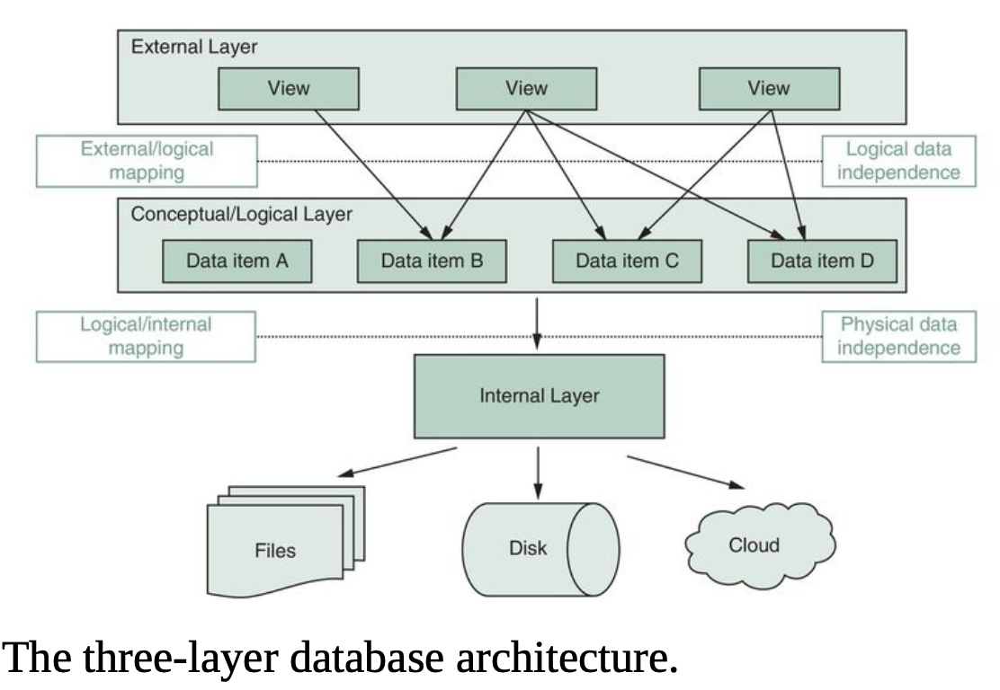
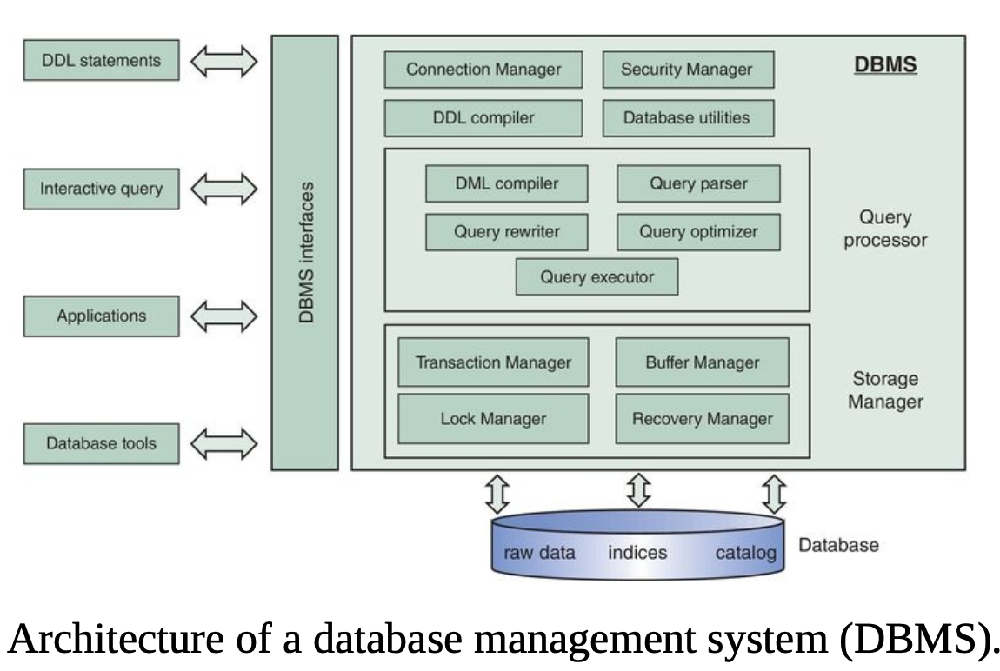
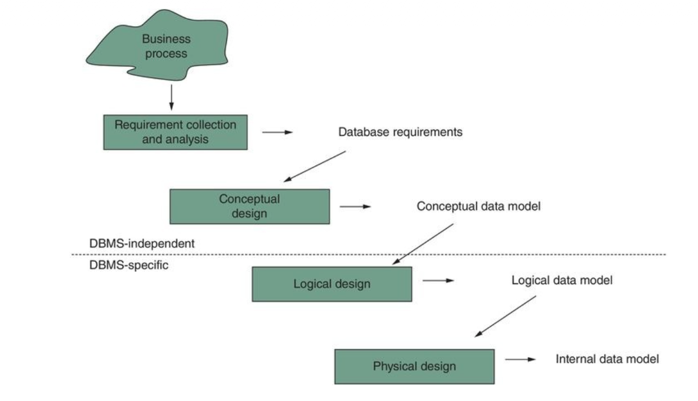
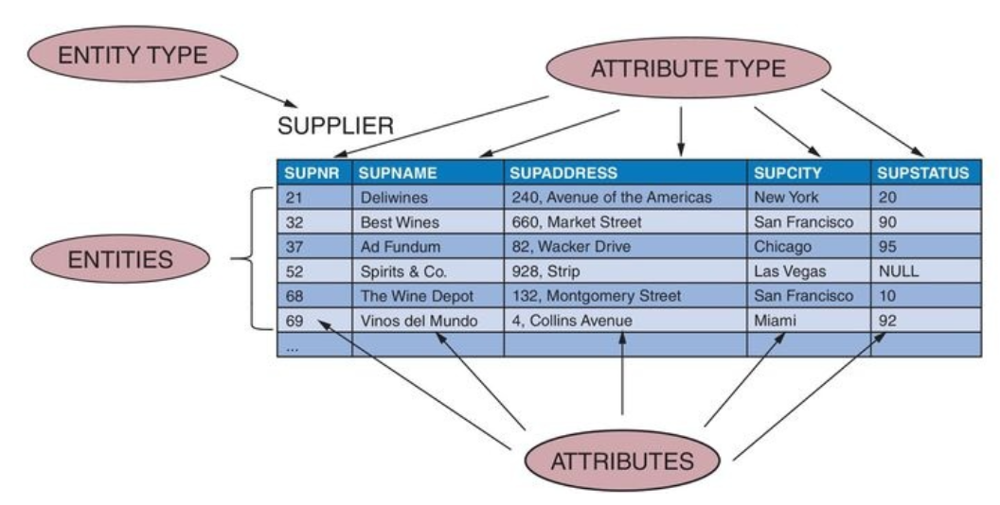
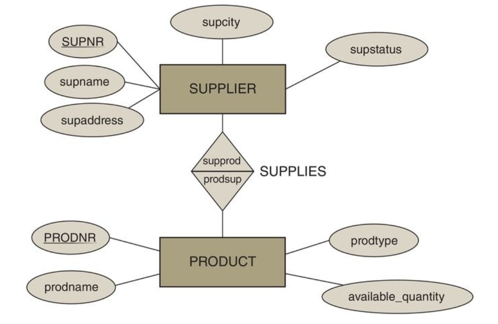
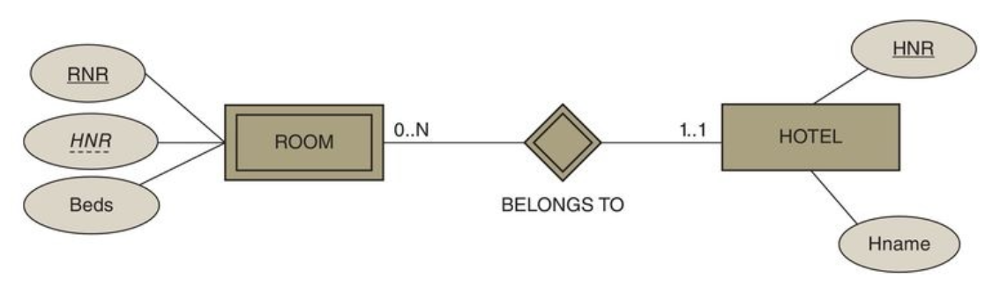
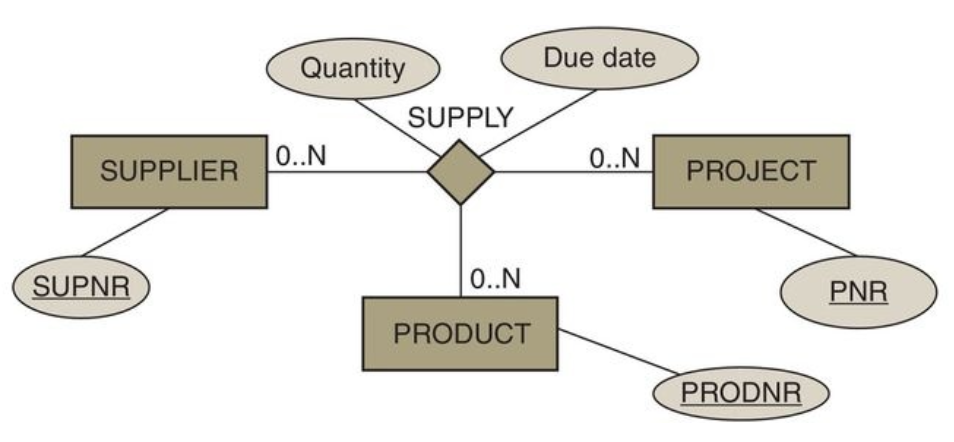
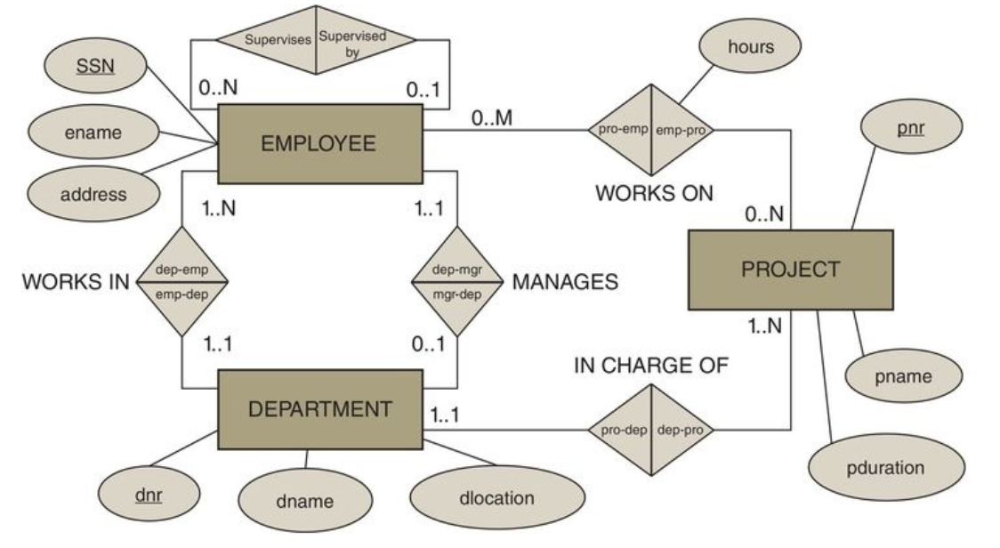
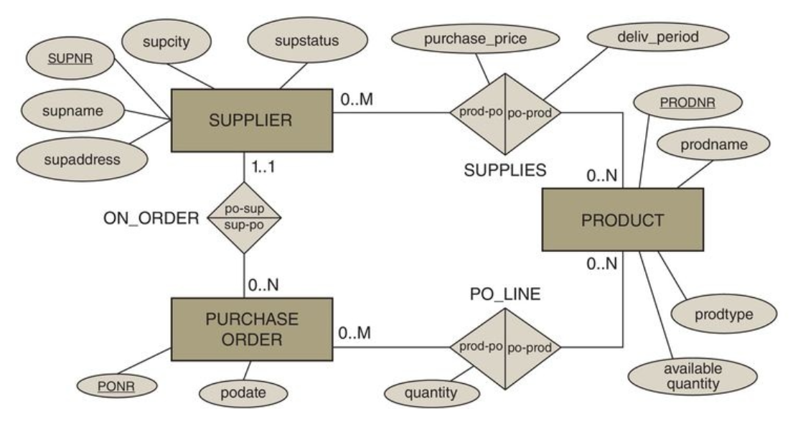

# Database Interview Notes

## Data Fundamentals

- **Database definition**: A structured collection of interrelated data, managed by a Database Management System (DBMS). It is designed for efficient storage, retrieval, and manipulation of data.
- **Data definition** (Ref: Principles of Database Management, Ch. 1): Raw, unprocessed facts representing events, entities, or measurements, captured as text, numbers, media, or logs.

> **Interview Tip:** When asked to define a database, always mention the DBMS. It's the software that makes the data useful and accessible. Highlighting the DBMS shows you understand the difference between a passive collection of files and an active, managed system.

- **Context matters**: The same value can mean different things depending on metadata (e.g., `42` as order quantity vs. department id).
- **Example**: A row `{"student_id": 17, "exam": "Normalization", "score": 92}` is data until we interpret it within grading rules or trends.

> **Interview Tip:** Expect to be asked to distinguish _data_ (facts) from _information_ (interpreted facts)—always mention metadata and context to earn full credit.

## Big Data Essentials

- **Definition**: Data whose size, speed, or diversity exceeds the capacity of conventional relational systems, requiring distributed storage/processing (Ch. 2).
- **Common triggers**: Real-time telemetry, clickstream analytics, IoT sensor fleets, multi-modal logs.
- **Example**: Storing and aggregating petabytes of mobile usage events per hour across regions pushes you toward Hadoop/Spark, not a single-instance OLTP DB.

> **Interview Tip:** When defining Big Data, describe _why_ traditional RDBMS scaling (vertical) fails and mention at least one distributed technology you would consider.

## Five Vs of Big Data

- **Volume**: Massive data quantities measured in TB/PB; drives storage partitioning.
- **Velocity**: High ingestion rates (streams, CDC feeds) that demand low-latency pipelines.
- **Variety**: Structured, semi-structured (JSON), and unstructured (audio, logs) formats.
- **Veracity**: Data quality/completeness; impacts model trust.
- **Value**: Business outcomes extracted through analytics; without it, the other Vs are cost.

> **Interview Tip:** Hiring managers often ask for trade-offs—tie each V to a design decision (e.g., velocity -> streaming platform) to show practical understanding.

## Data Analytics Lifecycle

- **Extract** sources (operational DBs, APIs) and land them in staging.
- **Transform & clean** using SQL, Spark, or Pandas to normalize formats and fix anomalies.
- **Analyze** with statistical models or rule-based scoring to answer business questions.
- **Visualize & communicate** insights via dashboards or alerts for decision-makers.
- **Iterate**: Incorporate feedback, refresh questions, and recalibrate pipelines.

> **Interview Tip:** Highlight tooling with verbs (“ingest via Airflow, cleanse in dbt, model in Python”) to demonstrate end-to-end ownership.

## Data ➜ Information ➜ Knowledge ➜ Decisions

- **Data**: Facts captured at the source (sensor reading `temp=88°F`).
- **Information**: Data plus context/aggregation (average oven temp per batch).
- **Knowledge**: Patterns or rules derived from information (temps above 85°F shorten shelf life).
- **Predictions/Decisions**: Actions informed by knowledge (lower oven setting to 82°F to reduce waste).

> **Interview Tip:** Map this chain to a concrete situation from your experience; quantifying the decision’s impact shows business acumen.

## A Brief History of Data Storage

- **Punched Cards**: One of the earliest forms of data storage, punched cards represent data using holes in predefined positions on a piece of cardstock. They were instrumental in the early days of computing and were used for data input, output, and storage. Herman Hollerith's use of punched cards to process the 1890 U.S. Census is a famous example of their success.

- **Magnetic Tape**: Replacing punched cards as the primary storage medium in the 1960s, magnetic tape offered higher storage capacity and faster access speeds. Data is stored on a long strip of plastic film with a magnetic coating. While sequential access is a limitation, tape is still used today for data archiving and backups due to its low cost and high capacity.

> **Interview Tip:** While you won't be asked to design a system using punched cards, showing awareness of the historical evolution of data storage (from cards to tape to disks to cloud) demonstrates a broader understanding of the field. Mentioning the trade-offs of each technology (e.g., cost, capacity, speed, access method) will impress interviewers.

## Types of Databases

- **Relational Databases (SQL)**:

  - **Structure**: Data is organized in tables with rows and columns, and relationships between tables are maintained using keys.
  - **Use Cases**: Best for structured data and applications requiring strong consistency (ACID compliance), such as financial systems, e-commerce platforms, and transactional applications.
  - **Examples**: MySQL, PostgreSQL, Oracle, SQL Server.

- **NoSQL Databases (Non-Relational)**: A category of databases that do not use the traditional table-based relational model. They are built for scalability, flexibility, and speed.

  - **Document Databases**: Store data in flexible, JSON-like documents.
    - **Use Cases**: Content management, mobile apps, and applications with rapidly evolving schemas.
    - **Examples**: MongoDB, Couchbase.
  - **Key-Value Stores**: The simplest NoSQL databases, storing data as a collection of key-value pairs.
    - **Use Cases**: Caching, session management, and real-time bidding.
    - **Examples**: Redis, Amazon DynamoDB.
  - **Wide-Column Stores**: Store data in columns instead of rows, which is efficient for querying large datasets.
    - **Use Cases**: Big data analytics, time-series data, and IoT applications.
    - **Examples**: Apache Cassandra, HBase.

- **Graph Databases**:
  - **Structure**: Use nodes to store entities and edges to store relationships between entities.
  - **Use Cases**: Ideal for applications that need to model and query complex relationships, such as social networks, recommendation engines, and fraud detection.
  - **Examples**: Neo4j, Amazon Neptune.

> **Interview Tip:** Be prepared to discuss the trade-offs between different database types. A common interview question is "What database would you choose for [scenario]?" Frame your answer around the specific requirements of the scenario, such as data structure, scalability needs, and consistency guarantees. For example, for a social media feed, you might suggest a graph database for the social network and a wide-column store for the activity feed.

## File-Based vs. Database Approach

### The File-Based Approach

In a file-based approach, data is stored in discrete files (e.g., `.txt`, `.csv`), and is accessed by application programs that read and write to these files.

**Drawbacks:**

- **Data Redundancy and Inconsistency**: The same data may be duplicated across multiple files, leading to inconsistencies if one file is updated and the others are not.
- **Data Isolation**: Data is scattered across different files, making it difficult to access and query data from multiple files simultaneously.
- **Data Dependence**: Applications are tightly coupled to the file structure. Any change to the file format requires changes to the application code.
- **Lack of Concurrency Control**: Managing simultaneous access by multiple users is difficult and can lead to data corruption.
- **Limited Security**: It's hard to enforce granular security policies. Access is often controlled at the file level (all or nothing).

### The Database Approach

The database approach uses a Database Management System (DBMS) to manage a central repository of data. The DBMS provides a unified interface for storing, retrieving, and managing data.

**Benefits:**

- **Centralized Data Management**: Reduces data redundancy and improves consistency.
- **Data Independence**: The DBMS separates the logical view of the data from its physical storage, so changes to the physical storage do not affect application code.
- **Concurrency Control**: The DBMS handles concurrent access to ensure data integrity.
- **Improved Security**: The DBMS provides mechanisms for access control and authentication.
- **Data Integrity**: The DBMS can enforce constraints to ensure the data is accurate and consistent.

> **Interview Tip:** While the database approach is superior in most cases, be prepared to acknowledge scenarios where a file-based approach is acceptable. For simple, single-user applications with a small amount of data (e.g., configuration files, logs), a file-based approach can be a simpler and more lightweight solution. Showing this nuance demonstrates practical judgment.

## Elements of a Database System

### Database Model (Schema) vs. Instance

- **Database Model (Schema)**: The blueprint of the database. It defines the structure of the data, including the tables, columns, data types, and the relationships between them. The schema is static and does not contain any actual data.

- **Database Instance**: A snapshot of the data in the database at a specific point in time. It is the actual data stored in the database, and it changes as data is added, updated, and deleted.

> **Interview Tip:** A great analogy is the blueprint of a house versus the house itself. The blueprint is the **schema**: it defines the structure, but you can't live in it. The house with all its furniture and people is the **instance**: it's the real-world implementation of the blueprint, and its contents change over time. Using this analogy shows you have a clear and intuitive understanding of the concept.

### Database Data Models

A data model defines the logical structure of a database. The most common data models are:

- **Relational Model**: The most widely used model. Data is stored in tables (relations), and relationships are represented by common columns between tables.
- **Hierarchical Model**: Organizes data in a tree-like structure with a single root. Each record has one parent and can have multiple children.
- **Network Model**: An extension of the hierarchical model, allowing a record to have multiple parent and child records, forming a graph-like structure.
- **Object-Oriented Model**: Data is represented as objects, with properties and methods, similar to object-oriented programming.

> **Interview Tip:** While it's good to be aware of the different data models, the relational model is by far the most dominant in the industry for structured data. For most interviews, a deep understanding of the relational model and a high-level awareness of NoSQL models will be sufficient.

### Three-Schema Architecture

The three-schema architecture (also known as the three-level architecture) provides a framework for modern database design. It separates the user's view of the database from the physical storage of the database.

- **External Level (View Level)**: The highest level of abstraction. It defines how a particular user or group of users sees the data. There can be multiple external views for a single database.
- **Conceptual Level (Logical Level)**: A unified view of the entire database. It describes what data is stored and the relationships between the data, without getting into the physical storage details.
- **Internal Level (Physical Level)**: The lowest level of abstraction. It describes how the data is physically stored on the storage medium.

> **Interview Tip:** The key takeaway of the three-schema architecture is **data independence**. There are two types:
>
> 1.  **Logical Data Independence**: Changes to the conceptual schema (e.g., adding a new table) do not require changes to the external schemas.
> 2.  **Physical Data Independence**: Changes to the internal schema (e.g., changing the storage method) do not require changes to the conceptual schema.
>     Mentioning both types of data independence shows a deep understanding of the benefits of this architecture.

### Database Catalog

The database catalog (also known as the data dictionary or system catalog) is the "database of the database". It's a metadata repository that contains information about all the objects in the database, such as:

- Table and view definitions
- Column names and data types
- Index definitions
- User permissions
- Stored procedures

The DBMS uses the catalog to understand the structure of the database and to process queries.

> **Interview Tip:** A simple analogy for the database catalog is a library catalog. You wouldn't search the entire library for a book; you'd start with the catalog to find out where the book is located. Similarly, the DBMS uses the database catalog to efficiently locate and manage data.

### Types of Database Users

Database users can be categorized by their level of expertise and how they interact with the system:

- **Database Administrator (DBA)**: The most privileged user, responsible for managing the entire database system. This includes security, backups, performance tuning, and user management.
- **Application Programmers**: Developers who write applications that interact with the database. They typically use a programming language and a library (like JDBC or an ORM) to access the data.
- **Sophisticated Users**: Users who are comfortable writing their own queries in a language like SQL to directly access the database for analysis or reporting.
- **Naive/End-Users**: The majority of users, who interact with the database through pre-built applications with graphical user interfaces. They don't need to know anything about the underlying database.

> **Interview Tip:** When discussing database users, the role of the DBA is often a key focus. Be prepared to talk about the responsibilities of a DBA, such as ensuring data availability, security, and recoverability. This shows you understand the operational side of database management.

### Database Languages

Database languages are used to read, store, and update data in a database. They are often grouped into the following categories, which are all part of SQL:

- **Data Definition Language (DDL)**: Used to define and manage the database structure.

  - `CREATE`: Creates database objects (e.g., `CREATE TABLE`).
  - `ALTER`: Modifies the structure of database objects (e.g., `ALTER TABLE`).
  - `DROP`: Deletes database objects (e.g., `DROP TABLE`).

- **Data Manipulation Language (DML)**: Used to manipulate the data within the database.

  - `SELECT`: Retrieves data from the database.
  - `INSERT`: Adds new data to the database.
  - `UPDATE`: Modifies existing data in the database.
  - `DELETE`: Removes data from the database.

- **Data Control Language (DCL)**: Used to control access to the database.

  - `GRANT`: Gives user access privileges.
  - `REVOKE`: Removes user access privileges.

- **Transaction Control Language (TCL)**: Used to manage transactions in the database.
  - `COMMIT`: Saves the work done in a transaction.
  - `ROLLBACK`: Undoes the work done in a transaction.

> **Interview Tip:** SQL (Structured Query Language) is the standard language for relational databases and encompasses all four of these categories. While different databases may have their own procedural extensions to SQL (like PL/SQL for Oracle or T-SQL for SQL Server), a strong foundation in standard SQL is a must-have skill for almost any data-related role.

## DBMS Architecture

A Database Management System (DBMS) architecture defines the design and layout of a database. It describes how the system is constructed, how its components are connected, and how data flows between them. A well-defined architecture is crucial for ensuring data integrity, security, performance, and scalability.

### Core Components of a DBMS

A typical DBMS is not a single, monolithic entity but a collection of interconnected components, each with a specific responsibility. The two main components are:

- **Query Processor**: This is the "brain" of the DBMS. It accepts queries from the user, parses them, optimizes them for efficient execution, and then dispatches them to the storage manager.
- **Storage Manager**: This is the "engine room" of the DBMS. It is responsible for the interaction with the physical database. It handles the storage, retrieval, and management of data on the storage devices.

These two high-level components are composed of several smaller, specialized modules:

- **Connection and Security Manager**: Authenticates users, manages sessions, and enforces security constraints.
- **DDL Compiler**: Compiles Data Definition Language (DDL) statements (like `CREATE TABLE`) into a set of table definitions in the database catalog.
- **DML Compiler**: Compiles Data Manipulation Language (DML) statements (like `SELECT`, `INSERT`, `UPDATE`, `DELETE`) into a query plan.
- **Query Parser and Rewriter**: Parses the query syntax and rewrites it into a more efficient internal representation.
- **Query Optimizer**: Analyzes the query and generates the most efficient execution plan. This is one of the most critical components for performance.
- **Query Executor**: Executes the chosen query plan and returns the results to the user.
- **Transaction Manager**: Ensures that transactions are executed in an atomic, consistent, isolated, and durable (ACID) manner.
- **Buffer Manager**: Manages the transfer of data between the main memory (buffer pool) and the secondary storage (disk).
- **Lock Manager**: Manages concurrent access to the database by using locks to prevent conflicting operations.
- **Recovery Manager**: Ensures that the database can be restored to a consistent state after a failure.

> **Interview Tip:** When asked about DBMS architecture, don't just list the components. Explain how they interact. For example, describe the journey of a SQL query: it's parsed by the query parser, optimized by the query optimizer, executed by the query executor, which in turn requests data from the storage manager. This shows a deeper understanding of the process.

### DBMS Utilities

DBMS utilities are a set of tools or programs that help in the day-to-day management and maintenance of a database. They are essential for database administrators (DBAs) to ensure the database is running smoothly. Common types of utilities include:

- **Loading Utilities**: Used to load data from external files (e.g., CSV, text files) into the database.
- **Backup and Recovery Utilities**: Used to create backups of the database and to restore the database from a backup in case of a failure.
- **Performance Monitoring Utilities**: Used to monitor the performance of the database and to identify bottlenecks.
- **Security Utilities**: Used to manage user accounts and permissions.
- **Reorganization Utilities**: Used to reorganize the data in the database to improve performance.
- **Data Export/Import Utilities**: Used to move data between different databases or between a database and an external file.

> **Interview Tip:** When asked about DBMS utilities, it's good to mention a few examples of utilities for a specific DBMS you are familiar with. For example, for PostgreSQL, you could mention `pg_dump` for backups, `pg_restore` for recovery, and `EXPLAIN` for query analysis. This shows practical knowledge.

### DBMS Interfaces

A DBMS interface is a component of the DBMS that allows users to interact with the database. There are several types of interfaces, designed for different types of users and tasks.

- **Command-Line Interface (CLI)**: A text-based interface where users type commands to interact with the database. This is a powerful and flexible interface, often preferred by developers and database administrators.
- **Graphical User Interface (GUI)**: A user-friendly interface that uses graphical elements like windows, menus, and buttons. This type of interface is suitable for users who are not familiar with command-line tools.
- **Programmatic Interfaces (APIs)**: These are interfaces for developers to use in their applications to interact with the database. Examples include JDBC (for Java), ODBC (for many languages), and other database-specific drivers.
- **Natural Language Interface**: An interface that allows users to interact with the database using a natural language (like English).
- **Forms-Based Interface**: An interface where users interact with the database by filling out forms. This is common in web applications.

> **Interview Tip:** When discussing DBMS interfaces, it's important to understand the trade-offs between different types of interfaces. For example, a CLI is powerful and flexible, but it has a steeper learning curve than a GUI. A GUI is easier to use, but it may not be as powerful or flexible as a CLI.

## Categorization of DBMSs

Database Management Systems (DBMS) can be classified in several ways, depending on the criteria used. Understanding these categorizations is important for choosing the right DBMS for a given application.

### Based on Data Model

The most common way to classify a DBMS is by the data model it supports. The data model defines the logical structure of the database.

- **Relational Model (RDBMS)**: Data is stored in tables (relations) with rows and columns. This is the most widely used model for structured data and applications requiring strong consistency (ACID). Examples: MySQL, PostgreSQL, SQL Server.
- **NoSQL Models**: A category of databases that are non-relational and are built for scalability and flexibility. They are ideal for large volumes of unstructured or semi-structured data.
  - **Document Databases**: Store data in flexible, JSON-like documents. Examples: MongoDB, Couchbase.
  - **Key-Value Stores**: Store data as key-value pairs. Examples: Redis, Amazon DynamoDB.
  - **Wide-Column Stores**: Store data in columns instead of rows. Examples: Apache Cassandra, HBase.
  - **Graph Databases**: Use nodes and edges to represent and store data, focusing on relationships. Examples: Neo4j, Amazon Neptune.
- **Object-Oriented Model**: Data is stored as objects, with attributes and methods.
- **Hierarchical Model**: Data is organized in a tree-like structure.
- **Network Model**: An extension of the hierarchical model that allows many-to-many relationships.

> **Interview Tip:** Be prepared to discuss the trade-offs between different data models. A common interview question is "What database would you choose for [scenario]?" Frame your answer around the specific requirements of the scenario, such as data structure, scalability needs, and consistency guarantees.

### Based on Degree of Simultaneous Access

This categorization is based on the number of users that can access the database at the same time.

- **Single-User DBMS**: Only one user can access the database at a time. This is suitable for personal use or embedded systems.
- **Multi-User DBMS**: Multiple users can access the database concurrently. This is the standard for most modern applications and requires a robust concurrency control mechanism.

> **Interview Tip:** When discussing multi-user systems, be prepared to talk about concurrency control mechanisms like locking and multi-version concurrency control (MVCC). This shows you understand the challenges of concurrent access.

### Based on Architecture

This categorization is based on how the DBMS is distributed.

- **Centralized DBMS**: The database and DBMS software reside at a single site.
- **Distributed DBMS**: The database and DBMS software are distributed across multiple sites connected by a network.
- **Cloud Databases**: The database is hosted on a cloud platform (e.g., AWS, Azure, GCP).
- **On-Premises Databases**: The database is hosted on local servers within an organization.
- **Hybrid Databases**: A combination of cloud and on-premises hosting.

> **Interview Tip:** The trend is moving towards cloud and hybrid databases. Be familiar with the advantages and disadvantages of each approach, such as cost, scalability, security, and control.

### Based on Usage

This categorization is based on the type of workload the DBMS is designed for.

- **Online Transaction Processing (OLTP)**: Optimized for a large number of short, atomic transactions (e.g., e-commerce orders, bank transactions).
- **Online Analytical Processing (OLAP)**: Optimized for complex queries and data analysis (e.g., business intelligence, data warehousing).
- **Time-Series Databases**: Optimized for storing and querying time-stamped data (e.g., IoT sensor data, financial data).

> **Interview Tip:** Understanding the difference between OLTP and OLAP is crucial. Be able to explain the different requirements of each type of system, such as response time, data volume, and query complexity.

## Phases of Database Design

The process of designing a database is typically divided into several phases. Each phase focuses on a different level of abstraction, moving from a high-level conceptual model to a detailed physical implementation.

- **Requirements Collection and Analysis**: The first step is to understand the data requirements of the end-users. This involves interviewing users, studying existing documentation, and understanding the business processes. The output of this phase is a set of user requirements.

- **Conceptual Design**: In this phase, the requirements are translated into a conceptual schema, which is a high-level description of the data to be stored in the database. The Entity-Relationship (ER) model is a popular tool for conceptual design. The conceptual schema is independent of the choice of DBMS.

- **Logical Design (Data Model Mapping)**: The conceptual schema is mapped to a logical model that is specific to a class of DBMS (e.g., relational, NoSQL). For a relational DBMS, this involves converting the ER model into a set of tables with their associated constraints.

- **Physical Design**: This phase deals with the physical implementation of the database. It involves decisions about how the data is stored on disk, the creation of indexes, and other performance-tuning measures. The physical design is specific to the chosen DBMS.

> **Interview Tip:** A common interview question is to describe the phases of database design. Be sure to emphasize the distinction between the conceptual, logical, and physical design phases. A good answer will also mention the tools and models used in each phase (e.g., ER model for conceptual design).

## Entity-Relationship (ER) Model

The Entity-Relationship (ER) Model is a high-level, conceptual data model that is used to represent the structure of a database. It was developed by Peter Chen and is a graphical representation of the entities in a database and the relationships between them. The ER model is a crucial tool in the conceptual design phase of a database.

The main components of the ER model are:

- **Entities**: Real-world objects or concepts that can be uniquely identified (e.g., a student, a course, a department).
- **Attributes**: Properties that describe an entity (e.g., a student's name, age, and major).
- **Relationships**: Associations between two or more entities (e.g., a student enrolls in a course).

The ER model provides a simple and clear way to visualize the structure of a database, which makes it an effective communication tool between database designers and end-users.

> **Interview Tip:** When asked about the ER model, be sure to mention that it is a **conceptual** model, meaning it is independent of the specific database technology being used. This is a key distinction. Also, be prepared to draw a simple ER diagram for a given scenario.

### Entity Types

An **entity type** (or entity set) is a collection of similar entities. It's a template for a set of entities that have the same attributes. In an ER diagram, an entity type is represented by a rectangle.

- **Entity**: A single, uniquely identifiable object in the real world. For example, a specific student named "John Smith" is an entity.
- **Entity Type**: A collection of entities with the same attributes. For example, "STUDENT" is an entity type.

Think of an entity type as a noun. It's a person, place, thing, or concept.

**Example**:

- **Entity Type**: `STUDENT`
- **Entities**: The individual students in a university, such as "John Smith", "Jane Doe", etc.

> **Interview Tip:** The distinction between an entity and an entity type is fundamental. An entity is a specific instance, while an entity type is the general category. A good analogy is a class and an object in object-oriented programming: the entity type is the class, and the entity is the object.

### Attribute Types

An **attribute** is a property or characteristic of an entity type. It describes the entity and provides more information about it. In an ER diagram, attributes are represented by ovals connected to their entity type.

For example, for the `STUDENT` entity type, the attributes could be `StudentID`, `Name`, `DateOfBirth`, and `Major`.

There are several types of attributes:

- **Simple vs. Composite**:
  - **Simple (or Atomic) Attribute**: An attribute that cannot be divided into smaller components. For example, `StudentID`.
  - **Composite Attribute**: An attribute that can be broken down into smaller, meaningful parts. For example, the `Name` attribute could be a composite attribute consisting of `FirstName`, `MiddleName`, and `LastName`.

- **Single-Valued vs. Multi-Valued**:
  - **Single-Valued Attribute**: An attribute that can have only one value for each entity. For example, `StudentID`.
  - **Multi-Valued Attribute**: An attribute that can have multiple values for a single entity. For example, a `PhoneNumber` attribute for a student, as a student can have more than one phone number.

- **Stored vs. Derived**:
  - **Stored Attribute**: An attribute whose value is stored directly in the database. For example, `DateOfBirth`.
  - **Derived Attribute**: An attribute whose value can be calculated or derived from another attribute. For example, the `Age` of a student can be derived from their `DateOfBirth`. Derived attributes are not stored in the database.

> **Interview Tip:** When designing a database schema, the choice of attribute types can have a significant impact on data integrity and query performance. Be prepared to discuss the trade-offs of using different attribute types. For example, while a composite attribute can be useful for detailed queries, it can also make data entry more complex.

### Domains

The **domain** of an attribute is the set of all possible values that the attribute can have. It's a constraint on the values that can be assigned to an attribute.

For example:

- The domain of the `Grade` attribute could be the set of single characters: `{'A', 'B', 'C', 'D', 'F'}`.
- The domain of the `Gender` attribute could be `{'Male', 'Female', 'Other'}`.
- The domain of a `Month` attribute could be the set of integers from 1 to 12.

Defining domains for attributes is crucial for maintaining data integrity. It ensures that only valid and meaningful values are stored in the database.

> **Interview Tip:** In practical terms, the domain of an attribute is enforced by its data type (e.g., `INT`, `VARCHAR`, `BOOLEAN`) and any additional constraints (e.g., `CHECK` constraints, `FOREIGN KEY` constraints). When asked about data integrity, mentioning the use of domains to restrict attribute values is a great way to demonstrate your understanding.

### Key Attribute Types

A **key** is an attribute or a set of attributes that uniquely identifies an entity within an entity set. Keys are fundamental to the relational model and are used to establish and enforce relationships between tables.

- **Super Key**: A set of one or more attributes that, taken collectively, can uniquely identify an entity in an entity set.
- **Candidate Key**: A minimal super key. It's a super key with no redundant attributes. An entity set can have multiple candidate keys.
- **Primary Key**: The candidate key that is chosen by the database designer to uniquely identify entities in an entity set. A primary key cannot have null values. In an ER diagram, the primary key attribute is usually underlined.
- **Alternate Key**: Any candidate key that is not chosen as the primary key.
- **Foreign Key**: An attribute or a set of attributes in one table that refers to the primary key of another table. Foreign keys are used to link tables together and enforce referential integrity.

**Example**:

Consider a `STUDENT` entity type with attributes `StudentID`, `SSN`, `Name`, and `Email`.

- **Super Keys**: `(StudentID)`, `(SSN)`, `(Email)`, `(StudentID, Name)`, `(SSN, Name)`, etc.
- **Candidate Keys**: `(StudentID)`, `(SSN)`, `(Email)` (assuming they are all unique).
- **Primary Key**: `(StudentID)` (chosen by the designer).
- **Alternate Keys**: `(SSN)`, `(Email)`.

> **Interview Tip:** Understanding the different types of keys is crucial for database design and normalization. Be prepared to explain the difference between a super key, a candidate key, and a primary key. A common interview question is to identify the candidate keys and choose a primary key for a given set of attributes.

### Relationship Types

A **relationship type** is an association between two or more entity types. It represents a real-world connection between the entities. In an ER diagram, a relationship type is represented by a diamond shape.

- **Relationship Instance**: A specific association between entities. For example, student "John Smith" enrolling in course "CS101" is a relationship instance.
- **Relationship Type**: A set of similar relationship instances. For example, `ENROLLS` is a relationship type that associates `STUDENT` entities with `COURSE` entities.

Think of a relationship type as a verb that connects two or more nouns (entity types).

**Example**:

- **Entity Types**: `STUDENT`, `COURSE`
- **Relationship Type**: `ENROLLS`
- **Meaning**: A student enrolls in a course.

> **Interview Tip:** When modeling a database, identifying the relationships between entities is just as important as identifying the entities themselves. A common mistake is to create a system with many entities but poorly defined relationships. Always think about how the entities are connected and what business rules those connections represent.

### Degrees and Roles

The **degree** of a relationship type is the number of participating entity types.

- **Unary (or Recursive) Relationship**: A relationship between instances of a single entity type. For example, an `EMPLOYEE` entity type might have a `SUPERVISES` relationship where one employee supervises another.
- **Binary Relationship**: A relationship between two different entity types. This is the most common type of relationship. For example, a `STUDENT` enrolls in a `COURSE`.
- **Ternary Relationship**: A relationship between three different entity types. For example, a `DOCTOR` prescribes a `MEDICATION` to a `PATIENT`.

**Roles** are used to clarify the meaning of a relationship when the participating entity types are not distinct. In a unary relationship, roles are essential to specify how the entity type participates in the relationship.

**Example**:

In a `SUPERVISES` relationship on the `EMPLOYEE` entity type, an employee can participate in two roles:

- **Supervisor**: The employee who supervises.
- **Supervisee**: The employee who is supervised.

> **Interview Tip:** While binary relationships are the most common, be prepared to discuss and model unary and ternary relationships. A classic example of a unary relationship is an employee supervising another employee. For ternary relationships, a common example is a supplier providing a part to a project.

### Cardinalities

**Cardinality** specifies the number of instances of one entity that can be associated with each instance of another entity. It's a constraint that defines the business rules of a relationship.

There are four main types of cardinality for binary relationships:

- **One-to-One (1:1)**: Each entity in the first entity set can be associated with at most one entity in the second entity set, and vice versa.
  - **Example**: A `PERSON` has one `PASSPORT`, and a `PASSPORT` is issued to one `PERSON`.

- **One-to-Many (1:N)**: Each entity in the first entity set can be associated with many entities in the second entity set, but each entity in the second entity set can be associated with at most one entity in the first.
  - **Example**: A `MOTHER` can have many `CHILDREN`, but each `CHILD` has only one `MOTHER`.

- **Many-to-One (N:1)**: Many entities in the first entity set can be associated with at most one entity in the second entity set, but each entity in the second entity set can be associated with many entities in the first.
  - **Example**: Many `STUDENTS` can enroll in one `COURSE`.

- **Many-to-Many (M:N)**: Each entity in the first entity set can be associated with many entities in the second entity set, and vice versa.
  - **Example**: A `STUDENT` can enroll in many `COURSES`, and a `COURSE` can have many `STUDENTS`.

In addition to cardinality, **participation constraints** (also known as **optionality**) specify whether the existence of an entity depends on its being related to another entity.

- **Total Participation (Mandatory)**: Every entity in the entity set must participate in at least one relationship instance. This is represented by a double line in some notations.
- **Partial Participation (Optional)**: Not all entities in the entity set need to participate in a relationship. This is represented by a single line.

> **Interview Tip:** Cardinality and participation are critical for accurately modeling business rules. Be prepared to explain the different types of cardinality and participation and to apply them to a given scenario. A common interview question is to model a situation like a library system, where you need to define the relationships between books, members, and loans, including their cardinalities.

### Relationship Attribute Types

A relationship type can also have attributes. These are called **descriptive attributes**. They are used to record information about the relationship itself.

This is most common in many-to-many relationships. For a one-to-many relationship, any attribute of the relationship can usually be moved to the entity on the "many" side.

**Example**:

Consider the many-to-many relationship `ENROLLS` between `STUDENT` and `COURSE`. A student can enroll in many courses, and a course can have many students.

The `ENROLLS` relationship can have an attribute `Grade` that stores the grade a student received in a particular course. The `Grade` attribute belongs to the relationship, not to the `STUDENT` or the `COURSE` entity, because it describes the outcome of a specific student enrolling in a specific course.

> **Interview Tip:** When you have a many-to-many relationship in your ER model, always consider if there are any attributes that describe the relationship itself. These attributes will become columns in the new table that is created to resolve the many-to-many relationship when you convert the ER model to a relational schema.

### Weak Entity Types

A **weak entity type** is an entity type that does not have a primary key of its own. It cannot be uniquely identified by its attributes alone. To be identified, a weak entity must be associated with another entity type, called the **identifying** or **owner entity type**.

The relationship between a weak entity type and its owner is called an **identifying relationship**.

In ER diagrams, a weak entity type is represented by a double-lined rectangle, and the identifying relationship is represented by a double-lined diamond. The primary key of a weak entity is formed by the combination of the primary key of the owner entity and a **partial key** (also called a **discriminator**) of the weak entity type.

**Characteristics of a Weak Entity:**

- It is existence-dependent on its owner entity.
- It has a partial key that can uniquely identify the weak entity in the context of its owner.

**Strong Entity Type vs. Weak Entity Type:**

- **Strong Entity Type**: An entity type that has its own primary key.
- **Weak Entity Type**: An entity type that does not have its own primary key.

**Example**:

Consider an `EMPLOYEE` entity type and a `DEPENDENT` entity type. A dependent cannot exist without an employee. The `DEPENDENT` entity might have a partial key, such as `DependentName`, which is unique for each dependent of a particular employee.

- **Owner Entity Type**: `EMPLOYEE` (with primary key `EmployeeID`)
- **Weak Entity Type**: `DEPENDENT` (with partial key `DependentName`)
- **Primary Key of `DEPENDENT`**: (`EmployeeID`, `DependentName`)

> **Interview Tip:** Weak entities are a common source of confusion. The key takeaway is that a weak entity cannot exist on its own and needs an owner entity for its identification. When asked to model a scenario, look for entities whose existence depends on another entity. A classic example is `ORDER` and `ORDER_ITEM`. An `ORDER_ITEM` cannot exist without an `ORDER`.

### Ternary Relationship Types

A **ternary relationship** is a relationship that involves three entity types. While less common than binary relationships, they are necessary in some modeling scenarios where a relationship can only be described by involving three entities simultaneously.

**Example**:

Consider a scenario where a `DOCTOR` prescribes a `MEDICATION` to a `PATIENT`. This is a single event that involves all three entities. It cannot be broken down into binary relationships without losing information. For example, if you have two binary relationships (`DOCTOR` prescribes `MEDICATION`, and `PATIENT` takes `MEDICATION`), you can't tell which doctor prescribed which medication to which patient.

The ternary relationship `PREScribes` connects the three entity types: `DOCTOR`, `PATIENT`, and `MEDICATION`.

> **Interview Tip:** Ternary relationships can be tricky to model and to implement in a relational database. A common approach is to convert the ternary relationship into a new entity (called an associative entity) that has foreign keys to the three participating entities. When faced with a complex modeling problem, always consider if a ternary relationship is needed to accurately represent the situation.

### Examples of the ER Model

Seeing examples of ER models can help solidify the concepts. Here are a couple of real-world scenarios modeled using the ER model.

**1. HR Administration**

This ER model represents a simple HR system. It includes entities for `EMPLOYEE`, `DEPARTMENT`, and `PROJECT`, and relationships like `WORKS_FOR` and `MANAGES`.

**2. Purchase Order Administration**

This ER model shows a system for managing purchase orders. It includes entities for `CUSTOMER`, `ORDER`, `PRODUCT`, and `INVOICE`.

> **Interview Tip:** Being able to read and interpret an ER diagram is a critical skill. Practice by looking at different ER diagrams and trying to understand the business rules they represent. A common interview exercise is to be given an ER diagram and asked to explain the system it models.

### Limitations of the ER Model

While the ER model is a powerful tool for conceptual database design, it has some limitations:

- **Limited Constraint Representation**: The ER model can represent a wide range of constraints, but it cannot represent all of them. For example, it's difficult to model functional dependencies that are not related to keys.
- **No Data Manipulation Language**: The ER model is a static model that describes the structure of the database. It does not have a language for manipulating the data.
- **Focus on Relational Model**: The ER model is best suited for designing relational databases. It is not as effective for modeling other data models, such as NoSQL databases.
- **Subjectivity**: The process of creating an ER model can be subjective. Different designers may come up with different ER models for the same system, depending on their interpretation of the requirements.

> **Interview Tip:** While the ER model is a fundamental concept in database design, it's important to be aware of its limitations. In an interview, you can demonstrate a deeper understanding by discussing when you might need to use other modeling techniques or tools to supplement the ER model. For example, you might mention using a data flow diagram (DFD) to model the processes in a system, or using a more advanced modeling language like UML for object-oriented systems.
