# NoSQL Databases — Final Exam Reference

## Table of Contents
1. [NoSQL Overview](#1-nosql-overview)
2. [Key-Value Stores](#2-key-value-stores)
3. [Distributed Systems Concepts](#3-distributed-systems-concepts)
4. [Tuple Store vs Relational Model](#4-tuple-store-vs-relational-model)
5. [Document Stores & MongoDB](#5-document-stores--mongodb)
6. [MongoDB Queries](#6-mongodb-queries)
7. [Column-Oriented Databases](#7-column-oriented-databases)
8. [Quick Reference — MongoDB Shell](#8-quick-reference--mongodb-shell)

---

## 1. NoSQL Overview

**NoSQL** = "Not Only SQL" — databases that store/manipulate data in **non-tabular formats**. Born from the need to handle massive data volumes, horizontal scalability, and flexible schemas.

### Why NoSQL Emerged

RDBMSs are great for structured, consistent, medium-sized data — but struggle when:
- Data volume is enormous (Big Data)
- Schema evolves rapidly (sensor data, social feeds)
- Horizontal scaling across many nodes is needed
- High-frequency read/write requests are required

### NoSQL vs Relational — Comparison

| Property | Relational (RDBMS) | NoSQL |
|---|---|---|
| Data paradigm | Relational tables | Key-value, Document, Column, Graph |
| Distribution | Single-node or distributed | Mainly distributed |
| Scalability | **Vertical** (scale up hardware) | **Horizontal** (add more nodes) |
| Schema | Rigid, schema-driven | Schema-free or flexible |
| Query language | SQL | Simple API or special-purpose |
| Transaction model | **ACID** | **BASE** |
| Feature set | Rich (triggers, views, procedures) | Simple API |
| Data volume | Normal-sized datasets | Huge volumes, high freq. requests |
| Openness | Closed and open-source | Mainly open-source |

### NoSQL Categories

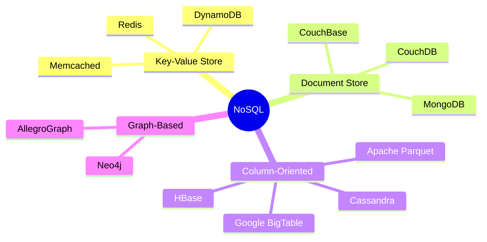

---

## 2. Key-Value Stores

A **key-value store** stores data as `(key, value)` pairs. Keys are **unique** and are the **sole search criterion** to retrieve the corresponding value.

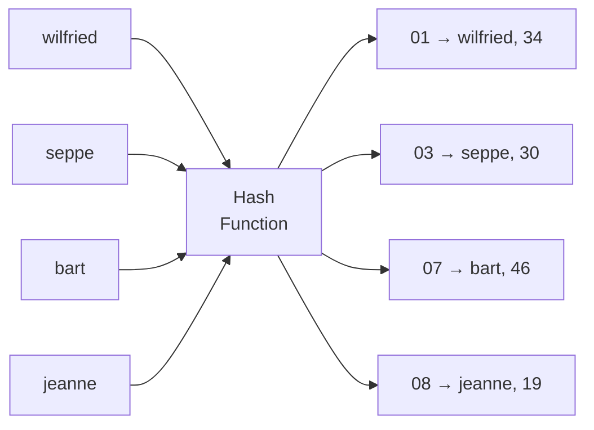

### Key Characteristics

- **Simple API:** typically just `put(key, value)` and `get(key)`
- **Opaque values:** the DBMS treats values as black boxes — cannot search by value content
- **No relationships** or referential integrity
- **No schema** — any new key-value pair is simply added
- All constraints/relationships managed **at the application level**

### Hash Function Properties

A **good hash function** must be:

| Property | Meaning |
|---|---|
| **Deterministic** | Same input → always same output |
| **Uniform** | Inputs spread evenly over output range (minimizes collisions) |
| **Defined size** | Output is fixed size (efficient storage, known address space) |

**Simple example:** `hash(bart) = 07` → stored at memory address 07. Lookup: compute `hash(bart)` → go to address 07 → retrieve value instantly.

---

## 3. Distributed Systems Concepts

### 3.1 Horizontal Scaling (Sharding)

When data outgrows a single machine, the hash table is **distributed across multiple servers** using the **modulo operator**:

```
index(hash) = mod(hash, nServers) + 1
```

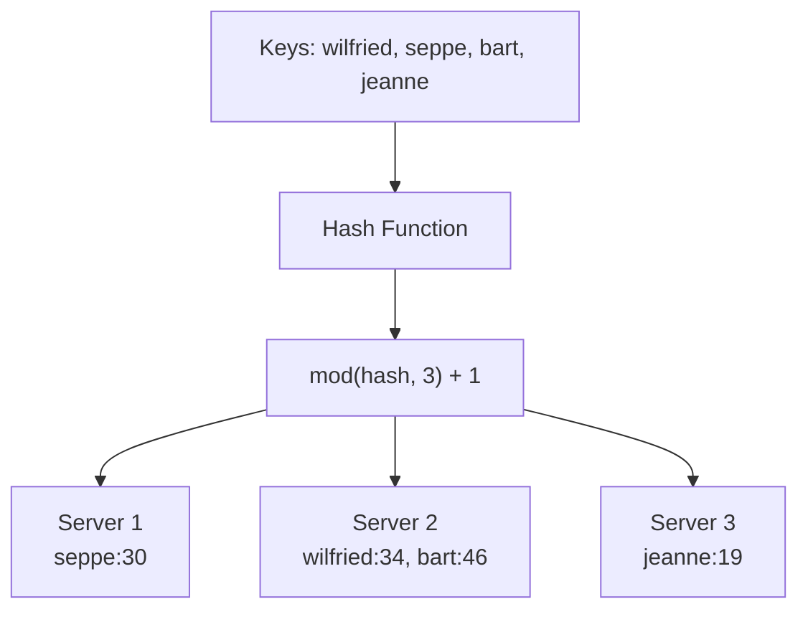

- Each partition is called a **shard**
- The practice of distributing is called **sharding**

**Problem with simple modulo hashing:**
When n changes (server added/removed), nearly all keys must be remapped:
- n=3 → n=4: `1 - n/k = 70%` of keys must move
- n=10 → n=11: `1 - 10/1000 = 99%` of all items move

---

### 3.2 Consistent Hashing

Consistent hashing uses a **ring topology** (number range [0,1]) to minimize key movement when nodes are added/removed.

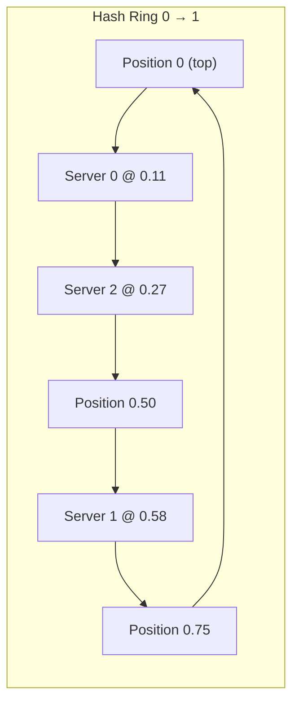

**How it works:**
1. Each **server** is hashed to a position on the ring
2. Each **key** is hashed to a position on the ring
3. The key is stored on the **first server clockwise** from its position

**Example:** Key 3 hashes to position 0.78 → stored on Server 0 (position 0.11, next clockwise)

**Benefit when adding a server:**
Only `k / (n + 1)` keys need to move — far better than modulo hashing.

**Benefit when removing a server:**
Only the keys that were on that server need to move to the next clockwise server.

---

### 3.3 Replication and Redundancy

**Virtual nodes (replicas):** Map each physical server to **r positions** on the ring.

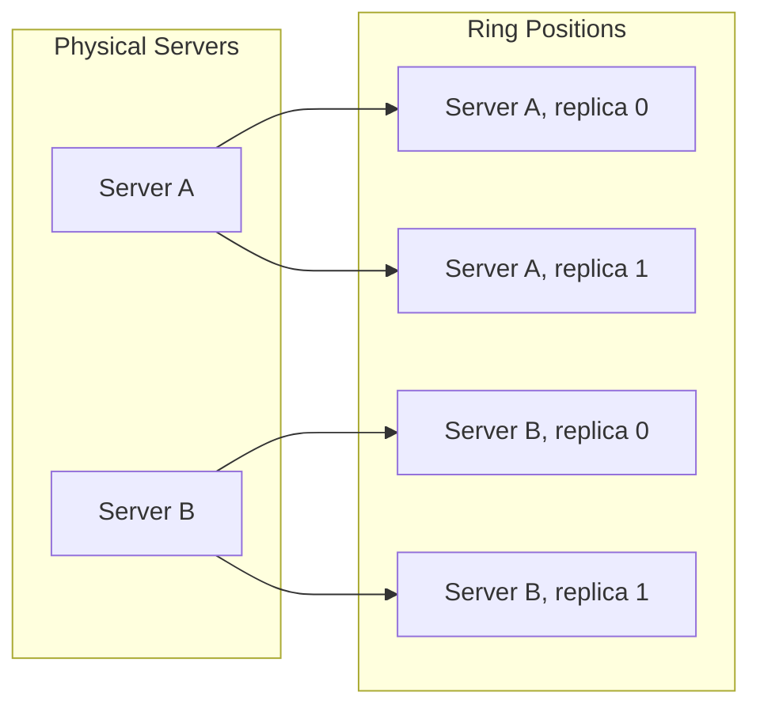

- **Virtual nodes ≠ data redundancy** — replicas of a server are the same physical machine
- Improves **uniformity** of key distribution across the ring
- Reduces the number of keys that must move when topology changes

**Data Replication (actual redundancy):**
Key-value pairs are duplicated on 2+ nodes clockwise from the key's position.
- Constraints can include: replicas must be on different physical machines or in different data centers

---

### 3.4 Request Coordination

In systems like Cassandra, DynamoDB, Redis:
- **Any node** can act as **request coordinator**
- Coordinator routes requests to the correct node and relays results to the client

**Membership protocol** — keeps all nodes informed about the network:
- **Dissemination** — gossip-like protocol; nodes exchange state pairwise periodically
- **Failure detection** — nodes that stop responding get marked as down and information spreads through the network

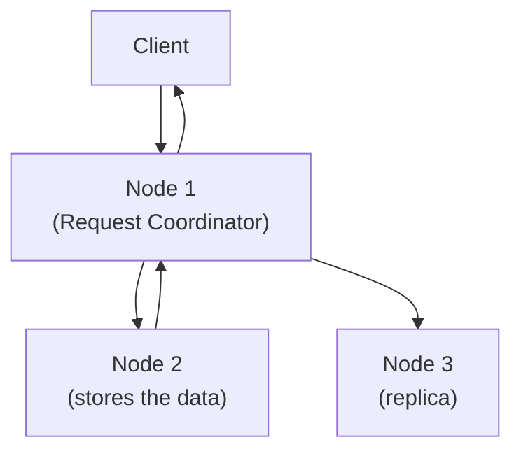

---

### 3.5 Eventual Consistency

**CAP Theorem** — A distributed system **cannot simultaneously guarantee** all three:

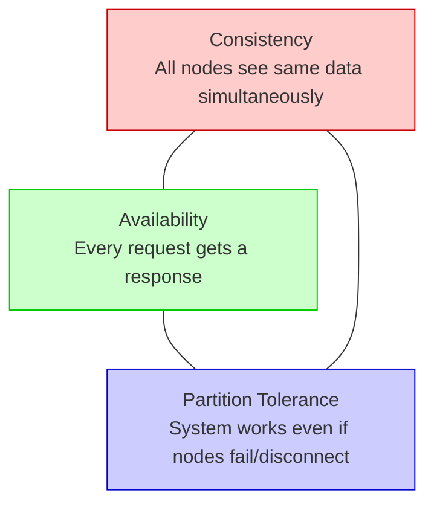

- **RDBMS:** Consistency + Availability (single node — no partition needed)
- **Distributed RDBMS:** Consistency + Partition Tolerance (may sacrifice availability)
- **Most NoSQL:** Availability + Partition Tolerance → **eventual consistency**

### ACID vs BASE

| ACID (Relational) | BASE (NoSQL) |
|---|---|
| **A**tomicity | **B**asically Available |
| **C**onsistency | **S**oft state |
| **I**solation | **E**ventually consistent |
| **D**urability | |

**BASE explained:**
- **Basically Available** — the system guarantees availability (every request gets a response)
- **Soft state** — the system's state can change over time even without new input (nodes continuously update each other)
- **Eventually consistent** — the system will become consistent over time once inputs stop, but at any given moment may have stale data

### Quorum Consistency

When writing, the coordinator can:
1. **Return immediately** after storing on one node
2. **Wait for one replica** to confirm
3. **Wait for all replicas** to confirm
4. **Wait for a quorum** (majority — at least ½ of replicas) — called **quorum consistency**

> **MongoDB is strongly consistent by default** — single-master system where all reads go to the primary node. Enabling reads from secondary nodes makes it eventually consistent.

---

### 3.6 Stabilization

When nodes are added/removed, keys must be **repartitioned** among nodes. This repartitioning is called **stabilization**.

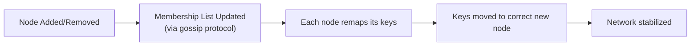

- Consistent hashing minimizes the number of key-to-node remaps
- A node being removed can only have its data deleted once it is confirmed at the new correct location
- Stabilization **takes time** — the network may be inconsistent during this period

---

## 4. Tuple Store vs Relational Model

### Tuple Store

A **tuple store** stores a unique key with a **vector of data** (unlabeled, ordered):

```
marc -> ("Marc", "McLast Name", 25, "Germany")
```

Collections (namespaces over keys):
```
Person:marc  -> ("Marc", "McLast Name", 25, "Germany")
Person:harry -> ("Harry", "Smith", 29, "Belgium")
Book:harry   -> ("Harry Potter", "J.K. Rowling")
```

Notice: `Person:harry` and `Book:harry` have different lengths — **schema-less**.

### Tuple Store vs Relational Model


| Feature | Relational Model | Tuple/Document Store |
|---|---|---|
| Schema | Fixed, enforced | Schema-less |
| Row structure | Uniform (same columns) | Variable (different lengths) |
| Relationships | Foreign keys, joins | None — application-managed |
| Referential integrity | Enforced by DBMS | Not enforced |
| Query richness | Full SQL | Simple get/put or filters |
| Null handling | Null values stored | Missing attributes simply absent |

---

## 5. Document Stores & MongoDB

### 5.1 Evolution from Tuple to Document Store

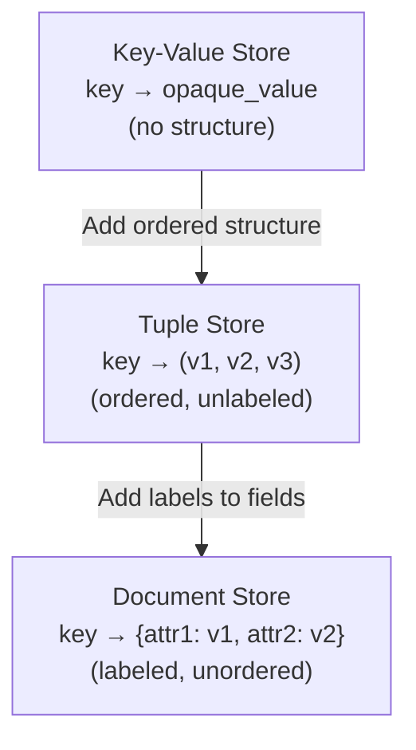

A **document store** stores labeled, unordered attribute collections (**semi-structured**). Unlike tuples, fields are named. Most use **JSON** (JavaScript Object Notation).

### 5.2 JSON Document Structure

```json
{
    "_id": "hp_001",
    "title": "Harry Potter",
    "authors": ["J.K. Rowling"],
    "price": 32.00,
    "genres": ["fantasy"],
    "dimensions": {
        "width": 8.5,
        "height": 11.0,
        "depth": 0.5
    },
    "pages": 234,
    "in_publication": true,
    "subtitle": null
}
```

**JSON data types:** `number`, `string`, `boolean`, `array []`, `object {}`, `null`

**Other formats:** BSON (Binary JSON — used internally by MongoDB), YAML, XML

### 5.3 Primary Keys — `_id` in MongoDB

- MongoDB uses **`_id`** as the mandatory primary key attribute
- If omitted, MongoDB **auto-generates** a unique random ObjectId
- Used as **partitioning key** — hashed to determine which node stores the document
- Nested fields accessed with **dot notation**: `"author.first_name"`

### 5.4 Embedded Documents vs Separate Collections

**Option 1 — Embedded (denormalized):**
```json
{
    "title": "Databases for Beginners",
    "authors": [
        {"first_name": "Jay Kay", "last_name": "Sequel", "age": 54},
        {"first_name": "John", "last_name": "Smith", "age": 32}
    ],
    "pages": 234
}
```
- **Pro:** Queries on author fields work like normal: `"authors.first_name": "John"`
- **Con:** Data duplication — updating an author requires updating every book they wrote

**Option 2 — Separate collections (normalized):**
```json
// books collection
{"_id": "db_beginners", "title": "Databases for Beginners",
 "authors": ["Jay Kay Sequel", "John Smith"], "pages": 234}

// authors collection
{"_id": "Jay Kay Sequel", "age": 54}
```
- **Pro:** No data duplication
- **Con:** No JOIN support → must perform multiple queries manually (application-level joins)

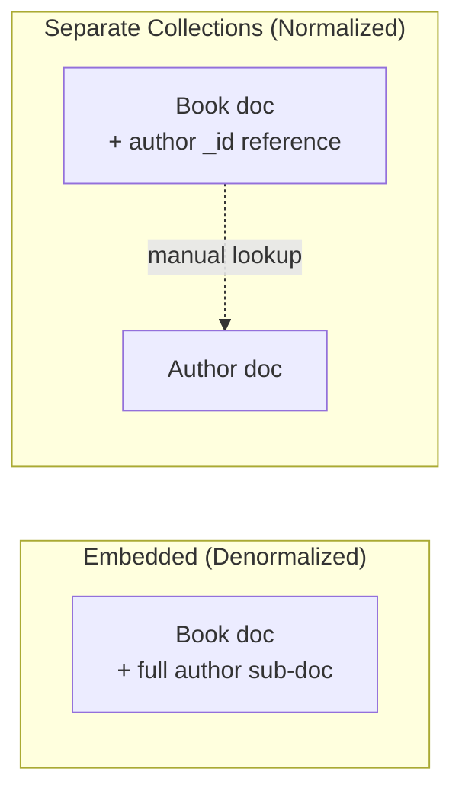

### 5.5 Query Performance & Indexing

- Every filter (except by `_id`) causes a **full collection scan** by default
- `_id` is always indexed — point lookups by `_id` are always fast
- **Secondary indexes** can be defined on any field or combination of fields
- Index types: unique, non-unique, compound, geospatial, text-based

---

## 6. MongoDB Queries

> All queries use MongoDB shell syntax: `db.<collection>.<operation>()`

### 6.1 Sample Dataset

```javascript
db.books.insertMany([
    {
        "author": {"first_name": "Wilfried", "last_name": "Lemahieu"},
        "title": "My First Book",
        "nrPages": 12,
        "genres": ["drama"]
    },
    {
        "author": {"first_name": "Seppe", "last_name": "vanden Broucke"},
        "title": "My Second Book",
        "nrPages": 437,
        "genres": ["fantasy", "thriller"]
    },
    {
        "author": {"first_name": "Seppe", "last_name": "vanden Broucke"},
        "title": "My Third Book",
        "nrPages": 200,
        "genres": ["educational"]
    },
    {
        "author": {"first_name": "Bart", "last_name": "Baesens"},
        "title": "Java Programming for Database Managers",
        "nrPages": 100,
        "genres": ["educational"]
    }
])
```

---

### 6.2 Simple Queries — `find()`

**Syntax:** `db.collection.find( {filter}, {projection} )`

```javascript
// Return ALL documents
db.books.find({})

// Find by exact field match
db.books.find({"author.last_name": "Baesens"})

// Find by nested field using dot notation
db.books.find({"author.first_name": "Seppe"})

// Find by array element (checks if "thriller" is in genres array)
db.books.find({"genres": "thriller"})

// Return only the first matching document
db.books.findOne({"author.last_name": "Lemahieu"})

// Count matching documents
db.books.find({"genres": "educational"}).count()
```

---

### 6.3 Comparison Operators

| Operator | Meaning | Example |
|---|---|---|
| `$eq` | Equal to | `{"nrPages": {$eq: 100}}` |
| `$ne` | Not equal to | `{"nrPages": {$ne: 100}}` |
| `$gt` | Greater than | `{"nrPages": {$gt: 100}}` |
| `$gte` | Greater than or equal | `{"nrPages": {$gte: 100}}` |
| `$lt` | Less than | `{"nrPages": {$lt: 500}}` |
| `$lte` | Less than or equal | `{"nrPages": {$lte: 500}}` |
| `$in` | Value in array | `{"genres": {$in: ["drama","thriller"]}}` |
| `$nin` | Value not in array | `{"genres": {$nin: ["drama"]}}` |

```javascript
// Books with more than 100 pages
db.books.find({"nrPages": {$gt: 100}})

// Books with pages between 100 and 400 (inclusive)
db.books.find({"nrPages": {$gte: 100, $lte: 400}})

// Books in fantasy OR thriller genre
db.books.find({"genres": {$in: ["fantasy", "thriller"]}})

// Books NOT in drama
db.books.find({"genres": {$nin: ["drama"]}})
```

---

### 6.4 Multiple Conditions

**Implicit AND** — all conditions in the same filter object must match:

```javascript
// author is vanden Broucke AND genre contains thriller AND pages > 100
db.books.find({
    "author.last_name": "vanden Broucke",
    "genres": "thriller",
    "nrPages": {$gt: 100}
})
```

**Explicit `$and`:**

```javascript
db.books.find({
    $and: [
        {"author.last_name": "vanden Broucke"},
        {"genres": "thriller"},
        {"nrPages": {$gt: 100}}
    ]
})
```

**`$or` — at least one condition must match:**

```javascript
// Books by Baesens OR with thriller genre
db.books.find({
    $or: [
        {"author.last_name": "Baesens"},
        {"genres": "thriller"}
    ]
})
```

**Combined `$and` + `$or`:**

```javascript
// (Baesens OR Lemahieu) AND pages > 50
db.books.find({
    $and: [
        {
            $or: [
                {"author.last_name": "Baesens"},
                {"author.last_name": "Lemahieu"}
            ]
        },
        {"nrPages": {$gt: 50}}
    ]
})
```

**`$not` — negate a condition:**

```javascript
// Books that are NOT drama
db.books.find({"genres": {$not: {$eq: "drama"}}})
```

---

### 6.5 Projection — Controlling Output Fields

```javascript
// Include only title and author, exclude _id
db.books.find({}, {"title": 1, "author": 1, "_id": 0})

// Exclude nrPages from output (show everything else)
db.books.find({}, {"nrPages": 0})

// Find fantasy books, show only title
db.books.find({"genres": "fantasy"}, {"title": 1, "_id": 0})
```

> `1` = include field, `0` = exclude field. Cannot mix include and exclude (except `_id`).

---

### 6.6 Sorting, Limiting, Skipping

```javascript
// Sort by nrPages ascending (1) or descending (-1)
db.books.find({}).sort({"nrPages": 1})
db.books.find({}).sort({"nrPages": -1})

// Sort by multiple fields
db.books.find({}).sort({"author.last_name": 1, "nrPages": -1})

// Limit to 3 results
db.books.find({}).limit(3)

// Skip first 2, return next 3 (pagination)
db.books.find({}).skip(2).limit(3)

// Top 3 books by page count
db.books.find({}).sort({"nrPages": -1}).limit(3)
```

---

### 6.7 CRUD — Insert, Update, Delete

**Insert:**
```javascript
// Insert one document
db.books.insertOne({
    "title": "New Book",
    "author": {"first_name": "John", "last_name": "Doe"},
    "nrPages": 300,
    "genres": ["fiction"]
})

// Insert multiple documents
db.books.insertMany([
    {"title": "Book A", "nrPages": 100, "genres": ["drama"]},
    {"title": "Book B", "nrPages": 200, "genres": ["fantasy"]}
])
```

**Update:**
```javascript
// Update one — set a specific field
db.books.updateOne(
    {"title": "My First Book"},
    {$set: {"nrPages": 150}}
)

// Update one — increment a field
db.books.updateOne(
    {"title": "My Second Book"},
    {$inc: {"nrPages": 100}}
)

// Update all educational books — add a new field
db.books.updateMany(
    {"genres": "educational"},
    {$set: {"isTextbook": true}}
)

// Remove a field from all documents
db.books.updateMany(
    {},
    {$unset: {"isTextbook": ""}}
)
```

**Delete:**
```javascript
// Delete the first matching document
db.books.deleteOne({"title": "My First Book"})

// Delete all drama books
db.books.deleteMany({"genres": "drama"})

// Delete ALL documents in collection
db.books.deleteMany({})
```

---

### 6.8 Aggregation Pipeline

The **aggregation pipeline** processes documents through sequential stages — each stage transforms the data.

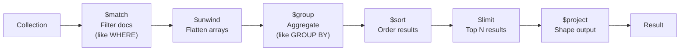

**Pipeline stages:**

| Stage | Purpose | SQL Equivalent |
|---|---|---|
| `$match` | Filter documents | `WHERE` |
| `$group` | Group and aggregate | `GROUP BY` |
| `$sort` | Sort results | `ORDER BY` |
| `$limit` | Limit result count | `LIMIT` |
| `$skip` | Skip N results | `OFFSET` |
| `$project` | Include/exclude/reshape fields | `SELECT` |
| `$unwind` | Deconstruct array into separate docs | — |

**Aggregation operators (used inside `$group`):**

| Operator | Meaning |
|---|---|
| `$sum` | Sum of values (use `1` to count) |
| `$avg` | Average of values |
| `$min` | Minimum value |
| `$max` | Maximum value |
| `$first` | First value in group |
| `$last` | Last value in group |

---

**Example 1: Total pages per author**
```javascript
db.books.aggregate([
    {
        $group: {
            _id: "$author.last_name",
            page_sum: {$sum: "$nrPages"}
        }
    }
])
// Output:
// { "_id": "Lemahieu",      "page_sum": 12  }
// { "_id": "vanden Broucke","page_sum": 637 }
// { "_id": "Baesens",       "page_sum": 100 }
```

**Example 2: Average pages per genre (filter first)**
```javascript
db.books.aggregate([
    {$match: {"genres": "educational"}},
    {
        $group: {
            _id: "$genres",
            avgPages: {$avg: "$nrPages"},
            bookCount: {$sum: 1}
        }
    }
])
```

**Example 3: Unwind array — one doc per genre**
```javascript
// $unwind expands: {genres: ["fantasy","thriller"]}
// into two docs: {genres: "fantasy"}, {genres: "thriller"}
db.books.aggregate([
    {$unwind: "$genres"},
    {
        $group: {
            _id: "$genres",
            count: {$sum: 1},
            avgPages: {$avg: "$nrPages"},
            maxPages: {$max: "$nrPages"}
        }
    },
    {$sort: {"count": -1}},
    {$limit: 5}
])
```

**Example 4: Full pipeline — match, group, sort, project**
```javascript
db.books.aggregate([
    {$match: {"nrPages": {$gt: 100}}},
    {
        $group: {
            _id: "$author.last_name",
            totalBooks: {$sum: 1},
            totalPages: {$sum: "$nrPages"},
            maxPages: {$max: "$nrPages"}
        }
    },
    {$sort: {"totalPages": -1}},
    {$project: {"_id": 1, "totalBooks": 1, "totalPages": 1}}
])
```

---

### 6.9 MapReduce in MongoDB

For very complex queries across massive distributed datasets, MongoDB supports **MapReduce** — a programming model where:
- **Map** transforms input documents into intermediate `(key, value)` pairs
- **Reduce** aggregates all values for each key into a final result

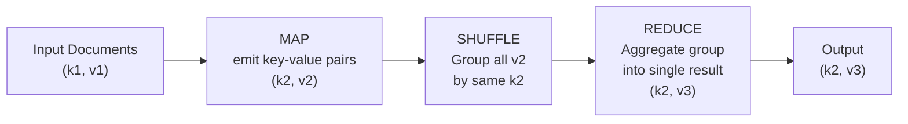

**Two critical rules for the reduce function:**
1. Output must have the **same structure** as map output (reduce can be called on partial results)
2. Must produce **correct results even when called multiple times** on partial results

**MapReduce prototype in MongoDB (JavaScript):**

```javascript
// Map function: 'this' refers to the current document
var mapFunction = function() {
    emit(key, value);
}

// Reduce function: called once per unique key
var reduceFunction = function(key, values) {
    return result;
}

// Run MapReduce
db.books.mapReduce(mapFunction, reduceFunction, {out: "results"})

// View results
db.results.find({})
```

**Example: Average pages per genre**

```javascript
// Map: emit one record per genre per book
var mapFn = function() {
    var nrPages = this.nrPages;
    this.genres.forEach(function(genre) {
        emit(genre, {average: nrPages, count: 1});
    });
}

// Reduce: combine partial averages correctly
var reduceFn = function(genre, values) {
    var s = 0;
    var newc = 0;
    values.forEach(function(curAvg) {
        s += curAvg.average * curAvg.count;
        newc += curAvg.count;
    });
    return {average: (s / newc), count: newc};
}

db.books.mapReduce(mapFn, reduceFn, {out: "genre_averages"})
db.genre_averages.find({})
// Output:
// { "_id": "action",      "value": { "average": 398.9, "count": 31 }}
// { "_id": "drama",       "value": { "average": 536.9, "count": 25 }}
// { "_id": "fantasy",     "value": { "average": 540.0, "count": 23 }}
```

**Classic word count example:**

```javascript
var mapWords = function() {
    var words = this.text.split(" ");
    words.forEach(function(word) {
        emit(word, 1);
    });
}

var reduceWords = function(word, counts) {
    return Array.sum(counts);
}

db.documents.mapReduce(mapWords, reduceWords, {out: "word_counts"})
```

**Aggregation Pipeline vs MapReduce:**

| | Aggregation Pipeline | MapReduce |
|---|---|---|
| Language | MongoDB operators | JavaScript functions |
| Performance | Faster (optimized) | Slower, more flexible |
| Scalability | Distributed | Distributed |
| Use case | Standard aggregations | Complex custom logic |
| Preferred? | Yes (modern MongoDB) | Legacy / very complex cases |

---

### 6.10 Indexing

```javascript
// Create index on a single field (1=ascending, -1=descending)
db.books.createIndex({"author.last_name": 1})

// Create compound index (multiple fields)
db.books.createIndex({"genres": 1, "nrPages": -1})

// Create unique index (no duplicate values)
db.books.createIndex({"title": 1}, {unique: true})

// View all indexes on collection
db.books.getIndexes()

// Drop an index
db.books.dropIndex({"author.last_name": 1})
```

Without an index, every filter (except `_id`) causes a **full collection scan** — all documents read to find matches.

---

## 7. Column-Oriented Databases

### 7.1 Concept

A **column-oriented DBMS** stores all values of each column **together on disk**, rather than storing complete rows together.

**Given this table:**

| Id | Genre | Title | Price | Audiobook price |
|---|---|---|---|---|
| 1 | fantasy | My first book | 20 | 30 |
| 2 | education | Beginners guide | 10 | null |
| 3 | education | SQL strikes back | 40 | null |
| 4 | fantasy | The rise of SQL | 10 | null |

**Row-oriented storage** (traditional RDBMS):
```
[1, fantasy, My first book, 20, 30]
[2, education, Beginners guide, 10, null]
[3, education, SQL strikes back, 40, null]
[4, fantasy, The rise of SQL, 10, null]
```

**Column-oriented storage:**
```
Genre:          fantasy:1,4     education:2,3
Title:          My first…:1     Beginners…:2    SQL Strikes…:3    The rise…:4
Price:          20:1            10:2,4          40:3
Audiobook price: 30:1
```

Each column stored as `(value → record_ids)` — effectively a built-in inverted index.

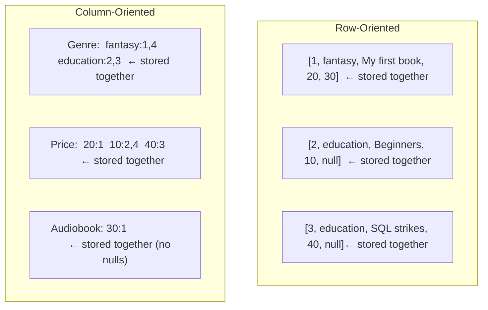

### 7.2 Advantages

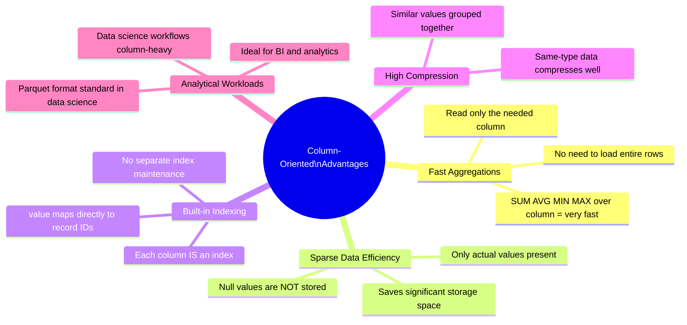

**Example — finding all books with price > 20:**
- Row-oriented: scan ALL rows, check price field in each
- Column-oriented: go directly to Price column → scan only that column → get record IDs

### 7.3 Disadvantages

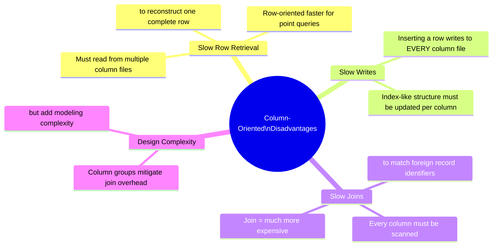

### 7.4 Row vs Column — Direct Comparison

| | Row-Oriented | Column-Oriented |
|---|---|---|
| Storage unit | Full rows together | All values of one column together |
| Best query | Retrieve single entity by ID | Aggregate over entire dataset |
| Null handling | Nulls stored as placeholders | Nulls **not** stored at all |
| Write speed | Fast (one write) | Slower (many column files) |
| Join speed | Fast (co-located) | Slow (column scans) |
| Aggregation | Needs secondary indexes | Naturally fast |
| Compression | Moderate | High (same-type values cluster) |
| Examples | MySQL, PostgreSQL, SQL Server | Cassandra, HBase, BigTable, Parquet |

### 7.5 Use Cases

| Use Case | Why Column-Oriented Works |
|---|---|
| Marketing analytics | Aggregates over millions of records on 2–3 columns |
| Business intelligence | Dashboards, reports, GROUP BY queries |
| Clinical/medical data | Sparse data (most patients don't have most attributes) |
| Data science | Parquet is columnar; correlations between two columns = fast |
| Time series / IoT | Aggregate sensor readings over time ranges |

> **Notable implementations:** Google BigTable, Apache Cassandra, HBase, Apache Parquet (data science), Apache ORC

> **Note:** Column-oriented is orthogonal to NoSQL vs relational — a relational database *can* be column-oriented (e.g., columnar PostgreSQL extensions). However, the need for column-oriented storage emerged alongside NoSQL, so they are categorized together.

---

## 8. Quick Reference — MongoDB Shell

```javascript
// ── CRUD ──────────────────────────────────────────────────
db.col.insertOne({field: val, ...})
db.col.insertMany([{...}, {...}])
db.col.find({filter}, {projection})
db.col.findOne({filter})
db.col.updateOne({filter}, {$set: {field: val}})
db.col.updateMany({filter}, {$set: {field: val}})
db.col.replaceOne({filter}, {newDoc})
db.col.deleteOne({filter})
db.col.deleteMany({filter})

// ── QUERY MODIFIERS ───────────────────────────────────────
db.col.find({}).sort({field: 1})       // 1=ASC, -1=DESC
db.col.find({}).limit(n)
db.col.find({}).skip(n).limit(m)
db.col.find({}).count()

// ── COMPARISON OPERATORS ──────────────────────────────────
{field: {$eq: val}}                    // equal (same as {field: val})
{field: {$ne: val}}                    // not equal
{field: {$gt: val}}                    // greater than
{field: {$gte: val}}                   // greater than or equal
{field: {$lt: val}}                    // less than
{field: {$lte: val}}                   // less than or equal
{field: {$in: [v1, v2]}}              // value in list
{field: {$nin: [v1, v2]}}             // value not in list

// ── LOGICAL OPERATORS ─────────────────────────────────────
{$and: [{cond1}, {cond2}]}
{$or:  [{cond1}, {cond2}]}
{field: {$not: {$gt: val}}}

// ── UPDATE OPERATORS ──────────────────────────────────────
{$set:   {field: val}}                 // set field value
{$unset: {field: ""}}                  // remove field from document
{$inc:   {field: n}}                   // increment numeric field by n
{$push:  {array_field: val}}           // append value to array
{$pull:  {array_field: val}}           // remove value from array

// ── AGGREGATION PIPELINE ──────────────────────────────────
db.col.aggregate([
    {$match:   {field: val}},
    {$unwind:  "$array_field"},
    {$group:   {_id: "$field", total: {$sum: "$numField"},
                                avg:   {$avg: "$numField"},
                                cnt:   {$sum: 1}}},
    {$sort:    {total: -1}},
    {$limit:   10},
    {$project: {_id: 1, total: 1, avg: 1}}
])

// ── MAPREDUCE ─────────────────────────────────────────────
db.col.mapReduce(mapFunction, reduceFunction, {out: "output_col"})
db.output_col.find({})

// ── INDEXING ──────────────────────────────────────────────
db.col.createIndex({field: 1})                    // ascending
db.col.createIndex({field: -1})                   // descending
db.col.createIndex({f1: 1, f2: -1})              // compound
db.col.createIndex({field: 1}, {unique: true})    // unique
db.col.getIndexes()
db.col.dropIndex({field: 1})
```

---

## Key Concepts Summary

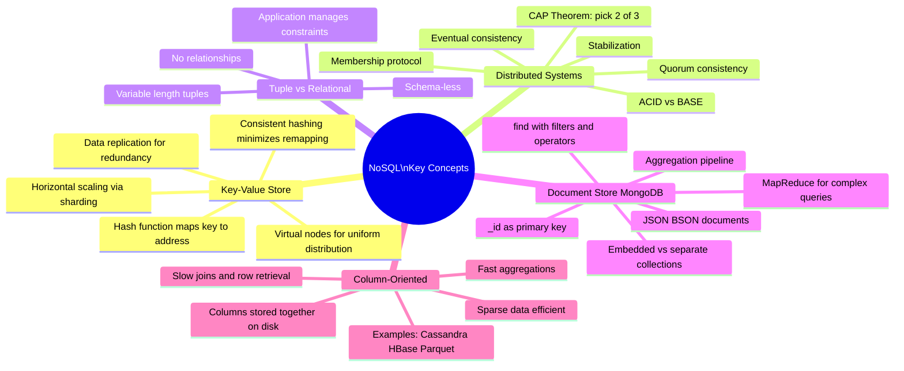
