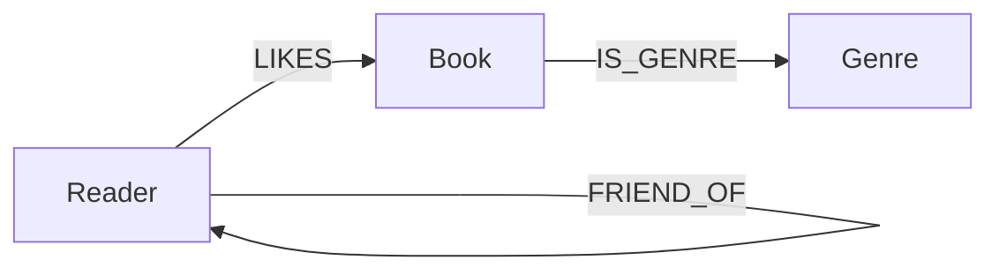
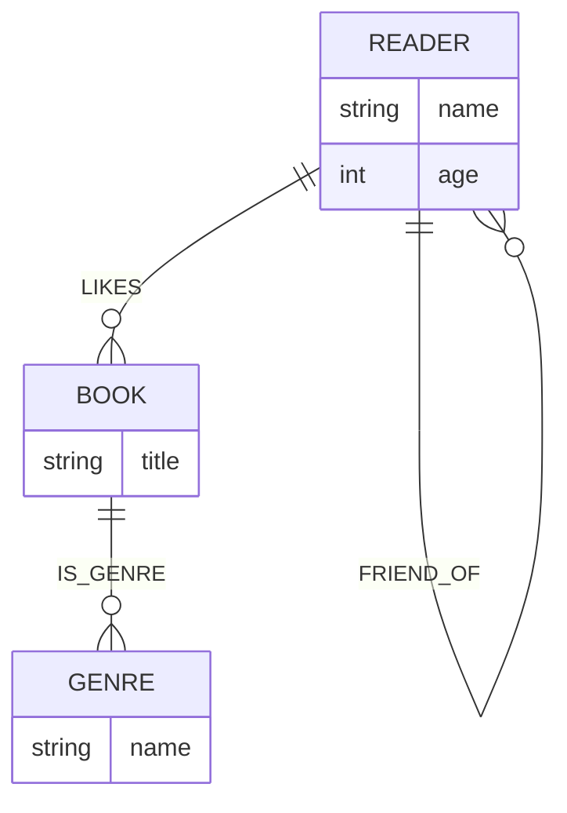

# Cypher Query Language — Final Exam Reference

> Neo4j's declarative, text-based graph query language (§11.5, Principles of Database Management)

---

## 1. What is Cypher?

- Like SQL but designed for **graph structures**
- Uses a special `MATCH` clause that visually mimics how graphs are drawn on a whiteboard
- Patterns use symbols that resemble circles (nodes) and arrows (edges)

---

## 2. Core Syntax Building Blocks

### 2.1 Nodes

Nodes are represented by **parentheses** (symbolizing a circle):

| Syntax | Meaning |
|--------|---------|
| `()` | Anonymous node (any node) |
| `(b)` | Node with variable `b` |
| `(b:Book)` | Node with variable `b` of type/label `Book` |
| `(b:Book {title:"Neo4j"})` | Node filtered by property inline |

### 2.2 Edges / Relationships

| Syntax | Meaning |
|--------|---------|
| `--` | Undirected edge |
| `-->` | Directed edge (left to right) |
| `<--` | Directed edge (right to left) |
| `-[:TYPE]->` | Directed edge with relationship type |
| `<-[:TYPE]-` | Directed edge (incoming) with type |
| `-[r:TYPE]->` | Named relationship variable `r` of type `TYPE` |
| `-[:TYPE*0..]->` | Variable-length path (0 or more hops) |
| `-[:TYPE*min..max]->` | Variable-length path with bounds |

### 2.3 Pattern Examples

```cypher
-- Undirected between a Book and an Author
(b:Book)<-[:WRITTEN_BY]-(a:Author)

-- Non-directional traversal (ignores direction)
(r:Reader)--(:Book)--(:Genre {name:'romance'})

-- Variable-length: book in any subcategory of Programming
(b:Book)-[:IN_GENRE]->(:Genre)
        -[:PARENT*0..]-(:Genre {name:"Programming"})
```

---

## 3. Graph Data Model (Social Graph — Fig 11.11)



Node labels and their properties:

| Label | Key Properties |
|-------|---------------|
| `Reader` | `name`, `age` |
| `Book` | `title` |
| `Genre` | `name` |

Relationship types:

| Type | Between |
|------|---------|
| `LIKES` | Reader → Book |
| `FRIEND_OF` | Reader → Reader |
| `IS_GENRE` | Book → Genre |

---

## 4. Keyword Reference

### `MATCH`
Finds nodes/relationships matching a pattern. Only returns **complete** matches.

```cypher
MATCH (b:Book)
RETURN b;
```

```cypher
-- JOIN expressed as relational matching
MATCH (c:Customer)-[p:PURCHASED]->(b:Book)<-[:WRITTEN_BY]-(a:Author)
WHERE a.name = "Wilfried Lemahieu"
  AND c.age > 30
  AND p.type = "cash"
RETURN DISTINCT c.name;
```

---

### `OPTIONAL MATCH`
Like `MATCH` but returns **null** for missing parts (equivalent to SQL's LEFT JOIN).

```cypher
MATCH (b1:Book), (b2:Book)
WITH b1, b2
OPTIONAL MATCH (b1)--(g:Genre)--(b2)
WHERE g IS NULL
RETURN b1.title, b2.title;
```

> Use `OPTIONAL MATCH` when you need rows even if a sub-pattern doesn't exist.

---

### `RETURN`
Specifies what to output (like SQL `SELECT`).

```cypher
MATCH (b:Book)
RETURN b;

-- Return specific property
RETURN b.title;

-- Return multiple values
RETURN friend.name, count(*) AS common_likes;
```

---

### `RETURN DISTINCT`
Eliminates duplicate rows in results.

```cypher
MATCH (c:Customer)-[p:PURCHASED]->(b:Book)<-[:WRITTEN_BY]-(a:Author)
WHERE a.name = "Wilfried Lemahieu"
RETURN DISTINCT c.name;
```

---

### `WHERE`
Filters matched patterns (like SQL `WHERE`). Can appear after `MATCH` or inline in the node pattern.

```cypher
-- Explicit WHERE
MATCH (b:Book)
WHERE b.title = "Beginning Neo4j"
RETURN b;

-- Inline property filter (equivalent)
MATCH (b:Book {title:"Beginning Neo4j"})
RETURN b;
```

---

### `WHERE NOT`
Negation filter — excludes rows matching the sub-pattern.

```cypher
-- Books Seppe's friends liked but Seppe hasn't liked yet (humor genre)
MATCH (me:Reader)--(friend:Reader),
      (friend)--(b:Book),
      (b)--(genre:Genre)
WHERE NOT (me)--(b)
  AND me.name = 'Seppe vanden Broucke'
  AND genre.name = 'humor'
RETURN DISTINCT b.title;
```

---

### `AND`
Logical conjunction inside `WHERE`.

```cypher
WHERE a.name = "Wilfried Lemahieu"
  AND c.age > 30
  AND p.type = "cash"
```

---

### `ORDER BY` / `ORDER BY ... DESC`
Sorts results. Default is ascending; `DESC` for descending.

```cypher
MATCH (b:Book)
RETURN b
ORDER BY b.price DESC
LIMIT 20;
```

---

### `LIMIT`
Restricts the number of returned rows.

```cypher
MATCH (b:Book)
RETURN b
ORDER BY b.price DESC
LIMIT 20;
```

---

### `CREATE`
Inserts nodes and/or relationships. Requires a direction for relationships.

```cypher
-- Create a single node
CREATE (Bart:Reader {name:'Bart Baesens', age:32})

-- Create multiple nodes at once
CREATE (b01:Book {title:'My First Book'}),
       (b02:Book {title:'A Thriller Unleashed'})

-- Create relationships
CREATE (b01)-[:IS_GENRE]->(Education),
       (b02)-[:IS_GENRE]->(Thriller)

-- Create relationships between existing nodes
CREATE (Bart)-[:FRIEND_OF]->(Seppe),
       (Bart)-[:FRIEND_OF]->(Wilfried)
```

---

### `WITH`
Pipes results between query parts — like a sub-query separator. Used to define computed values **before** they are referenced in `WHERE`.

```cypher
-- WITHOUT WITH: FAILS — common_genres used before defined
MATCH (b1:Book)--(g:Genre)--(b2:Book)
WHERE common_genres > 1
RETURN b1.title, b2.title, count(*) AS common_genres

-- WITH FIX: define first, then filter
MATCH (b1:Book)--(g:Genre)--(b2:Book)
WITH b1, b2, count(*) AS common_genres
WHERE common_genres > 1
RETURN b1.title, b2.title, common_genres
```

---

### `AS`
Aliases an expression (like SQL `AS`).

```cypher
RETURN friend.name, count(*) AS common_likes
ORDER BY common_likes DESC
```

---

### `IS NULL`
Tests whether a value is null — useful after `OPTIONAL MATCH`.

```cypher
MATCH (b1:Book), (b2:Book)
WITH b1, b2
OPTIONAL MATCH (b1)--(g:Genre)--(b2)
WHERE g IS NULL
RETURN b1.title, b2.title;
```

---

### `count(*)`
Aggregation function — counts matched rows. Grouping is **implicit**: all non-aggregated columns become group keys automatically.

```cypher
MATCH (me:Reader)--(b:Book),
      (me)--(friend:Reader)--(b)
WHERE me.name = 'Bart Baesens'
RETURN friend.name, count(*) AS common_likes
ORDER BY common_likes DESC
```

> Result: Wilfried Lemahieu=3, Seppe vanden Broucke=2, Mike Smith=1

---

## 5. Variable-Length Paths (Transitive Queries)

The `*` operator after a relationship type traverses paths of arbitrary depth — the **"friend-of-a-friend"** problem.

```cypher
-- All books in "Programming" genre AND any subcategory (any depth)
MATCH (b:Book)-[:IN_GENRE]->(:Genre)
            -[:PARENT*0..]-(:Genre {name:"Programming"})
RETURN b.title;
```

| Syntax | Meaning |
|--------|---------|
| `*` | Any number of hops (unbounded) |
| `*0..` | 0 or more hops |
| `*1..` | 1 or more hops |
| `*..5` | Up to 5 hops |
| `*2..5` | Between 2 and 5 hops |

---

## 6. SQL vs Cypher Comparison

| SQL | Cypher Equivalent |
|-----|-------------------|
| `SELECT * FROM books AS b` | `MATCH (b:Book) RETURN b` |
| `WHERE col = val` | `WHERE b.title = "val"` or `{title:"val"}` inline |
| `LEFT JOIN` | `OPTIONAL MATCH` |
| `DISTINCT` | `RETURN DISTINCT` |
| `ORDER BY col DESC` | `ORDER BY b.price DESC` |
| `LIMIT n` | `LIMIT n` |
| `GROUP BY` | Implicit when aggregation used |
| `JOIN` (multi-table) | Pattern in `MATCH` clause |
| Recursive CTE | `[:TYPE*]` variable-length path |

---

## 7. Complete Query Pattern Examples

### 7.1 Basic SELECT all books
```cypher
MATCH (b:Book)
RETURN b;
```

### 7.2 Filter by property (two equivalent forms)
```cypher
MATCH (b:Book)
WHERE b.title = "Beginning Neo4j"
RETURN b;

MATCH (b:Book {title:"Beginning Neo4j"})
RETURN b;
```

### 7.3 JOIN — customers who bought books by an author
```cypher
MATCH (c:Customer)-[p:PURCHASED]->(b:Book)<-[:WRITTEN_BY]-(a:Author)
WHERE a.name = "Wilfried Lemahieu"
  AND c.age > 30
  AND p.type = "cash"
RETURN DISTINCT c.name;
```

### 7.4 Non-directional traversal — who likes romance books?
```cypher
MATCH (r:Reader)--(:Book)--(:Genre {name:'romance'})
RETURN r.name
```

### 7.5 Friends who liked humor books
```cypher
MATCH (me:Reader)--(friend:Reader)--(b:Book)--(g:Genre)
WHERE g.name = 'humor'
  AND me.name = 'Bart Baesens'
RETURN DISTINCT friend.name
```

### 7.6 Recommendation — books friends liked but I haven't
```cypher
MATCH (me:Reader)--(friend:Reader),
      (friend)--(b:Book),
      (b)--(genre:Genre)
WHERE NOT (me)--(b)
  AND me.name = 'Seppe vanden Broucke'
  AND genre.name = 'humor'
RETURN DISTINCT b.title;
```

### 7.7 Aggregation — ranked similarity list
```cypher
MATCH (me:Reader)--(b:Book),
      (me)--(friend:Reader)--(b)
WHERE me.name = 'Bart Baesens'
RETURN friend.name, count(*) AS common_likes
ORDER BY common_likes DESC
```

### 7.8 WITH clause — pairs of books with more than 1 genre in common
```cypher
MATCH (b1:Book)--(g:Genre)--(b2:Book)
WITH b1, b2, count(*) AS common_genres
WHERE common_genres > 1
RETURN b1.title, b2.title, common_genres
```

### 7.9 OPTIONAL MATCH — pairs of books with NO genres in common
```cypher
MATCH (b1:Book), (b2:Book)
WITH b1, b2
OPTIONAL MATCH (b1)--(g:Genre)--(b2)
WHERE g IS NULL
RETURN b1.title, b2.title;
```

### 7.10 Variable-length — books in a genre hierarchy
```cypher
MATCH (b:Book)-[:IN_GENRE]->(:Genre)
              -[:PARENT*0..]-(:Genre {name:"Programming"})
RETURN b.title;
```

---

## 8. Data Insertion — Full Social Graph Schema



### Creating Nodes
```cypher
CREATE (Bart:Reader {name:'Bart Baesens', age:32})
CREATE (Fantasy:Genre {name:'fantasy'})
CREATE (b01:Book {title:'My First Book'})
```

### Creating Relationships in Bulk
```cypher
CREATE
  (b01)-[:IS_GENRE]->(Education),
  (b02)-[:IS_GENRE]->(Thriller),
  (b03)-[:IS_GENRE]->(Education)

CREATE
  (Bart)-[:FRIEND_OF]->(Seppe),
  (Bart)-[:FRIEND_OF]->(Wilfried)

CREATE
  (Bart)-[:LIKES]->(b01),
  (Bart)-[:LIKES]->(b03)
```

---

## 9. Key Concepts to Remember

| Concept | Rule |
|---------|------|
| **Grouping** | Implicit when using aggregation — all non-aggregated columns become group keys |
| **MATCH vs OPTIONAL MATCH** | `MATCH` returns nothing if pattern missing; `OPTIONAL MATCH` returns `null` |
| **WHERE placement** | `WHERE` after `MATCH` filters; use `WITH` to define computed values before filtering |
| **Direction in CREATE** | Must specify `->` or `<-`; direction can be ignored in queries using `--` |
| **Inline property filter** | `{key:"val"}` inside node `()` is equivalent to a `WHERE` clause |
| **Variable-length `*`** | Enables recursive/transitive traversal without recursive SQL CTEs |
| **`RETURN DISTINCT`** | Deduplicates result rows |

---

*Source: §11.5 Cypher Query Language — Principles of Database Management (pp. 779–790)*
