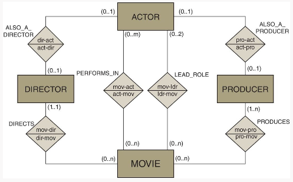
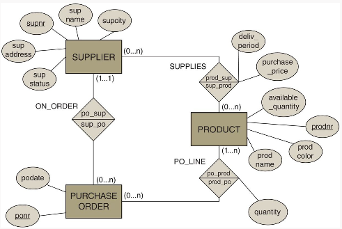
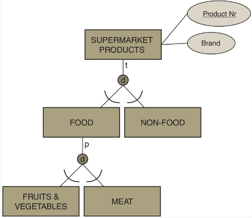
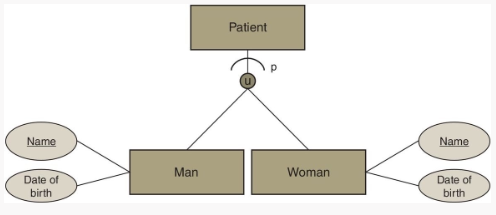

# Quiz 2: Advanced Data Modeling Concepts

Reference scope used for answers: **Principles of Database Management** (mainly Chapter 3 for ER/EER/UML and Chapter 4 for data management roles and data quality).

## Questions

### 1) What are the key building blocks of the ER model?

**Answer:**

- **Entity types** (things to store data about), e.g., `STUDENT`, `COURSE`.
- **Attribute types** (properties of entities/relationships), e.g., `student_id`, `name`.
- **Relationship types** (associations between entity types), e.g., `ENROLLS_IN`.
- **Constraints** (cardinality, participation, keys) to define valid states.
- **Domains** for allowed attribute values.

**Interview Tip:** If asked to “design ER quickly,” start with entities, then relationships, then constraints (cardinality + optionality).

### 2) Discuss the attribute types supported in the ER model.

**Answer:**

- **Simple (atomic):** indivisible (e.g., `age`).
- **Composite:** decomposable (e.g., `address` -> street, city, zip).
- **Single-valued:** one value per entity.
- **Multi-valued:** multiple values (e.g., phone numbers).
- **Derived:** computed from other attributes (e.g., age from date of birth).
- **Key attribute:** uniquely identifies entity instances.

**Interview Tip:** Mention storage tradeoff: derived attributes improve read speed if materialized, but increase update complexity.

### 3) Discuss the relationship types supported in the ER model.

**Answer:**

- **By degree:** unary (recursive), binary, ternary (or n-ary).
- **By cardinality:** 1:1, 1:N, M:N.
- **By participation:** total (mandatory) or partial (optional).
- Relationship types can also have their own attributes.

**Interview Tip:** For ternary relationships, do not blindly split into binaries; semantics are often lost.

### 4) What are weak entity types and how are they modeled in the ER model?

**Answer:**

- A **weak entity type** has no full key of its own.
- It depends on an **owner (strong) entity type** for identification.
- Identified by **owner key + partial key**.
- Modeled with an identifying relationship and total participation of the weak entity.

**Interview Tip:** A weak entity is always existence-dependent, but existence-dependent entities are not always weak.

### 5) Discuss the limitations of the ER model.

**Answer:**

- Limited support for behavior/operations (focus is structural).
- Limited expressiveness for complex constraints (temporal, cross-relationship rules).
- No direct OO features like encapsulation/polymorphism.
- Some real rules require textual constraints or implementation logic.

**Interview Tip:** A common answer: “ER captures structure well, but many business rules still need SQL constraints/triggers/app logic.”

### 6) What modeling extensions are provided by the EER model? Illustrate with examples.

**Answer:**

- **Specialization/generalization:** `EMPLOYEE` -> `MANAGER`, `ENGINEER`.
- **Disjoint/overlap constraints:** whether subtypes can coexist.
- **Total/partial completeness constraints:** whether every supertype instance must be in subtypes.
- **Categorization (union types):** subtype from multiple supertypes.
- **Inheritance/selective inheritance:** share attributes/relationships.

**Interview Tip:** Always state both constraints in specialization: disjoint vs overlap, and total vs partial.

### 7) What are the limitations of the EER model?

**Answer:**

- Still mostly conceptual; not all constraints map directly to relational schema.
- Behavior/methods still weak compared with UML OO modeling.
- Complex categorization/inheritance can be hard to implement and maintain.

**Interview Tip:** In interviews, pair EER with mapping strategy (table-per-hierarchy, table-per-subclass, etc.).

### 8) What are the key concepts of object orientation (OO)?

**Answer:**

- **Class and object**.
- **Encapsulation / information hiding**.
- **Inheritance**.
- **Polymorphism**.
- **Abstraction**.

**Interview Tip:** Give one sentence per concept with a code-level example.

### 9) Discuss the components of a UML class diagram.

**Answer:**

- **Classes** (name, attributes, methods/operations).
- **Associations** (roles, multiplicities, navigability, qualifiers).
- **Generalization/inheritance**.
- **Aggregation/composition**.
- **Dependencies and constraints** (often OCL).

**Interview Tip:** Multiplicity + navigability are frequently tested and often confused.

### 10) How can associations be modeled in UML?

**Answer:**

- **Binary or n-ary associations**.
- **Unidirectional or bidirectional navigability**.
- **Role names** and **multiplicity** on each end.
- **Association class** when the relationship has its own attributes/operations.
- **Qualified association** to restrict lookup path.

**Interview Tip:** If relationship has attributes (e.g., `hours_worked`), propose an association class.

### 11) What types of aggregation are supported in UML?

**Answer:**

- **Shared aggregation** (weak whole-part).
- **Composition (composite aggregation)** (strong ownership, lifecycle dependency).

**Interview Tip:** Composition implies a part belongs to at most one whole at a time.

### 12) What advanced modeling concepts are offered by UML?

**Answer:**

- **OCL constraints** for invariants/pre/post-conditions.
- **Dependency relationships**.
- **Changeability constraints** (readOnly, etc.).
- **Qualified associations, association classes, visibility modifiers**.

**Interview Tip:** Use OCL when cardinality alone cannot express the rule.

### 13) Contrast the UML class diagram with the EER model.

**Answer:**

- **EER:** conceptual data structure, database-oriented.
- **UML class diagram:** broader OO software model (data + behavior).
- **UML** has methods, visibility, richer OO semantics.
- **EER** is often simpler and very effective for conceptual DB design.

**Interview Tip:** For DB schema interviews, lead with ER/EER; for system design with domain objects, use UML.

### 14) Discuss the job profiles in data management. Which ones can be combined?

**Answer:**

- Common profiles: **data owner, data steward, DBA, database designer, information architect, information analyst, data scientist**.
- In smaller organizations, one person may combine **DBA + designer**, or **analyst + steward**, etc.
- Governance ownership and stewardship should remain clearly assigned even if roles are combined.

**Interview Tip:** Clarify accountability (owner) vs execution/control (steward/DBA).

### 15) What differentiates a data owner from a data steward?

**Answer:**

- **Data owner:** accountable for business decisions about data domain.
- **Data steward:** operational guardian of data definitions, quality, standards, and issue resolution.

**Interview Tip:** Owner decides policy; steward enforces and operationalizes policy.

### 16) What are the key characteristics of a data scientist?

**Answer:**

- Strong in statistics/ML and data wrangling.
- Can formulate business problems analytically.
- Skilled in experimentation, evaluation, and communication.
- Understands data quality and bias impacts.

**Interview Tip:** Interviewers look for problem framing + validation approach, not just model names.

## Keywords

- **abstraction:** Modeling essential characteristics while ignoring irrelevant detail.
- **access modifiers:** UML visibility markers (`+`, `-`, `#`) controlling access.
- **aggregation:** Whole-part association with weak ownership.
- **association class:** Class attached to an association to store relationship attributes.
- **associations:** Structural links between classes.
- **attribute type:** Property definition of an entity or relationship.
- **bidirectional association:** Association navigable in both directions.
- **business process:** Set of activities producing business outcomes.
- **cardinalities:** Minimum/maximum participation counts in relationships.
- **categorization:** EER subtype defined as subset of union of multiple supertypes.
- **changeability property:** Constraint on whether values/links may change.
- **class:** Blueprint defining attributes and methods of objects.
- **class invariant:** Condition that must always hold for all instances of a class.
- **completeness constraint:** Total vs partial coverage in specialization/categorization.
- **composite attribute type:** Attribute composed of sub-attributes.
- **conceptual data model:** High-level business-focused data model independent of DBMS.
- **degree:** Number of entity types in a relationship type.
- **dependency:** UML “uses” relation where one element change can affect another.
- **derived attribute type:** Attribute computed from other data.
- **disjoint specialization:** Subtypes are mutually exclusive.
- **disjointness constraint:** Rule defining disjoint vs overlapping subtype membership.
- **domain:** Allowed set of values for an attribute.
- **Enhanced Entity Relationship (EER) model:** ER extension with specialization/generalization/categorization.
- **entity relationship (ER) model:** Conceptual model using entities, relationships, and attributes.
- **entity type:** Set of similar entities described by common attributes.
- **existence dependency:** Entity existence depends on related entity existence.
- **generalization:** Bottom-up abstraction combining similar subtypes into supertype.
- **information hiding:** Restrict internal state access through controlled interface.
- **inheritance:** Subclass obtains attributes/operations from superclass.
- **key attribute type:** Attribute (or set) uniquely identifying entity instances.
- **multi-valued attribute type:** Attribute that can hold multiple values per instance.
- **object:** Runtime instance of a class.
- **object constraint language (OCL):** Declarative language for UML constraints.
- **overlap specialization:** Subtypes may overlap for the same supertype instance.
- **owner entity type:** Strong entity that identifies/supports a weak entity.
- **partial categorization:** Not every union-supertype instance must belong to the category.
- **partial participation:** Participation in a relationship is optional.
- **partial specialization:** Not every supertype instance must be in a subtype.
- **qualified association:** Association with qualifier to narrow target instance set.
- **relationship:** Actual association instance between entities.
- **relationship type:** Set of similar relationships between entity types.
- **requirement collection and analysis:** Eliciting and structuring data/application needs.
- **roles:** Names describing participation meaning in a relationship.
- **selective inheritance:** Inheriting only selected superclass properties.
- **simple or atomic attribute type:** Indivisible attribute.
- **single-valued attribute:** Attribute with one value per instance.
- **specialization:** Top-down refinement of supertype into subtypes.
- **strong entity type:** Entity type with its own full key.
- **temporal constraints:** Time-based rules (validity, sequencing, duration).
- **ternary relationship types:** Relationship types involving three entity types.
- **total categorization:** Every relevant supertype-union instance belongs to the category.
- **total participation:** Mandatory participation in a relationship.
- **total specialization:** Every supertype instance belongs to at least one subtype.
- **unidirectional association:** Association navigable in one direction only.
- **Unified Modeling Language (UML):** Standard visual language for OO system modeling.
- **weak entity type:** Entity type identified via owner key + partial key.
- **access category:** Data quality/accessibility dimension about availability of data.
- **accessibility:** Ease/timeliness with which authorized users can retrieve data.
- **accuracy:** Degree to which data correctly represents reality.
- **catalog:** DBMS metadata repository (schema, constraints, definitions).
- **completeness:** Degree to which required data is present.
- **consistency:** Absence of conflicting representations of the same fact.
- **contextual category:** Data quality dimensions depending on task context (e.g., timeliness).
- **data governance:** Decision rights, policies, and accountability for data.
- **data management:** Practices for modeling, storing, securing, and using data.
- **data owner:** Business accountable role for a data domain.
- **data quality (DQ):** Fitness of data for intended use.
- **data scientist:** Role applying statistics/ML to generate insight and predictions.
- **data steward:** Role maintaining data definitions, quality, and compliance processes.
- **database administrator (DBA):** Role managing performance, security, backup, recovery, operations.
- **database designer:** Role defining conceptual/logical/physical database design.
- **DQ frameworks:** Structured models for defining and measuring data quality dimensions.
- **information analyst:** Role translating data into business insights and reports.
- **information architect:** Role designing enterprise information structures and standards.
- **intrinsic category:** Data quality dimensions inherent to data itself (e.g., accuracy).
- **metamodel:** Model describing the constructs/rules of another model.
- **representation category:** Data quality dimensions about format/interpretability consistency.
- **timeliness:** Degree to which data is up to date for use.

## MCQ

### 3.1 Given the ER model above, which of the following statements is correct?

a. A movie can have as many lead actors as there are actors in the movie.  
b. PRODUCER is an existence-dependent entity type.  
c. A director of a movie can also act in the same movie.

**Correct option:** `c`  
**Explanation:** The model allows overlap between `DIRECTOR` and `ACTOR` via `ALSO_A_DIRECTOR`, so a director can also be an actor in the same movie. `PRODUCER` is not modeled as weak/existence-dependent.

### 3.2 In the movie ER model above, we focus on the binary relationship `PRODUCES`. Suppose we add an attribute type that indicates the time each producer spent on each movie (`WORKING_HOURS`). Which scenario is possible?

a. Migrate `WORKING_HOURS` to `MOVIE`.  
b. Migrate `WORKING_HOURS` to `PRODUCER`.  
c. Migrate `WORKING_HOURS` to either linked entity type.  
d. Add `WORKING_HOURS` to relationship type `PRODUCES`.

**Correct option:** `d`  
**Explanation:** `WORKING_HOURS` depends on a producer-movie pair, so it is a relationship attribute.

### 3.3 Which statement is correct?

a. If a ternary relationship type is represented as three binary relationship types, semantics get lost.  
b. A ternary relationship can always be represented as three binaries without loss.  
c. Three binaries can always be replaced by one ternary relationship.  
d. A ternary relationship type cannot have attribute types.

**Correct option:** `a`  
**Explanation:** Ternary semantics often cannot be preserved by independent binaries.

### 3.4 Which statements are correct?

a. A weak entity type can only have one attribute type.  
b. A weak entity type is always existence-dependent.  
c. An existence-dependent entity type is always a weak entity type.  
d. An existence-dependent entity type always participates in a 1:1 relationship type.

**Correct option:** `b`  
**Explanation:** Weak implies existence-dependent. The reverse is not always true.

### 3.5 Given the following ER model:

Which statement is **not** correct?
a. The model does not enforce that a supplier only has purchase orders for products they supply.  
b. The model has both weak and existence-dependent entity types.  
c. A supplier cannot have more than one address.  
d. Suppliers may exist with no supplied products and no purchase orders.

**Correct option:** `b`  
**Explanation:** The shown model includes existence dependency but does not clearly model a weak entity type.

### 3.6 Given the following EER specialization:

Which statement is correct?
a. A supermarket product can be food and non-food at the same time.  
b. Some supermarket products are not fruits/vegetables, not meat, and not non-food.  
c. All food products are either fruits/vegetables or meat.  
d. A meat product has no attribute types.

**Correct option:** `b`  
**Explanation:** Top level is total+disjoint into `FOOD`/`NON-FOOD`; within `FOOD`, specialization into `FRUITS&VEGETABLES` and `MEAT` is disjoint but partial, so some food products may be in neither subtype.

### 3.7 Given the following EER categorization:

Which statement is correct?
a. All men and women are patients.  
b. A patient only inherits `Name` and `Date of birth` from the superclass the entity belongs to.  
c. The categorization can also be represented as a specialization.  
d. The categorization can also be represented as an aggregation.

**Correct option:** `b`  
**Explanation:** In a category/union-type setup like `PATIENT` from `MAN` and `WOMAN`, not all supertype instances must be patients; the category inherits the relevant shared attributes.

### 3.8 Which is an example of a disjoint and partial specialization?

a. `HUMAN -> VEGETARIAN + NON-VEGETARIAN`  
b. `HUMAN -> BLONDE + BRUNETTE`  
c. `HUMAN -> LOVES_FISH + LOVES_MEAT`  
d. `HUMAN -> UNIVERSITY_DEGREE + COLLEGE_DEGREE`

**Correct option:** `b`  
**Explanation:** Typically disjoint (cannot be both in this simplified model) and partial (some humans are neither).

### 3.9 Which statement is correct?

a. An aggregation cannot have attribute types.  
b. An aggregation cannot participate in a relationship type.  
c. An aggregation should both have attribute types and participate in one or more relationships.  
d. An aggregation can have attribute types and participate in relationship types.

**Correct option:** `d`  
**Explanation:** Aggregations can carry attributes and can participate in other relationships.

### 3.10 Which statement is correct?

a. A class is an instance of an object.  
b. A class only has variables.  
c. Inheritance is not supported in OO.  
d. Information hiding means object variables are accessed through methods (e.g., getters/setters).

**Correct option:** `d`  
**Explanation:** Encapsulation controls access through class interface methods.

### 3.11 Which variable types are **not directly** supported in UML?

a. Composite variables.  
b. Multi-valued variables.  
c. Variables with unique values.  
d. Derived variables.

**Correct option:** `a`  
**Explanation:** UML supports multiplicity (`multi-valued`), uniqueness constraints, and derived attributes (`/attr`), but not ER-style composite attributes as direct attribute structure.

### 3.12 Which statement is **not** correct?

a. Access modifiers can control variable/method access.  
b. `-` (private): accessible only by the class itself.  
c. `+` (public): accessible by any class.  
d. `#` (protected): accessible by the class and its superclasses.

**Correct option:** `d`  
**Explanation:** Protected is for class + subclasses (not superclasses).

### 3.13 Which statement is correct?

a. An association is an instance of a link.  
b. Only binary associations are supported in UML class diagrams.  
c. An association is always bidirectional.  
d. Qualified associations can be used to represent weak entity types.

**Correct option:** `d`  
**Explanation:** Link is instance-level, association is type-level; UML supports n-ary and unidirectional associations.

### 3.14 A composite aggregation...

a. has maximum multiplicity 1 and minimum 0 or 1 at the composite side.  
b. has maximum multiplicity n and minimum 0 at the composite side.  
c. has maximum multiplicity n and minimum 0 or 1 at the composite side.  
d. has maximum multiplicity 1 and minimum 1 at the composite side.

**Correct option:** `a`  
**Explanation:** In composition, a part belongs to at most one whole; minimum may be 0 or 1 depending on lifecycle constraints.

### 3.15 Which statement is **not** correct?

a. Changeability property specifies allowed operations on values/links.  
b. OCL constraints are defined procedurally.  
c. OCL can specify invariants, pre/post-conditions, and operation constraints.  
d. Dependency is a “using” relation where changes in one element may affect another.

**Correct option:** `b`  
**Explanation:** OCL is declarative, not procedural.

### 4.1 Which of the following statements is correct?

a. The catalog is the heart of a database and can be integrated or standalone.  
b. The catalog helps preserve correctness by storing integrity rules.  
c. The catalog describes metadata components defined in the metamodel.  
d. All of the above.

**Correct option:** `d`  
**Explanation:** All three statements are correct.

### 4.2 A data steward notices part of the database contains values in a different language. Which data quality error type is this?

a. Intrinsic.  
b. Contextual.  
c. Representational.  
d. Accessibility.

**Correct option:** `c`  
**Explanation:** Different languages/formats are representational consistency issues.

### 4.3 Is this statement true or false? “The accuracy of a database depends on its representational and contextual characteristics.”

a. True.  
b. False.

**Correct option:** `b`  
**Explanation:** Accuracy is an intrinsic quality dimension; representational/contextual dimensions are different categories.

### 4.4 Why can data incompleteness prove useful information?

a. It can reveal faults in the data model/process.  
b. It can help trace and remove root causes of incompleteness.  
c. Missingness patterns can reveal useful user/process insights.  
d. All of the above.

**Correct option:** `d`  
**Explanation:** Incompleteness patterns can be diagnostic and analytically useful.

### 4.5 Which statement is **not** correct?

a. Subjectivity can cause data quality issues.  
b. Consistency issues can arise across departments.  
c. Data quality can always be measured objectively.  
d. Data quality checks should be repeated regularly due to ongoing change.

**Correct option:** `c`  
**Explanation:** Not all data quality dimensions are fully objective; context and judgment matter.
